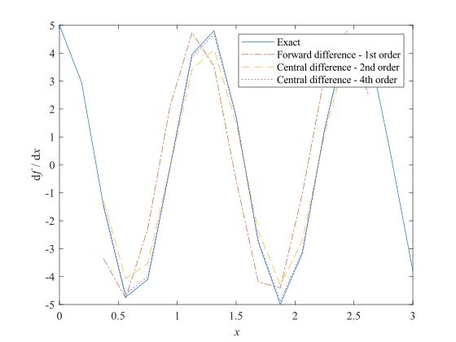
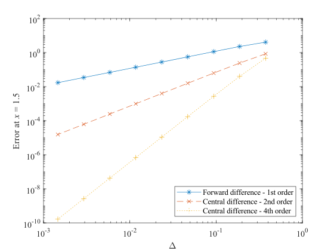
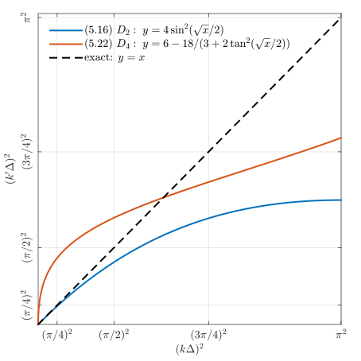

---
export_on_save:
  html: true
html:
  embed_local_images: true
  embed_svg: true
  offline: false
  toc: true
puppeteer:
  landscape: true
  format: "A4"
  timeout: 3000 # <= Special config, which means waitFor 3000 ms
print_background: false
---

# Homework 1

- **Course:** Numerical Solutions to PDEs - FALL 2024
- **Instructor:** Zhou, Bowen ([周博闻](https://as.nju.edu.cn/54/79/c11339a218233/page.htm))
- **Due date:** Oct. 12, 2024
- **Submitted date:** Oct. 17, 2024
- **Problem set:** [PS1.pdf](https://box.nju.edu.cn/d/439906db314e411489a3/files/?p=%2FProblemSets%2FPS1.pdf)
- **Course website:** <https://grwei.github.io/NJU_070601C05_2024_Fall/>

> &ensp; &ensp; Describe the setup and each step in your solutions with words and clearly label your final answers. Use Matlab for plotting and programming and include your code as an appendix to your problem set.

## Table of Contents {ignore=true}

<!-- @import "[TOC]" {cmd="toc" depthFrom=1 depthTo=6 orderedList=false} -->

<!-- code_chunk_output -->

- [Homework 1](#homework-1)
  - [Problem 1](#problem-1)
  - [Problem 2](#problem-2)
  - [Problem 3](#problem-3)
  - [Problem 4](#problem-4)
  - [Problem 5](#problem-5)
    - [Theory (P5)](#theory-p5)
    - [Results (P5)](#results-p5)
  - [Acknowledgement](#acknowledgement)
  - [Contact Information](#contact-information)
  - [Appendix](#appendix)
    - [Matlab code for Problem 3](#matlab-code-for-problem-3)
    - [Matlab code for Problem 5](#matlab-code-for-problem-5)
      - [hw1_5.m](#hw1_5m)
      - [ModWaveNumAnalysis.m](#modwavenumanalysism)

<!-- /code_chunk_output -->

## Problem 1

> &ensp; &ensp; If you are not already comfortable with Matlab, spend 1-2 hours going through the Mathworks tutorial introduction step by step: <http://www.mathworks.com/support/learn-with-matlabtutorials.html> (You don’t have to show any work for this part.)

&ensp; &ensp; I'm fine.

## Problem 2

> &ensp; &ensp; Consider the central finite difference operator $\delta$ defined by
>
> $$\delta u_n = \frac{u_{n+1} - u_{n-1}}{2 \Delta}.$$
>
> &ensp; &ensp; (a) In calculus we have
> $$\frac{\mathrm{d}(uv)}{\mathrm{d}x} = u \frac{\mathrm{d}v}{\mathrm{d}x} + v \frac{\mathrm{d}u}{\mathrm{d}x}.$$
>
> Show that the analogous finite difference expression does not hold, i.e., $\delta(u_n v_n) \neq u_n \delta v_n + v_n \delta u_n$.
> &ensp; &ensp; (b) Show that this expression holds instead:
>
> $$\delta(u_n v_n) = \bar{u} \delta{v_n} + \bar{v} \delta{u_n},$$
>
> where the overbar indicates an average over the nearest neighbors, $\bar{u} = \frac{1}{2} (u_{n+1} + u_{n-1})$.

&ensp; &ensp; **(b)** Directly introducing the definition of the central F.D. operator $\delta$ yields

$$
\begin{align*}
    \delta{(u_n v_n)} & = \frac{u_{n+1} v_{n+1} - u_{n-1} v_{n-1}}{2 \Delta} \\
    & = \frac{u_{n-1} + u_{n+1}}{2} \frac{v_{n+1} - v_{n-1}}{2 \Delta} + \frac{v_{n-1} + v_{n+1}}{2} \frac{u_{n+1} - u_{n-1}}{2 \Delta} \\
    & = \bar{u} \delta v_n + \bar{v} u_n.
    \end{align*}
$$

&ensp; &ensp; **(a)** Since $\bar{u}$ does not necessarily equals to $u_n$, the well-known expression

$$\frac{\mathrm{d}(uv)}{\mathrm{d}x} = u \frac{\mathrm{d}v}{\mathrm{d}x} + v \frac{\mathrm{d}u}{\mathrm{d}x}$$

in calculus does not hold in discretized cases.

## Problem 3

> &ensp; &ensp; Consider the first-order forward difference, second-order central difference, and fourth-order central difference approximations (as given in lecture) to the first derivative of $f(x) = \sin{(5x)}$. Plot the exact derivative and the three approximations on the same plot for $0 \le x \le 3$ and $N = 16$. (Don’t worry about points near the boundaries, just leave out those values.) Evaluate the derivative at $x = 1.5$ and plot the absolute value of the differences from the exact solution as a function of $\Delta$ on a log-log plot. Use $N=8, 16, 32, \ldots, 2048$ where $N$ is the number of grid cells. Discuss your plot.
>
> &ensp; &ensp; Note: On the course website you will find a Matlab script to assist you with this problem. There are key places in the script that have been erased - they are marked by three question marks (???) and you need to replace all of those with the correct information for the script to work.

&ensp; &ensp; The first-order forward difference (3.1), second-order central difference (3.2), and fourth-order central difference approximations (3.3) can be derived using *Taylor table*.

$$
\begin{align*}
    f'_j & = \frac{f_{j+1} - f_j}{\Delta} + \frac{\Delta}{2} f''_j + o(\Delta) \tag{3.1} \\
    & = \frac{f_{j+1} - f_{j-1}}{2 \Delta} + \frac{\Delta^2}{6} f^{(3)}_j + o(\Delta^2) \tag{3.2} \\
    & = \frac{f_{j-2} - 8f_{j-1} + 8f_{j+1} - f_{j+2}}{12 \Delta} - \frac{2}{5}\Delta^4 f^{(5)}_j + o(\Delta^4). \tag{3.3}
\end{align*}
$$

&ensp; &emsp; 下图展示了 $N = 16$ 时, 三种有限差分格式的数值解. 可见, 四阶中央差分方案 (3.3) 最接近精确解, 二阶中央差分方案 (3.2) 次之, 而一阶前向差分方案 (3.1) 误差相对最大. 还发现, (3.1) 方案引入了相移, 而另外两个方案则未见.



&ensp; &emsp; 可从数学上解释这些结果. 分别记一阶前向差分算子、二阶中央差分算子、四阶中央差分算子为 $\mathscr{D}_1, \mathscr{D}_2, \mathscr{D}_4$. 用三角函数的和差化积公式得

$$
\begin{align*}
    & \mathscr{D}_1[\sin{(5x)}] = 5 \mathop{\text{sinc}{\left( 5h / 2 \right)}} \cos{(5x + 5h / 2)}, \tag{3.4} \\
    & \mathscr{D}_2[\sin{(5x)}] = 5 \mathop{\text{sinc}{\left( 5h \right)}} \cos{(5x)}, \tag{3.5} \\
    & \mathscr{D}_4[\sin{(5x)}] = \left[ (4/3) \mathop{\text{sinc}{\left( 5h \right)}} - (1/3) \mathop{\text{sinc}{\left( 10h \right)}} \right] 5 \cos{(5x)}, \tag{3.6}
\end{align*}
$$

where the *unnormalized sinc function*

$$
\begin{equation*}
    \tag{3.7}
    \mathop{\text{sinc}}{x} := \left\{
        \begin{aligned}
            & 1, \quad & x = 0, \\
            & \frac{\sin x}{x}, \quad & x \neq 0.
        \end{aligned}
    \right.
\end{equation*}
$$

从 (3.4) 看出, $\mathscr{D}_1$ 导致相位超前, 解释了上图红线相对蓝线的左移. (3.4) 中的 sinc 系数使振幅略下降. 上图中红线的振幅下降不明显, 是因为离散格点且叠加相移干扰. 从 (3.5) 看出 $\mathscr{D}_2$ 不会导致相位偏差, 但会有振幅低偏差. 从公式上看, (3.5) 的振幅低偏差是三个方案中最严重的, 这在上图中表现明显, 因为没有相位偏差的干扰. 这样看来, 在 $\mathscr{D}_1$ 与 $\mathscr{D}_2$ 的比较中, 就对总误差的贡献而言, 相位偏差要比振幅偏差更重要. 从 (3.6) 看出, $\mathscr{D}_4$ 无相位偏差. $\mathscr{D}_4$ 的振幅低偏差通过引入 $\mathop{\text{sinc}{\left( 5h \right)}}$ 与 $\mathop{\text{sinc}{\left( 10h \right)}}$ 之间的松弛而得到缓解, 因为 $\mathop{\text{sinc}{\left( 5h \right)}}$ 项系数大于 1, 推动线性组合的结果由小于 1 的 $\mathop{\text{sinc}{\left( 5h \right)}}$ 向 1 移动, 使 $\mathscr{D}_4$ 的振幅偏差优于 $\mathscr{D}_2$ (是否优于 $\mathscr{D}_1$, 需要更仔细的论证, 这里略去).

&ensp; &emsp; 下图展示了, 在求解区间中点 $x = 1.5$ 处, 三种方案对精确解的偏差对网格距 $\Delta$ 的变化情况. 可以看出, 偏差的对数值与 $\Delta$ 的对数值很好地符合增量线性关系. 计算结果表明 (not shown), 对于每种方案, 下图中最左边的五个点两两之间的变化率相对由 (3.1) 至 (3.3) 决定的理想值的偏差都不超过百分之一. 右边几个点与理想值的偏差稍大一些, 是因为 (3.1) 至 (3.3) 是基于 Taylor 展开得到的, 表现的是当 $\Delta \to 0^+$ 时的渐近性态, 不能保证 $\Delta$ 远离 0 时的准确性. Anyway, 下图的数值结果能够证实 $\mathscr{D}_p$ 是 $p$ 阶方案, $p = 1, 2, 4$.



## Problem 4

> &ensp; &ensp; Use a Taylor table to construct the most accurate formula for the first derivative at $x_i$ using known function values of $f$ at $x_{i-1}, x_i, x_{i+1}$ and $x_{i+2}$,  assuming the points are uniformly spaced. Include the leading error term and state the “order” of the method.

&ensp; &ensp; For a given function $f: \, \mathbb{R} \to \mathbb{R}$ and a given uniformly spaced grid points $x_i = ih, \, i \in \mathbb{N}$, we denote

$$f_i := f(x_i) =: f^{(0)}(x_i),$$

$$f^{(p)}_i := f^{(p)}(x_i) := \left. \frac{\mathrm{d}^p f}{{\mathrm{d} x}^p} \right|_{x = x_i}.$$

&ensp; &ensp; We want to find a set of real numbers $a_j, \; j = -1, 0, 1, 2,$ which are not all zero, and the largest $m \in \mathbb{N}^*$, such that

$$
\begin{equation}
    \tag{4.1}
    -f'_i + \sum_{j} a_j f_{i+j} = o(h^m), \quad \forall f \in C^{\infty}{(\mathbb{R})}.
\end{equation}
$$

To do this we utilize the Taylor expansion of $f$ at $x_{i}$,

$$
\begin{equation}
    \tag{4.2}
    f(x_i + \delta) = \sum_{k = 0}^{N} {\frac{f_i^{(k)}}{k!} \delta^k} + o(\delta^{k}).
\end{equation}
$$

We substitute (4.2) into (4.1), and the result of the substitution is expressed by the following *Taylor table*.

|                 |  $f_i$   |   $f'_i$    |      $f_i^{(2)}$       |       $f_i^{(3)}$       |       $f_i^{(4)}$       | $\cdots$ |
| --------------- | :------: | :---------: | :--------------------: | :---------------------: | :---------------------: | :------: |
| $-f'_i$         |          |    $-1$     |                        |                         |                         | $\cdots$ |
| $a_{-1}f_{i-1}$ | $a_{-1}$ | $-h a_{-1}$ | $\frac{h^2}{2} a_{-1}$ | $-\frac{h^3}{6} a_{-1}$ | $\frac{h^4}{24} a_{-1}$ | $\cdots$ |
| $a_{0}f_{i}$    |  $a_0$   |             |                        |                         |                         | $\cdots$ |
| $a_{1}f_{i+1}$  |  $a_1$   |   $h a_1$   |  $\frac{h^2}{2} a_1$   |  $\frac{h^3}{6} a_{1}$  | $\frac{h^4}{24} a_{1}$  | $\cdots$ |
| $a_{2}f_{i+2}$  |  $a_2$   |  $2h a_2$   |       $2h^2 a_2$       |  $\frac{4}{3} h^3 a_2$  |  $\frac{2}{3} h^4 a_1$  | $\cdots$ |

&ensp; &ensp; Inspection of the Taylor table above shows that for a given set of $a_j$, the largest $m$ is the smallest $m$ such that the coefficients of the $f_i^{(m+1)}$ terms in (4.1) are non-zero. So, the question becomes, how to choose $a_j$ such that $M$ is maximized, where $M$ makes the coefficients of the $f_i^{(p)}$ terms (i.e., the sums of the numbers in the corresponding columns of the Taylor table) in (4.1) zero, $\forall p \le M$.

&ensp; &ensp; We first try to make $M = 4$, that is, to make the coefficients of the $f_i^{(0)}, f_i^{(1)}, f_i^{(2)}, f_i^{(3)}$ terms in (4.1) zero, which is equivalent to choosing $a_j$ as a solution to linear equation

$$
\begin{equation*}
    \tag{4.3}
    \begin{bmatrix}
    1 & 1 & 1 & 1 \\
    -h &  & h & 2h \\
    h^2 / 2 &  & h^2 / 2 & 2 h^2 \\
    -h^3 / 6 & & h^3 / 6 & 4 h^3 / 3
    \end{bmatrix}
    \begin{bmatrix}
    a_{-1} \\
    a_0 \\
    a_1 \\
    a_2
    \end{bmatrix} =
    \begin{bmatrix}
    0 \\
    1 \\
    0 \\
    0
    \end{bmatrix}.
\end{equation*}
$$

The unique solution to this equation is

$$(a_{-1}, a_0, a_1, a_2) = (\frac{-1}{3h}, \frac{-1}{2h}, \frac{1}{h}, \frac{-1}{6 h}),$$

and (4.1) becomes

$$
\begin{equation*}
    \tag{4.4}
    f'_i = \frac{1}{6h} \left( -2f_{i-1} -3f_{j} + 6f_{j+1} - f_{j+2} \right) - \frac{h^3}{12} f_j^{(4)} + o(h^3), \quad \forall f \in C^{\infty}(\mathbb{R}).
\end{equation*}
$$

&ensp; &ensp; We call (4.4) a *third-order* method, since its leading error term $h^3 f^{(4)}_j / 12$ is a third-order infinitesimal of $h$ as $h \to 0^+$.

&ensp; &ensp; In fact, we cannot achieve $M = 5$ (let alone larger), because the corresponding equation

$$
\begin{equation*}
    \begin{bmatrix}
    1 & 1 & 1 & 1 \\
    -h &  & h & 2h \\
    h^2 / 2 &  & h^2 / 2 & 2 h^2 \\
    -h^3 / 6 & & h^3 / 6 & 4 h^3 / 3 \\
    h^4 / 24 &  & h^4 / 24 & 2h^4 / 3
    \end{bmatrix}
    \begin{bmatrix}
    a_{-1} \\
    a_0 \\
    a_1 \\
    a_2
    \end{bmatrix} =
    \begin{bmatrix}
    0 \\
    1 \\
    0 \\
    0 \\
    0
    \end{bmatrix}
\end{equation*}
$$

has no solution. Therefore, (4.4) is the most accurate finite difference formula for $f'_i$ when only the information of $f$ at $x_{i-1}, x_i, x_{i+1}$ and $x_{i+2}$ is utilized.

## Problem 5

> &ensp; &ensp; Recall that the second derivative of $f = \exp{(\mathrm{i} kx)}$ is $-k^2 f$. Application of a finite difference operator for the second derivative to $f$ would lead to $-k'^2 f$, where $k'^2$ is the ‘modified wavenumber’ for the second derivative. The modified wave number method for assessing the accuracy of second derivative finite-difference formulas is then to compare the corresponding $k'^2$ with $k^2$ (in a plot $k'^2 \Delta^2$ vs. $k^2 \Delta^2$, $0 \le k\Delta \le \pi$).
>
> &ensp; &ensp; Use modified wavenumber analysis to compare the accuracy of the second-order central difference formula
>
> $$f_j'' = \frac{f_{j+1} - 2 f_j + f_{j - 1}}{\Delta^2}$$
>
> and the fourth-order Padé formula
>
> $$\frac{1}{12} f''_{j-1} + \frac{10}{12}f''_j + \frac{1}{12} f''_{j+1} = \frac{f_{j+1} - 2f_j + f_{j-1}}{\Delta^2}.$$
>
> &ensp; &ensp; Hint: to derive the modified wavenumber for Padé type schemes, replace $f''$ with $-k'^2 \exp{(\mathrm{i} k x_j)}$, etc.

### Theory (P5)

&ensp; &emsp; Fourier 频谱分析的观点, 是将平方可和的 $f: \, h\mathbb{Z} \to \mathbb{C}$ 看作由一系列平面波线性叠加而成,

$$
\begin{equation*}
    \tag{5.1}
    f(x_i) = \int_{-\pi / h}^{\pi / h} {\hat{f}(k) \mathop{\mathrm{e}}^{\mathrm{i} k x_i}} \mathop{\mathrm{d} k},
\end{equation*}
$$

式中

$$
\begin{equation*}
    \tag{5.2}
    \hat{f}(k) = \frac{h}{2 \pi} \sum_i {f(x_i) \mathop{\mathrm{e}}^{-\mathrm{i} k x_i}}
\end{equation*}
$$

是 $f$ 的 semi-discrete Fourier transform. 定义 semi-discrete Fourier transform operator

$$
\begin{align*}
    \mathscr{F}: \; H & \to H, \\
    f & \mapsto \mathscr{F}[f],
\end{align*}
$$

其中 $\mathscr{F}[f](k)$ 按 (5.2) 定义. 定义 semi-discrete inverse Fourier transform operator

$$
\begin{align*}
    \mathscr{F}^{-1}: \; H & \to H, \\
    \hat{f} & \mapsto \mathscr{F}^{-1}[\hat{f}],
\end{align*}
$$

其中 $\mathscr{F}^{-1}[\hat{f}](x_i)$ 按 (5.1) 定义.

&ensp; &emsp; 因 $\hat{f}(k) = \hat{f}(k + 2 \pi / h)$, 故 (5.1) 的积分区域只需要取 $[-\pi / h, \pi / h)$. 这件事的物理意义, $h \mathbb{Z}$ 网格上的能量有限信号可由一系列信号分量线性叠加而成, 这些分量的周期在 $[2h, +\infty)$ 连续地取值; 对于周期比 $2h$ 还要短的信号, 总存在一个较低频的信号, 使两个信号在 $h \mathbb{Z}$ 上的值 (样值) 完全相同, 以至于无法被区分, 即存在*混叠* (*aliasing*) 现象. 称 $\pi / h$ 为 Nyquist cut-off wave-number, 这是 $h \mathbb{Z}$ 网格能分辨的信号频率的最高值的理论值 (Nyquist 采样定理).

&ensp; &emsp; Fourier 频谱分析的观点, 在数值分析中很有用. 例如, 若想考察某个线性算子或线性方程的线性数值格式的精度 (accuracy) 和稳定度 (stability), 可以分别考察每个单波分量的数值表现与其理想表现的差异. 用 Fourier 频谱分析的观点考察数值格式稳定度的例子, 会在[下次作业](../hw2/hw2.md)中给出. 这次, 我们先关注精度. 我们会以二阶求导算子 (它是线性算子) 为例, 考察该算子的两个有限差分格式 (也是线性的, 但可能是隐式的) 的精度.

&ensp; &emsp; 记 $H := \left\{ f: \, h \mathbb{Z} \to \mathbb{C}, \, \sum_i |f(x_i)|^2 < \infty \right\}$, $f_j := f(x_j)$, $x_j = jh$. 定义 second-order central difference 算子

$$
\begin{align*}
    & \mathscr{D}_2: \, H \to H, \\
    & \mathscr{D}_2[f](x_j) = \frac{1}{h^2} (f_{j+1} - 2f_j + f_{j-1}). \tag{5.3}
\end{align*}
$$

这是一个显式 (explicit) 的线性算子.

&ensp; &emsp; 又定义 fourth-order Padé 算子

$$
\begin{align*}
    \mathscr{D}_4: \, H & \to H, \\
    f & \mapsto \mathscr{D}_4[f], \tag{5.4}
\end{align*}
$$

其中 $\mathscr{D}_4[f]$ 由方程组

$$
\begin{equation*}
    \tag{5.5}
    \frac{1}{12} \mathscr{D}_4[f](x_{j-1}) + \frac{10}{12} \mathscr{D}_4[f](x_{j}) + \frac{1}{12} \mathscr{D}_4[f](x_{j+1}) = \frac{1}{h^2}(f_{j+1} - 2f_j + f_{j-1}), \quad j \in \mathbb{Z}
\end{equation*}
$$

在适当的边界条件, 不妨 (really?) $\mathscr{D}_4[f](x_i) = f''_i, \, i = 0, 1$, 下决定. 这是一个隐式 (implicit) 算子, 下面证明它是线性的.

&emsp; &ensp; $\forall g \in H$, $c \in \mathbb{C}$, $\mathscr{D}_4[g]$ 由方程组

$$
\begin{equation*}
    \tag{5.6}
    \frac{1}{12} \mathscr{D}_4[g](x_{j-1}) + \frac{10}{12} \mathscr{D}_4[g](x_{j}) + \frac{1}{12} \mathscr{D}_4[g](x_{j+1}) = \frac{1}{h^2}(g_{j+1} - 2g_j + g_{j-1}), \quad j \in \mathbb{Z}
\end{equation*}
$$

在适当的边界条件, 不妨 (really?) $\mathscr{D}_4[g](x_i) = g''_i, \, i = 0, 1$, 下决定. $\mathscr{D}_4[f + cg]$ 由方程组

$$
\begin{align*}
    \frac{1}{12} \mathscr{D}_4[f + cg](x_{j-1}) & + \frac{10}{12} \mathscr{D}_4[f + cg](x_{j}) + \frac{1}{12} \mathscr{D}_4[f + cg](x_{j+1}) \\
    & = \frac{1}{h^2} \left[ (f + cg)_{j+1} - 2(f + cg)_j + (f + cg)_{j-1} \right], \quad j \in \mathbb{Z} \tag{5.7}
\end{align*}
$$

在边界条件 $\mathscr{D}_4[f + cg](x_i) = b_i, \, i = 0, 1$ 下决定. 由 (5.5)(5.6) 知 $s := \mathscr{D}_4[f] + c\mathscr{D}_4[g]$ 满足

$$
\begin{equation*}
    \tag{5.8}
    \frac{1}{12} s_{j-1} + \frac{10}{12} s_{j} + \frac{1}{12} s_{j+1} = \text{RHS of Eq. (5.7)}, \quad j \in \mathbb{Z},
\end{equation*}
$$

和边界条件 $s_i = f''_i + cg''_i, \, i = 0, 1$. 比较 (5.7) 和 (5.8) 知, 只要 $b_i = f''_i + cg''_i, \, i = 0, 1$, 就有

$$
\begin{equation*}
    \tag{5.9}
    \mathscr{D}_4[f + cg] = \mathscr{D}_4[f] + c \mathscr{D}_4[g].
\end{equation*}
$$

这就是说, $\mathscr{D}_4$ 是线性算子, **当且仅当它在边界是线性的**. 这够吗[^1]? 特别地, 若边界条件**可以**设置为齐次的 ($f \in H$ 是否蕴含这件事?), 则算子 $\mathscr{D}_4$ 必是线性的.

[^1]: 对于隐式格式, 这种线性性够用吗? (5.4) 实际上必须添加边界条件才能决定 $\mathscr{D}_4[f]$, 所以算子线性性的成立依赖于边界. 我执着于讨论算子的线性性, 是因为线性算子能够保证叠加原理, 使数值格式作用于函数相当于对组成函数的各 Fourier 平面波分量分别作用、再线性叠加; 这样使 *modified wave number method* make sense !

### Results (P5)

&ensp; &emsp; 下面考察二阶导数算子的两个线性格式 $\mathscr{D}_2$ 和 $\mathscr{D}_4$ 在均匀网格 $h \mathbb{Z}$ 上的精度. 由[前面](#results-p5)的分析, 我们考虑这些算子对单波

$$
\begin{equation*}
    \tag{5.10}
    f(x) = \mathrm{e}^{\mathrm{i} k x}, \quad x \in \mathbb{R}, \quad |k| \le \pi / h
\end{equation*}
$$

的作用. 理想地, 我们有

$$
\begin{equation*}
    \tag{5.11}
    \frac{\mathrm{d}^2 f}{{\mathrm{d} x}^2} = - k^2 f.
\end{equation*}
$$

&ensp; &emsp; 对于 $\mathscr{D}_2$, 由 (5.3) 知, 在 $h \mathbb{Z}$ 上有

$$
\begin{align*}
    \mathscr{D}_2[f] & = \frac{f}{h^2} \left(\mathrm{e}^{\mathrm{i} kh} - 2 + \mathrm{e}^{-\mathrm{i} kh} \right) \\
    & = -\frac{4}{h^2} \sin^2{\left( \frac{kh}{2} \right)} f. \tag{5.12}
\end{align*}
$$

比较 (5.12) 与 (5.11), 我们定义 modified wave number $k_2'$ such that

$$
\begin{equation*}
    \tag{5.13}
    -k_2'^2 = -\frac{4}{h^2} \sin^2{\left( \frac{kh}{2} \right)}, \quad |k| \le \pi / h,
\end{equation*}
$$

这样 (5.12) 可写成

$$
\begin{equation*}
    \tag{5.14}
    \mathscr{D}_2[f] = - k'^2_2 f.
\end{equation*}
$$

比较数值行为 (5.14) 与理想行为 (5.11), 我们说, $k'_2$ 对 $k$ 的偏离程度, 体现了数值格式 $\mathscr{D}_2$ 作用于波数为 $k$ 的单波 $f$ 的数值解与精确解的偏差. 为使结果更具一般性, 作变量代换

$$
\begin{equation*}
    \tag{5.15}
    x = (kh)^2, \quad y = (k'h)^2, \quad |k| \le \pi / h,
\end{equation*}
$$

使 (5.13) 成为

$$
\begin{equation*}
    \tag{5.16}
    y = x \mathop{\text{sinc}}^2{\frac{\sqrt{x}}{2}}, \quad x \in [0, \pi^2],
\end{equation*}
$$

where the *unnormalized sinc function*

$$
\begin{equation*}
    \tag{5.17}
    \mathop{\text{sinc}}{x} := \left\{
        \begin{aligned}
            & 1, \quad & x = 0, \\
            & \frac{\sin x}{x}, \quad & x \neq 0.
        \end{aligned}
    \right.
\end{equation*}
$$

&ensp; &emsp; 对于 $\mathscr{D}_4$, 由 (5.5) 知, $\mathscr{D}_4[f]$ 满足

$$
\begin{equation*}
    \tag{5.18}
    \frac{1}{12} \mathscr{D}_4[f](x_{j-1}) + \frac{10}{12} \mathscr{D}_4[f](x_{j}) + \frac{1}{12} \mathscr{D}_4[f](x_{j+1}) = \frac{f_j}{h^2} \left(\mathrm{e}^{\mathrm{i} kh} - 2 + \mathrm{e}^{-\mathrm{i} kh} \right), \quad j \in \mathbb{Z}.
\end{equation*}
$$

约定 $\xi$ 为 Fourier 频域变量, $j$ 为时域变量. 利用 ($\delta$ 是 Dirac delta function [^2])

[^2]: [Dirac delta function](https://www.math.wustl.edu/~alanchang/teaching/mathcamp/mathcamp2020_dirac_delta_function.pdf)

$$
\mathscr{F}[1] = \delta{(\xi)},
$$

时移性质

$$
\mathscr{F}[f(x_{j + j_0})](\xi) = \mathrm{e}^{\mathrm{i} \xi j_0 h} \mathscr{F}[f(x_{j})](\xi)
$$

和频移性质

$$
\mathscr{F}[f(x_j)](\xi - \xi_0) = \mathscr{F}[\mathrm{e}^{\mathrm{i} \xi_0 x_j} f(x_j)](\xi),
$$

对 (5.18) 作 Fourier 变换 (5.2), 整理得

$$
\begin{equation*}
    \tag{5.19}
    \mathscr{F}[\mathscr{D}_4[f](x_j)](\xi) = -\frac{6}{h^2} \left[ 1 - 3 \left( 3 + 2 \tan^2{\frac{\xi h}{2}} \right)^{-1} \right] \delta(\xi - k).
\end{equation*}
$$

对上式作 Fourier 逆变换 (5.1), 得

$$
\begin{equation*}
    \tag{5.20}
    \mathscr{D}_4[f] = - k'^2_4 f,
\end{equation*}
$$

其中 modified wave number $k'_4$ 定义为 (比较 (5.20) 与 (5.11))

$$
\begin{equation*}
    \tag{5.21}
    -k'^2_4 = -\frac{6}{h^2} \left[ 1 - 3 \left( 3 + 2 \tan^2{\frac{k h}{2}} \right)^{-1} \right], \quad |k| \le \pi / h.
\end{equation*}
$$

在变量代换 (5.15) 下, 体现数值格式 $\mathscr{D}_4$ 精度的 (5.21) 写成

$$
\begin{equation*}
    \tag{5.22}
    y = 6 - 18 \left( 3 + 2 \tan^2{\frac{\sqrt{x}}{2}} \right)^{-1}, \quad x \in [0, \pi^2].
\end{equation*}
$$

&ensp; &emsp; 将 (5.16)(5.22) 绘制于下图, 以讨论数值格式 $\mathscr{D}_2$ 和 $\mathscr{D}_4$ 的精度. 可见, $\mathscr{D}_2$ 的低频精度较好, 当 $kh \to 0$ 时近乎精确, 但精度随频率升高而恶化; 与 $\mathscr{D}_2$ 相比, $\mathscr{D}_4$ 牺牲了一些低频精度, 而换取了更好的高频精度. 所以, 在网格距 $h$ (图中记为 $\Delta$) 相同的前提下, 相对而言, $\mathscr{D}_2$ 适合求解变化较缓 (尺度较大, 越大越好) 的信号, 而 $\mathscr{D}_4$ 适合求解变化较快 (主要频谱分量的周期落在 3 至 4 倍网格距内为佳) 的信号.



## Acknowledgement

&ensp; &ensp; I thank ...

## Contact Information

- **Author:** Guorui Wei (危国锐)
- **E-mail:** [313017602@qq.com](mailto:313017602@qq.com)
- **Website:** <https://github.com/grwei>

## Appendix

### Matlab code for Problem 3

```matlab {.line-numbers}
%--------------------------------------------------------------------------
%Matlab script to calculate derivative using three different finite 
%difference formulas
%--------------------------------------------------------------------------
%Problem Set #1, Problem 3
%--------------------------------------------------------------------------
%Author: Guorui Wei (危国锐) (313017602@qq.com)
%Date created: Oct. 17, 2024
%--------------------------------------------------------------------------

close all %close all figure windows
clear all %clear memory of all variables

%-------------------------------------------------------
%Define variables that do not change for different grids
%-------------------------------------------------------
L=3; %Length of domain
m=1; %counter for number of grid sizes to plot

%---------------------------------------------------------------
%Loop over different grid sizes (N = number of points in domain)
%---------------------------------------------------------------
for N = [8 16 32 64 128 256 512 1024 2048] 

  %-------------------------------------
  %Define resolution-dependent variables
  %-------------------------------------
  deltax = L/N; %Grid spacing
  x =0:deltax:L; %define x, grid
  nx=length(x); %number of points in grid

  f = sin(5*x); %function to be differentiated

  dfdx_exact = 5 * cos(5*x); %exact (analytical) derivative

  %-----------------------------------------------------------------------
  %Initialize arrays for 3 schemes with NaNs so that un-used values at the 
  %edge of the domain will not be plotted. This isn't necessary, but just
  %makes the plotting a bit easier.
  %-----------------------------------------------------------------------
  dfdx_1st = NaN*ones(size(dfdx_exact));
  dfdx_2nd = NaN*ones(size(dfdx_exact));
  dfdx_4th = NaN*ones(size(dfdx_exact));

  %-----------------------------------------------------------------------
  %Compute derivatives with three different approximations
  %-----------------------------------------------------------------------
  for i=3:nx-2 %Notice the limits here
      dfdx_1st(i) =  (f(i+1) - f(i)) / deltax; %first order forward
      dfdx_2nd(i) =  (f(i+1) - f(i-1)) / 2 / deltax; %second order central
      dfdx_4th(i) =  (f(i-2) - 8*f(i-1) + 8*f(i+1) - f(i+2)) / 12 / deltax; %fourth order central
  end

  %-----------------------------------------------------------------------
  %Plot the exact and approximated derivatives for the case where N=16
  %-----------------------------------------------------------------------
  if (N == 16)
    figure
    plot(x,dfdx_exact,'-',x,dfdx_1st,'-.',x,dfdx_2nd,'--',x,dfdx_4th,':')
    xlabel('\it x')
    ylabel('d{\itf} / d{\itx}')
    legend('Exact','Forward difference - 1st order',...
          'Central difference - 2nd order', 'Central difference - 4th order')
    set(gca, FontName="Times New Roman", FontSize=10.5)
    print(gcf, "fig_3_1_first_diff_compare.svg", "-dsvg")
  end

  %-----------------------------------------------------------------------
  %Extract the errors for x = 1.5, the midpoint of the domain
  %-----------------------------------------------------------------------
  dx(m) = deltax; %store the current deltax in an array for plotting later
  midpoint = floor((1+nx)/2); %calculate the midpoint index 
  error_1st(m) = abs(dfdx_1st(midpoint)-dfdx_exact(midpoint));
  error_2nd(m) = abs(dfdx_2nd(midpoint)-dfdx_exact(midpoint));
  error_4th(m) = abs(dfdx_4th(midpoint)-dfdx_exact(midpoint));

  m = m +1; %Advance counter for number of grids
  
end %end of loop over different grid sizes

%-----------------------------
%Calculate slopes of lines
%-----------------------------
slope_1st = diff(log(error_1st))./diff(log(dx))
slope_2nd = diff(log(error_2nd))./diff(log(dx))
slope_4th = diff(log(error_4th))./diff(log(dx))

%--------------------------------
%Plot dx versus error at x = 1.5
%--------------------------------
figure
loglog(dx,error_1st,'-*',dx,error_2nd,'x--',dx,error_4th,'+:')
xlabel('\Delta')
ylabel('Error at{\it x} = 1.5')
legend('Forward difference - 1st order','Central difference - 2nd order', ...
      'Central difference - 4th order', Location='southeast')
set(gca, FontName="Times New Roman", FontSize=10.5)
print(gcf, "fig_3_2_first_diff_error_loglog.svg", "-dsvg")
```

### Matlab code for Problem 5

#### hw1_5.m

```matlab {.line-numbers}
%% hw1_5.m
% Description: create figure of the results of modified wave number analysis
% Author: Guorui Wei (危国锐) (313017602@qq.com)
% Created at: Oct. 16, 2024
% Last modified:
%

mod_wave_func_handle = {
    @(x) 4 * sin(sqrt(x) / 2).^2;
    @(x) 6 - 18 ./ (3 + 2 * tan(sqrt(x) / 2).*2);
};
scheme_disp_name_ = {
    "(5.16) $D_2: \; y = 4 \sin^2 (\sqrt{x} / 2)$";
    "(5.22) $D_4: \; y = 6 - 18 / (3 + 2 \tan^2 (\sqrt{x} / 2))$";
};

hw1_5_obj = ModWaveNumAnalysis();
hw1_5_obj.set_mod_wave_func_handle(mod_wave_func_handle);
hw1_5_obj.set_scheme_disp_name(scheme_disp_name_);
hw1_5_obj.create_fig(true);
```

#### ModWaveNumAnalysis.m

```matlab {.line-numbers}
%% ModWaveNumAnalysis.m
% Description: create figure of the results of modified wave number analysis
% Author: Guorui Wei (危国锐) (313017602@qq.com)
% Created at: Oct. 16, 2024
% Last modified:
%

%% class def

classdef ModWaveNumAnalysis < handle
    properties (Access=private)
        scheme_disp_name_
        mod_wave_func_handle_
    end

    methods (Access=public)
        function obj = ModWaveNumAnalysis(mod_wave_func_handle, scheme_disp_name_)
            arguments
                mod_wave_func_handle = {
                    @(x) 4 * sin(sqrt(x) / 2).^2;
                    @(x) 6 - 18 ./ (3 + 2 * tan(sqrt(x) / 2).*2);
                }
                scheme_disp_name_ = {
                    "$D_2: \; y = 4 \sin^2 (\sqrt{x} / 2)$";
                    "$D_4: \; y = 6 - 18 / (3 + 2 \tan^2 (\sqrt{x} / 2))$";
                }
            end

            obj.mod_wave_func_handle_ = mod_wave_func_handle;
            obj.scheme_disp_name_ = scheme_disp_name_;
        end
        
        function obj = set_scheme_disp_name(obj, scheme_disp_name)
            obj.scheme_disp_name_ = scheme_disp_name;
        end
        
        function obj = set_mod_wave_func_handle(obj, mod_wave_func_handle)
            obj.mod_wave_func_handle_ = mod_wave_func_handle;
        end

        function scheme_disp_name = get_scheme_disp_name(obj)
            scheme_disp_name = obj.scheme_disp_name_; 
        end

        function mod_wave_func_handle = get_mod_wave_func_handle(obj)
            mod_wave_func_handle = obj.mod_wave_func_handle_;
        end
        
        function obj = create_fig(obj, flag_save)
            arguments
                obj 
                flag_save = false;
            end
            t_fig = figure(Name="fig_5_1_mod_wave_num_results");

            % set figure size
            UNIT_ORIGINAL = t_fig.Units;
            t_fig.Units = "centimeters";
            t_fig.Position = [3, 3, 12, 12];
            t_fig.Units = UNIT_ORIGINAL;

            % create figure
            t_TCL = tiledlayout(t_fig, 1, 1, TileSpacing="compact", Padding="compact");
            t_axes = nexttile(t_TCL, 1);
            
            x = linspace(0, pi^2, 10000);
            hold(t_axes,"on" )
            for i = 1:length(obj.mod_wave_func_handle_)
                plot(x, obj.mod_wave_func_handle_{i}(x), LineWidth=1.5, DisplayName=obj.scheme_disp_name_{i})
            end
            plot([0, pi^2], [0, pi^2], "--k", LineWidth=1.5, DisplayName="exact: $y = x$")
            
            set(t_axes, FontName="Times New Roman", FontSize=10.5, XTick=(pi/4:pi/4:pi).^2, XTickLabel=["$(\pi/4)^2$", "$(\pi/2)^2$", "$(3\pi/4)^2$", "$\pi^2$"], Box="on", TickLabelInterpreter="latex", XLimitMethod="tight")
            set(t_axes, YTick=t_axes.XTick, YTickLabel=t_axes.XTickLabel, YTickLabelRotation=90)
            grid(t_axes, "on")
            legend(t_axes, Location="northwest", Interpreter="latex", FontSize=10.5, Box="off")
            xlabel(t_axes, "$(k \Delta)^2$", Interpreter="latex", FontSize=10.5);
            ylabel(t_axes, "$(k' \Delta)^2$", Interpreter="latex", FontSize=10.5);
            
            if flag_save
                print(t_fig, t_fig.Name + ".svg", "-dsvg")
            end
        end
    end
end
```
