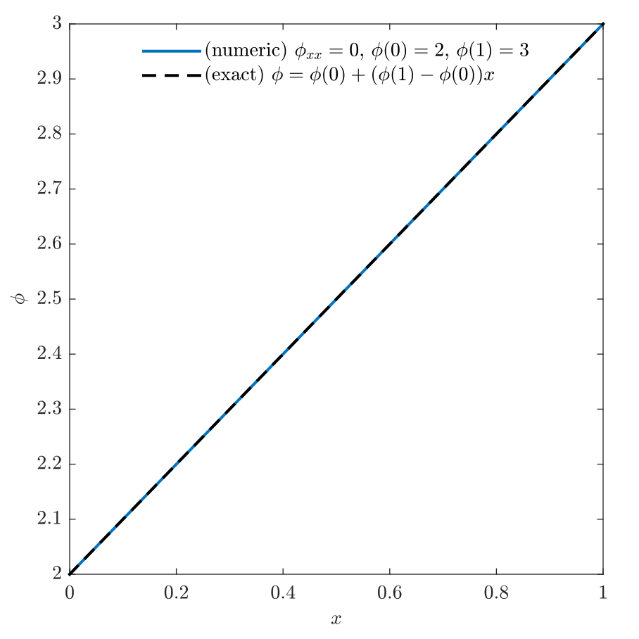
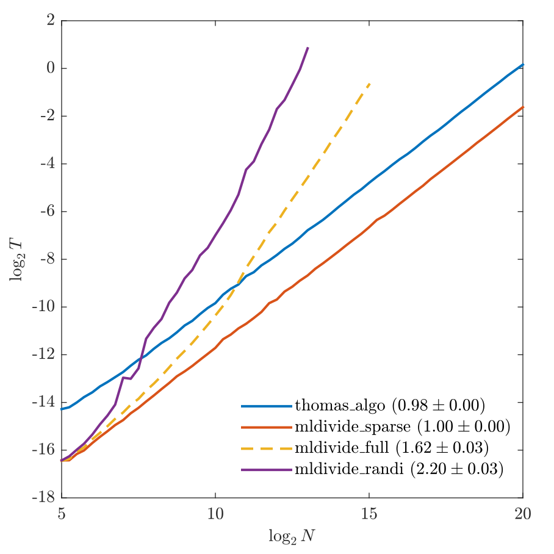
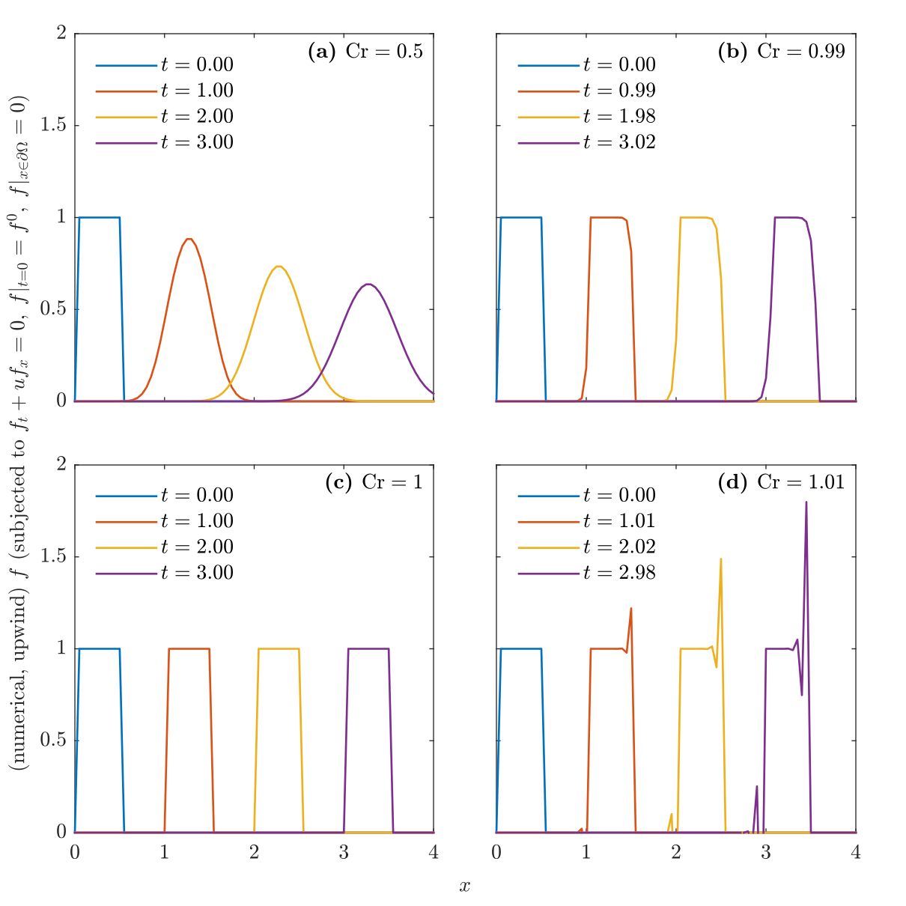
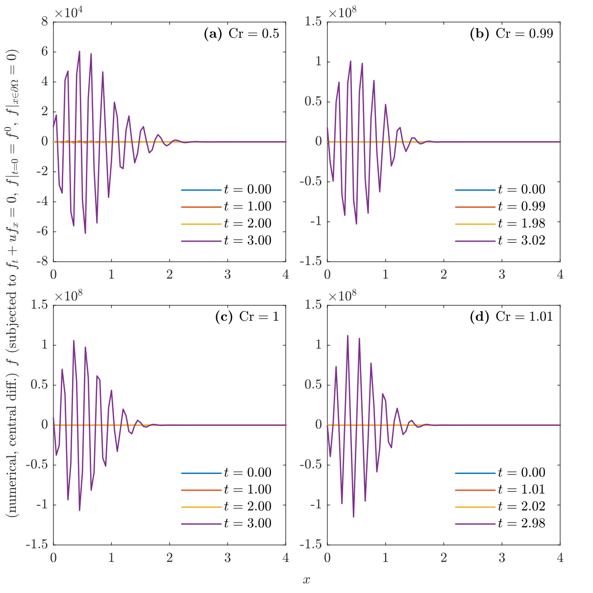
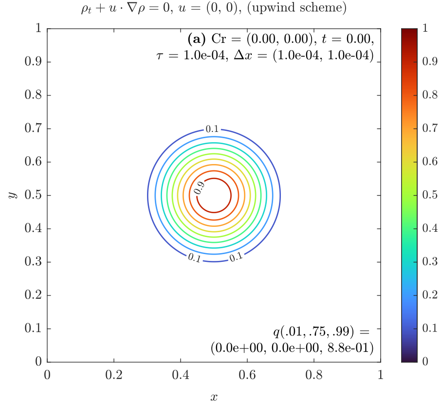
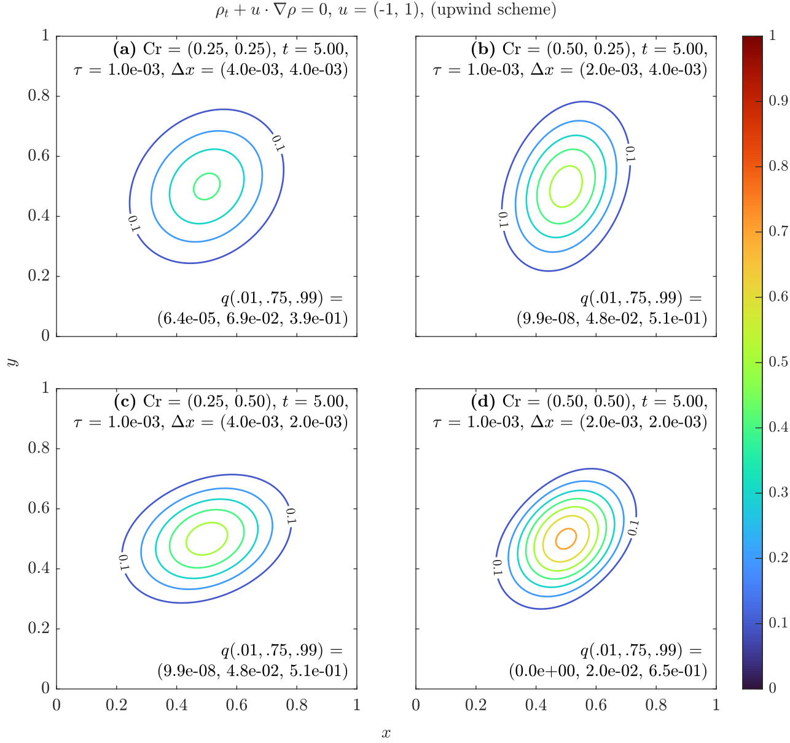
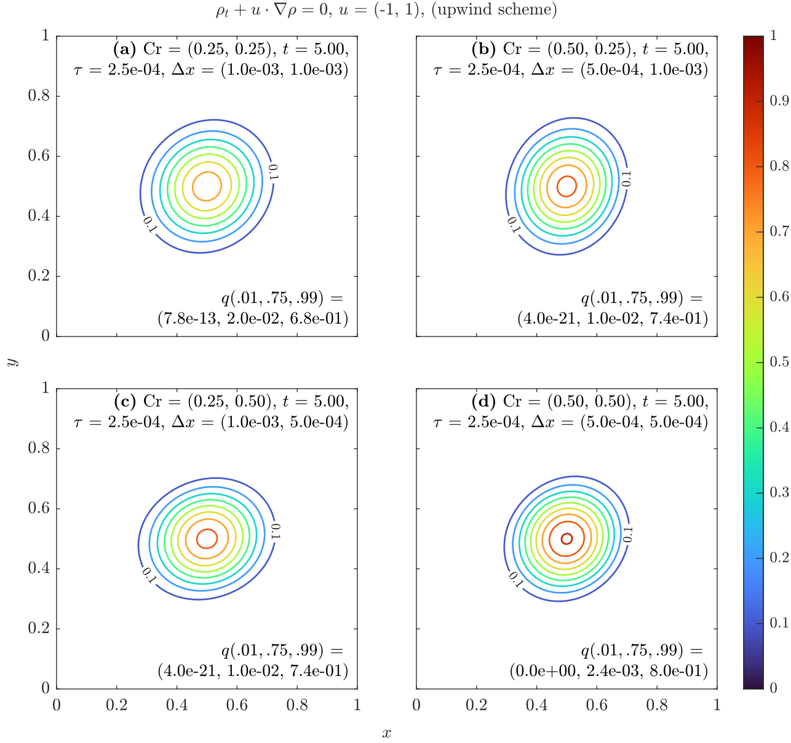
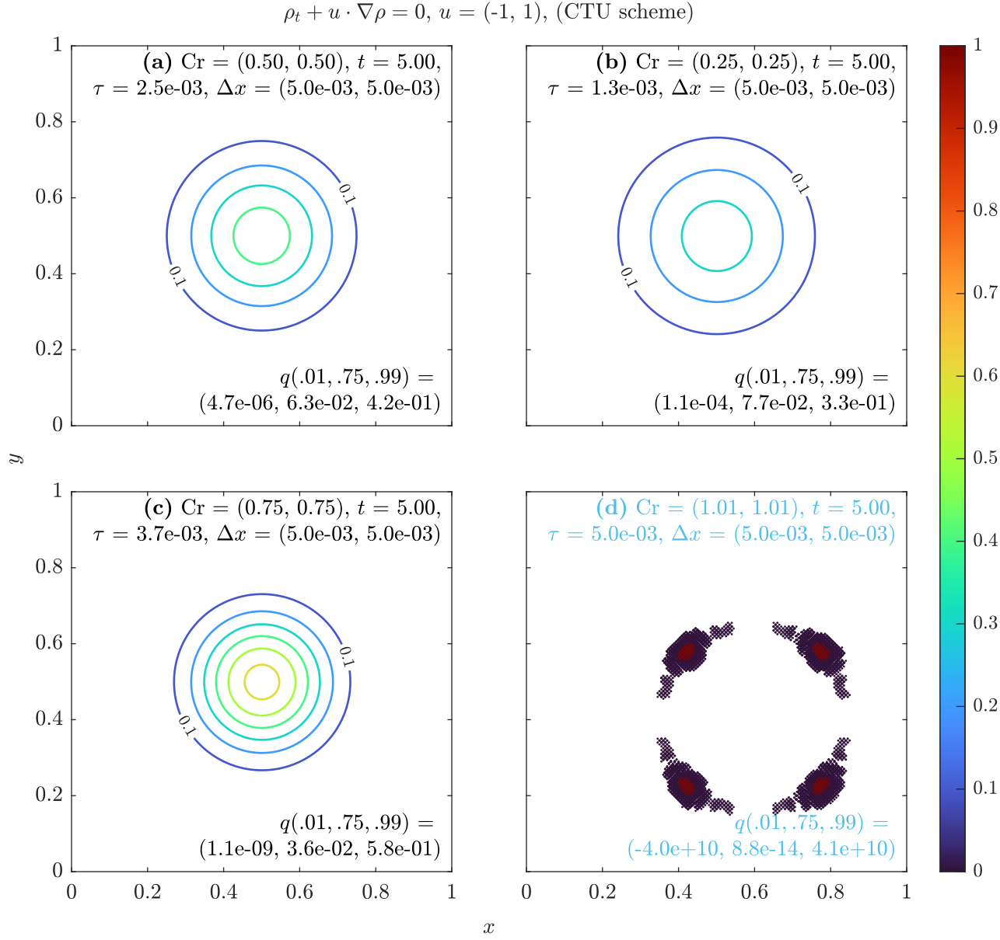
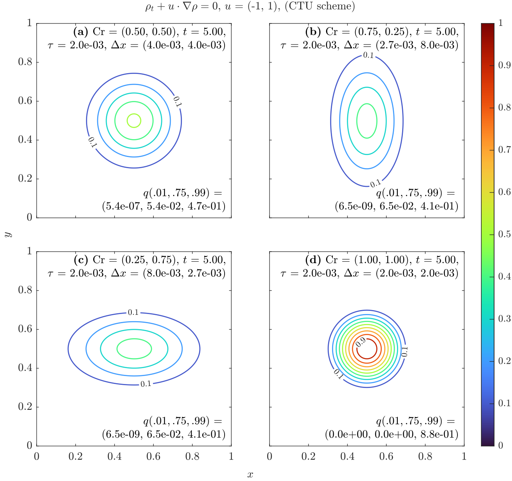
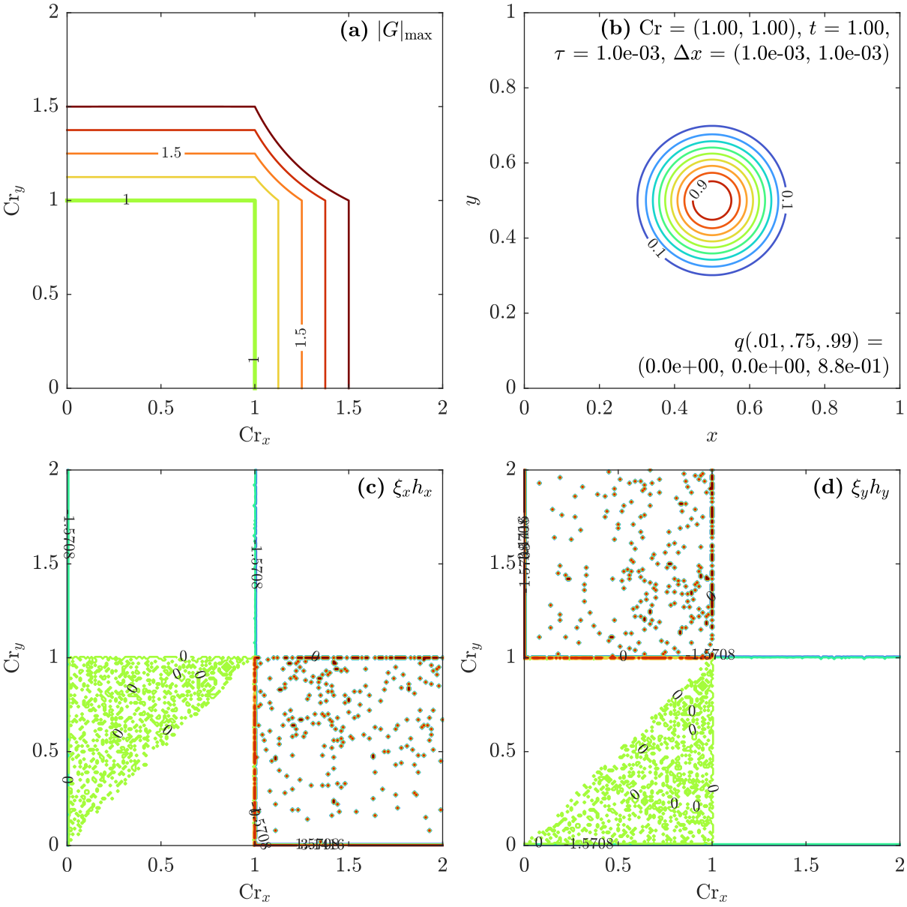

---
export_on_save:
  html: true
html:
  embed_local_images: false
  embed_svg: true
  offline: false
  toc: true
print_background: true
---

# Homework 2

- **Course:** Numerical Solutions to PDEs - FALL 2024
- **Instructor:** Zhou, Bowen ([周博闻](https://as.nju.edu.cn/54/79/c11339a218233/page.htm))
- **Due date:** Oct. 18, 2024
- **Submit date:** Oct. 26, 2024
- **Problem set:** [PS2.pdf](https://box.nju.edu.cn/d/439906db314e411489a3/files/?p=%2FProblemSets%2FPS2.pdf)

> &ensp; &ensp; Describe the setup and each step in your solutions with words and clearly label your final answers. Use Matlab for plotting and programming and include your code as an appendix to your problem set.

## Table of Contents {ignore=true}

<!-- @import "[TOC]" {cmd="toc" depthFrom=1 depthTo=6 orderedList=false} -->

<!-- code_chunk_output -->

- [Homework 2](#homework-2)
  - [Problem 1](#problem-1)
  - [Problem 2](#problem-2)
  - [Problem 3](#problem-3)
  - [Acknowledgement](#acknowledgement)
  - [Contact Information](#contact-information)
  - [Appendix](#appendix)
    - [Matlab code for problem 1](#matlab-code-for-problem-1)
      - [hw2_1.m](#hw2_1m)
      - [TriDiagSolver.m](#tridiagsolverm)
    - [Matlab code for problem 2 and 3](#matlab-code-for-problem-2-and-3)
      - [hw2_2.m](#hw2_2m)
      - [hw2_3.m](#hw2_3m)
      - [AdvecProb2D.m](#advecprob2dm)

<!-- /code_chunk_output -->

## Problem 1

> &ensp; &emsp; Consider the 1D steady-state diffusion problem:
>
> $$\frac{\partial^2 \phi}{\partial x^2} = 0$$
>
> over the domain $x = 0$ to $1$ with $\phi = 2$ at $x = 0$ and $\phi = 3$ at $x = 1$. Solve this using a second-order finite difference scheme (as done in class). Set up the tridiagonal matrix that you will solve. Make your code adjustable for any number of grid points and plot the solution for $N = 21$.
>
> &ensp; &emsp; **(a)** Use the Thomas algorithm to solve the problem. (Note: you will use the tridiagonal solver again in a later homework).
>
> &ensp; &emsp; **(b)** Now set up a full matrix (with all the zeros) and use Matlab’s internal matrix solver to determine the solution, i.e. if $\boldsymbol{A} \phi = \boldsymbol{b}$ then type `phi = A\b`. To compare the computational cost of this approach to the Thomas algorithm you used above, use the function "`cputime`" to determine the time to obtain each solution. Note that Matlab will try to figure out the structure of the matrix and optimize the solution algorithm. Therefore, also compare your timings to a full matrix (no zeros) inversion by setting up a sample matrix using the function "`magic`", for example: `B = magic(nx); dd=([1:nx]’); phi_magic = B\dd;` You will have to make `nx` large before you see differences. Plot the timings for various `nx` value. Discuss the advantages of using the Thomas algorithm.

&ensp; &emsp; 本节, 我们讨论用 Thomas 算法 (追赶法) 求解系数矩阵为三对角矩阵的线性方程组 (三对角方程) 的优势, 并将算法应用于数值求解一维 Laplace 方程.

&ensp; &emsp; 记 $x_j = jh, \, \phi_j := \phi(x_j), \, h = 1/N, \, j \in \mathbb{N}$. 我们要在 $h \mathbb{N}$ 网格上, 使用二阶中央差分格式

$$
\begin{equation*}
    \tag{1.1}
    \frac{1}{h^2} \left( \phi_{j+1} - 2 \phi_j + \phi_{j-1} \right) = 0, \quad j = 1, 2, \cdots, N-1,
\end{equation*}
$$

在边界条件

$$
\begin{equation*}
    \tag{1.2}
    \phi_0 = 2, \quad \phi_N = 3
\end{equation*}
$$

下, 数值求解带 Dirichlet 边界的一维 Laplace 方程定解问题

$$
\begin{equation*}
    \tag{1.3}
    \left\{ \begin{aligned}
        & \frac{\mathrm{d}^2 \phi}{\mathrm{d} x^2} = 0, \quad x \in [0, 1], \\
        & \phi(0) = 2, \quad \phi(1) = 3.
    \end{aligned}
    \right.
\end{equation*}
$$

问题 (1.3) 的精确解是

$$
\phi(x) = \phi(0) + (\phi(1) - \phi(0))x.
$$

&ensp; &emsp; Eq. (1.1)(1.2) 可写成矩阵方程

$$
\begin{equation*}
    \tag{1.4}
    \begin{bmatrix}
        -2 & 1 &  &  &  &  \\
        1 & -2 & 1 &  &  &  \\
        & 1 & -2 & 1 &  & \\
        &  & \cdots &  & & \\
        & & & 1 & -2 & 1 \\
        & & & & 1 & -2
    \end{bmatrix} \begin{bmatrix}
        \phi_1 \\
        \phi_2 \\
        \phi_3 \\
        \cdots \\
        \phi_{N-2} \\
        \phi_{N-1}
    \end{bmatrix} = \begin{bmatrix}
        -\phi_0 \\
        \\
        \\
        \\
        \\
        -\phi_N
    \end{bmatrix}.
\end{equation*}
$$

Eq. (1.3) 因系数矩阵为三对角阵, 故可使用 Thomas 算法 (追赶法) 快速求解.

&ensp; &emsp; **(a)** 从下图看出, 用二阶中央差分格式 (1.1)(1.2) 求解定解问题 (1.3), 取 $N = 20$ (甚至 $N = 3$, $N$ 是等长区间数), 得到的数值解几乎就是精确解. 这可用 modified equation analysis 解释. 均匀网格 $h\mathbb{Z}$ 上的二阶中央差分算子 $\mathscr{D}_2$ 作用于 $f \in C^4(\mathbb{R})$ 得

$$
\begin{equation*}
    \tag{1.5}
    \mathscr{D}_2[f](x_j) = f''(x_j) + f^{(4)}(\xi) h^2 / 12,
\end{equation*}
$$

故有限差分方程 (1.1) 支持 $f^{(4)} \equiv 0$ 的 $f$, 包括 (1.3) 的精确解

$$
\begin{equation*}
    \tag{1.6}
    \phi(x) = 2 + x.
\end{equation*}
$$



&ensp; &emsp; **(b)** 本小节考察 Thomas 算法 (追赶法) 的性能. 理论上, 对于系数矩阵为 $N$ 阶三对角阵的线性方程组, 用追赶法求解的时间复杂度是 $\mathcal{O}(N)$, which 远优于 Gaussian elimination 的 $\mathcal{O}(N^3)$.

&ensp; &emsp; 我们用 Matlab R2024a 软件实现了 Thomas 算法 (源代码见[附录](#matlab-code-for-problem-1)). 我们以 Matlab 的 `mldivide` 函数 (`\` 运算符的重载函数) 作为性能基准. 该函数会尝试根据线性方程的特点, 选取较优的求解算法 (详见[文档](https://ww2.mathworks.cn/help/matlab/ref/double.mldivide.html#bt4jslc-6)), 包括针对非稀疏矩阵表示的三对角方程也选用 Thomas 算法 (从 R2024a 版本开始, 详见[文档](https://ww2.mathworks.cn/help/matlab/ref/double.mldivide.html#mw_42068477-4c79-4ae8-a762-acb395179b1b)). 对于最一般的线性方程组, `mldivide` 函数会用 LU 分解法求解, 这方法本质上就是 Gaussian Elimination. 我们用 `timeit` 函数来记录程序运行时间.

&ensp; &emsp; 我们设置了四个实验. `mldivide` 函数会被用于求解一个三对角方程, 分别用完整的系数矩阵 (mldivide_full) 和稀疏表示 (用 `spdiags` 函数) 的系数矩阵 (mldivide_sparse) (这样可以节约内存, 减少程序运行的非计算性耗时. 见[文档](https://ww2.mathworks.cn/help/matlab/ref/double.mldivide.html#bt42omx_head)), 同一个方程也被我们实现的 Thomas 算法求解 (thomas_algo). 另外, 为触发 `mldivide` 函数的 LU 分解分支, 该函数还被用于求解另一个方程组, 这方程的系数矩阵由 `randi` 函数生成 (mldivide_randi). 尽管这有些不公平, 但我们关注的是不同算法的时间复杂度阶数的差异, 所以不影响结论.

&ensp; &emsp; 下图展示了实验结果, 图中 $x$, $y$ 轴分别是以 2 为底的系数矩阵阶数 $N$ 的对数值和程序运行时间 $T$ 的对数值. 曲线的斜率可近似表示相应算法的时间复杂度阶数, 斜率的期望 ± 标准差 (用 `fitlm` 函数得出) 括注在图例旁. 可见, 我们实现的 Thomas 算法 (蓝线) 的时间复杂度阶数很接近理论值 1, 这与 Thomas 算法的 Matlab 官方实现 mldivide_sparse (橙线) 一致. mldivide_full (黄虚线) 尽管也应使用 Thomas 算法求解, 但时间复杂度似乎是超线性的, 这可能因为本实验未向求解器明示系数矩阵的稀疏性, 使求解器至少在最开始对系数矩阵要先按普通矩阵处理, 且要检验是否满足三对角或其他特殊性质, which 导致额外的时间消耗. 还注意到, mldivide_full 的时间复杂度阶数在完整表示的系数矩阵 (尽管是三对角的) 超过 $2^{10}$ 阶后似有一次跃升 (看黄虚线斜率的变化), 这可能因为 `mldivide` 函数对超过这个规模的方程采取不同于小规模方程的求解策略. mldivide_randi (紫线) 实验给求解器提供随机生成的系数矩阵, 使求解器很可能用 LU 分解算法解方程, 所以时间复杂度阶数最高, 看起来超过平方量级; 但远低于 LU 分解算法时间复杂度阶数的理论值 3, 这可能因为 Matlab 的底层实现对矩阵运算做了某些优化. 我们实现的 Thomas 算法的计算耗时在小规模问题中相对较大, 且在所有测试规模中都大致是官方实现的 4 倍, 这可能这可能与我们算法的实现、封装和性能测试引入的非计算性性能开销有关, which 超出本文的范围.



&ensp; &emsp; 综上, 我们的实验结果能够验证理论分析, 即对于系数矩阵为三对角阵的线性方程组, 用 Thomas 算法求解的时间复杂度约为一阶, which 远优于用一般的 Gauss 消元法或 LU 分解法求解的. 另外, Thomas 算法不仅在时间上有优势, 在存储空间占用上也占优, 它能使求解算法的空间复杂度由 LU 分解法的 $\mathcal{O}(N^2)$ 降低到 $\mathcal{O}(N)$ (not verified here, as it is well-known).

## Problem 2

> &ensp; &emsp; Assume the velocity in a straight channel is constant and uniform at 1.0 m/s. A uniform pulse of dye is introduced into a 4 m long channel at $t = 0:$
>
> $$
> \begin{align*}
>     & c(x, 0) = 1, \quad &0 < x \le 0.5, \\
>     & c(x, 0) = 0, \quad &x > 0.5.
> \end{align*}
> $$
>
> The background concentration (outside of the pulse of dye) is zero. Assume that diffusion is negligible, so the 1D advection equation
>
> $$\begin{equation*}
> \frac{\partial{c}}{\partial t} + u \frac{\partial c}{\partial x} = 0
> \end{equation*}
> $$
>
> describes the transport of the dye accurately. You will use finite differences to discretize the equations and compute the concentration as a function of x and t.
>
> &ensp; &emsp; **(a)** Write out the explicit finite difference solution for a forward difference scheme in time, and an upwind scheme in space, together with the appropriate boundary conditions.
>
> &ensp; &emsp; **(b)** Using Matlab and $\Delta x = 0.05 \, \text{m}$, compute the solution for $c(x, t)$ using the maximum permissible time step. Plot the results on the same $c, x$ axis at $t = 0, 1, 2, 3 \, \text{s}$ and describe your plot. (Use different line styles and a legend to label your graph.)
>
> &ensp; &emsp; **(c)** Now repeat the solution for a Courant number of 0.5, 0.99, and 1.01 (keep the grid spacing fixed). Plot the results for each case on the same graph for $t = 2 \, \text{s}$, including the results for when the Courant number is unity. Discuss your observations.
>
> &ensp; &emsp; **(d)** Repeat the analysis using a central difference in space, i.e. discretize the equations and advance them using Matlab (hint: create a flag in your code so that you can use the same script to do different schemes). Explain what happens and why. Think about the behavior in terms of the advection velocity (wave speed) and what you know about characteristics. Discuss the sign of the coefficients and the modified equation analysis for this scheme.

&ensp; &emsp; 本节, 我们讨论一维平流问题

$$
\begin{equation*}
    \tag{2.1}
    \left\{
    \begin{aligned}
        & c_t + u c_x = 0, \quad t \ge 0, \; x \in \mathbb{R}, \\
        & t = 0: \quad c = c^0(x)
    \end{aligned}
    \right.
\end{equation*}
$$

的数值解. 式中, 常数 $u > 0$, 初值 $c^0(x)$ 给定.

&ensp; &emsp; 问题 (2.1) 的物理意义, 是 $c$ 的初始分布 $c^0(x)$ 会在一维空间 ($x$ 轴) 以匀速 $u$ 传播, 且在传播过程中保持原有的形状和强度, 即纯平流过程. 由这物理意义, 立即写出方程的精确解

$$
\begin{equation*}
    c(x, t) = c^0(x - ut), \quad t \ge 0, \; x \in \mathbb{R}.
\end{equation*}
$$

这解也可从数学上得到.

&ensp; &emsp; 我们用特征线法求 (2.1) 的精确解. 特征线法是想找轨迹 (**特征线**) $x = x(t)$, 使沿轨迹运动看到的 $c$ 保持不变, 即

$$
\begin{equation*}
    \tag{2.2}
    \frac{\mathrm{d}}{\mathrm{d} t} c(x(t), t) = 0, \quad \forall t \ge 0,
\end{equation*}
$$

这要求轨迹方程 $x(t)$ 满足

$$
\begin{equation*}
    \tag{2.3}
    c_x \, \mathrm{d}x + c_t \, \mathrm{d} t = 0.
\end{equation*}
$$

上式与 (2.1) 的泛定方程联立, 得**特征方程**

$$
\begin{equation*}
    \tag{2.4}
    \mathrm{d}x - u \, \mathrm{d} t = 0.
\end{equation*}
$$

若 $u$ 为常数, 则 (2.4) 的通积分为

$$
\begin{equation*}
    \tag{$2.4'$}
    x = ut + x_0,
\end{equation*}
$$

其中任意常数 $x_0 \in \mathbb{R}$. 容易验证, $c = c(ut + x_0, t)$ 的确满足 (2.2), 所以 $(2.4')$ 就是我们想找的特性线, 从而

$$
\begin{equation*}
    \tag{2.5}
    c(ut + x_0, t) = \left. c(ut + x_0, t) \right|_{t = 0} = c^0(x_0), \quad t \ge 0, \; x_0 \in \mathbb{R}.
\end{equation*}
$$

对 (2.5) 作关于变量 $(x_0, t) \in \mathbb{R} \times \mathbb{R}^+$ 的变量代换

$$
\begin{equation*}
    \tag{2.6}
    x = ut + x_0, \quad t = t,
\end{equation*}
$$

which is $\mathbb{R} \times \mathbb{R}^+$ 上的一个正则变换, 使 (2.5) 成为

$$
\begin{equation*}
    \tag{2.7}
    c(x, t) = c^0(x - ut), \quad t \ge 0, \; x \in \mathbb{R}.
\end{equation*}
$$

容易验证, (2.7) 满足定解问题 (2.1) 的方程和初值, 故是 (2.1) 的一个精确解.

&ensp; &emsp; 还可以证明定解问题 (2.1) 解的唯一性 (这里略去), 所以 (2.7) 是 (2.1) 的唯一解, 于是我们已完成 (2.1) 的精确求解, which 与前面根据 (2.1) 的物理意义 (传播速度为 $u$ 的一维平流问题) 所得的结果一致. 接下来, 我们讨论 (2.1) 的数值解.

&ensp; &emsp; **(a)** 定义 $c_j^n := c(x_j, t_n), \, x_j = jh, \, t_n = n\tau$. 我们在时间上用 forward Euler, 在空间上用一阶迎风, 构建 explicit 迭代格式

$$
\begin{equation*}
    \tag{2.8}
    \frac{c_j^{n + 1} - c_j^n}{\tau} + u \frac{c^n_{j} - c^n_{j-1}}{h} = 0, \quad n \in \mathbb{N}, \; j \in \mathbb{Z},
\end{equation*}
$$

并设置初始条件

$$
\begin{equation*}
    \tag{2.9}
    c_j^0 = \left\{
        \begin{aligned}
            & 1, \quad &jh \in (0, 0.5], \\
            & 0, \quad & \text{otherwise.}
        \end{aligned}
    \right.
\end{equation*}
$$

定义 Courant number (经过一个时间步, 信息的实际传播距离与网格距之比)

$$
\begin{equation*}
    \tag{2.10}
    \text{Cr} := |u| \tau / h,
\end{equation*}
$$

把 (2.8) 写成迭代格式

$$
\begin{equation*}
    \tag{2.11}
    c^{n+1}_j = (1 - \text{Cr}) c^n_j + \text{Cr} \, (\mathcal{I}_{u > 0} c_{j-1}^{n} + \mathcal{I}_{u < 0} c_{j+1}^{n}), \quad n \in \mathbb{N}, \; j \in \mathbb{Z},
\end{equation*}
$$

式中 $\mathcal{I}$ 是示性函数, $p(x)$ 是关于 $x$ 的命题,

$$
\begin{equation*}
    \mathcal{I}_{p(x)} := \left\{
        \begin{aligned}
            & 1, \quad & p(x) \; \text{true,} \\
            & 0, \quad & p(x) \; \text{false.}
        \end{aligned}
    \right.
\end{equation*}
$$

&ensp; &emsp; 到此, 我们已可获得一些关于迎风格式数值行为的直观, 从 (2.11). 对于 $\text{Cr} \in [0, 1]$, (2.11) 说 $c^{n+1}_j$ 是 $c^n_j$ 和 $c_{j-1}^{n}$ 的**凸组合** (convex combinations), 使 $c^{n+1}_j$ 的取值介于 $c^n_j$ 和 $c_{j-1}^{n}$ 之间, 看起来有平滑效果, 利于稳定. 而对于 $\text{Cr} > 1$, (2.11) 中 $c^n_j$ 项系数为负, 使线性组合的结果突破 $c^n_j$ 和 $c_{j-1}^{n}$ 的限制. 此时, 若 $c_{j-1}^{n}$ 是 $t_n$ 时刻的极大 (小) 值, 则下一时刻 $c^{n+1}_j$ 将比 $c_{j-1}^{n}$ 更大 (小), 看起来会使数值解随积分的进行而趋向极端 (高者愈高, 低者愈低), 带来格式不稳定的风险. 事实上, 这些直观将被后文的分析所证实.

&ensp; &emsp; 我们用 modified equation analysis 方法考察格式 (2.8) 的精度. 利用 Taylor 展开, 发现满足 (2.8) 的 $\tilde{c} \in C^2$ 成立

$$
\begin{equation*}
    \tag{2.12}
    \tilde{c}_t + u \tilde{c}_x = \tilde{T},
\end{equation*}
$$

其中

$$
\begin{equation*}
    \tag{2.13}
    \tilde{T} =  -\frac{\tau}{2} \tilde{c}_{t^2} - \frac{h}{2} u \tilde{c}_{x^2} + \mathcal{O}(\tau^2 + h^2)
\end{equation*}
$$

具有“截断” (truncation) 误差的意义 (比较 (2.12) 与 (2.1)). 所以, 我们说 (2.8) 是一个具有一阶时间精度和一阶空间精度的格式. 特别地, 若取 $\text{Cr} = 1$, 则格式 (2.11) 成为

$$
\begin{equation*}
    c^{n}_{j} = c^{n-1}_{j-1} = \cdots = c^{0}_{j - n}, \quad n \in \mathbb{N}, \; j \in \mathbb{Z},
\end{equation*}
$$

这与 $c$ 的精确解 (2.7) (在 $h\mathbb{Z}$ 上)

$$
\begin{equation*}
    c(x_j, t_n) = c(x_j - u t_n, 0) = c^0((j - n)h)
\end{equation*}
$$

相同, 即格式 (2.11) 当 $\text{Cr} = 1$ 时完全精确. 但在实际应用中, 平流速度 $u$ 通常不是常数, 所以无法简单地做到 $\text{Cr} = 1$.

&ensp; &emsp; 我们用 Fourier analysis 方法考察格式 (2.8) 的稳定度. 在任一选定的时刻 $t_n$, $c(x; t_n)$ 可看作由一系列关于 $x$ 的平面波线性叠加而成,

$$
\begin{equation*}
    \tag{2.14}
    c(x_j; t_n) = \int_{|\xi| \le \pi / h} {\hat{c}(t_n) \mathrm{e}^{\mathrm{i} \xi x_j} \, \mathrm{d} \xi}.
\end{equation*}
$$

从 (2.11) 看出, $c(\cdot; t_{n+1})$ 关于 $c(\cdot; t_n)$ 成立线性性 (齐次性和可加性), 故 $c(\cdot; t_{n+1})$ 可看作是 $c(\cdot; t_n)$ 的各平面波分量分别通过 (2.8) 所得的输出的线性叠加. 其中, 波数为 $\xi$ 的那个单波分量 ($\xi$ -单波) $\hat{c}(t_n) \mathrm{e}^{\mathrm{i} \xi x_j}$, 在通过 (2.8) 一个时间步的迭代 (从 $t_n$ 到 $t_{n+1}$) 后, 成为 $G \hat{c}(t_n) \mathrm{e}^{\mathrm{i} \xi x_j}$, 其中**复增长因子**

$$
\begin{equation*}
    \tag{2.15}
    G = G(\xi, \tau, h) := (1 - \text{Cr}) + \text{Cr} \, \mathrm{e}^{-\mathrm{i} \xi h}, \quad |\xi h| \le \pi
\end{equation*}
$$

不依赖 $t$ 和 $x$. 格式 (2.8) 是稳定的 (不考虑渐近稳定), 当且仅当 (?)

$$
\begin{equation*}
    \tag{2.16}
    |G| \le 1, \quad \forall |\xi| \le \pi / h.
\end{equation*}
$$

由三角不等式,  (2.16) 成立 if and only if (iff.)

$$
\begin{equation*}
    \tag{2.17}
    |\text{Cr}| + |1 - \text{Cr}| \le 1 \Leftrightarrow \text{Cr} \in [0, 1],
\end{equation*}
$$

故为保证数值格式 (2.11) 稳定, 须取 $\text{Cr} \in (0, 1]$. 不取 $\text{Cr} = 0$, 不然时间步 $\tau = 0$.

&ensp; &emsp; 用 Fourier analysis, 还可考察相位误差. 在数值格式 (2.8) 中, $t_0$ 时刻的 $\xi$ -单波 $\hat{c}(t_0) \exp{(\mathrm{i} \xi x)}$ 通过 (2.8) 经 $n$ 个时间步的迭代后成为 $G^n \hat{c}(t_0) \exp{(\mathrm{i} \xi x)}$. 因复增长因子 $G$ 不依赖 $x, t$ (看 (2.15)), 故经 $n$ 个时间步, $\xi$ -单波的相位函数相应地由 $\varphi(x, t_0, \xi) = \xi x + \varphi_0$ 变为 $\varphi(x, t_n, \xi) = \xi x + ((\arg{G}) / \tau) (n\tau)+ \varphi_0$, 所以数值行为上的相速度

$$
\tag{2.18}
c_{\text{p}}' = c'_{\text{p}}(\xi, \tau, h) := - \frac{\arg{G}}{\tau \xi}
$$

依赖 $\xi$, 即是**色散**的. 而在精确解中, $\xi$ -单波 $\hat{c}(t) \exp{(\mathrm{i} \xi x)}$ 应满足 (2.1) 的方程 (since 精确方程是线性的), 故 $\hat{c}(t)$ 满足

$$
\begin{equation*}
    \tag{2.19}
    \frac{\mathrm{d}}{\mathrm{d} t} \hat{c} + \mathrm{i} u \xi = 0,
\end{equation*}
$$

故 $\xi$ -单波的精确行为是

$$
\begin{equation*}
    \tag{2.20}
    \hat{c}(t_0) \exp{(\mathrm{i} \xi (x - ut))},
\end{equation*}
$$

所以相速度的精确值

$$
\begin{equation*}
    \tag{2.21}
    c_{\text{p}} = u
\end{equation*}
$$

不依赖 $\xi$, 即是**非色散**的. 相速度的数值行为 (2.18) 与精确行为 (2.21) 的相对差异, 量化为

$$
\begin{equation*}
    \tag{2.22}
    \frac{c'_{\text{p}}}{c_{\text{p}}} = - \frac{\arg{G}}{u \tau \xi} = - \frac{\arg{G}}{\text{Cr} \, \xi h},
\end{equation*}
$$

可用于评估相位误差.

&ensp; &emsp; **(b)(c)** 本小节考虑一维有界单连通区域上的纯平流问题. 这问题是在 (2.1) 的基础上, 限制关于变量 $x$ 的求解区域在区间 $[0, L]$, $L > 0$ 给定, 并添加 Dirichlet 齐次边界条件形成的, 即

$$
\begin{equation*}
    \tag{2.23}
    \left\{
        \begin{aligned}
           & c_t + u c_x = 0, \quad t \ge 0, \; x \in [0, L], \\
           & \text{(I.C.)} \quad \left. c \right|_{t = 0} = c^0(x),\\
           & \text{(B.C.)} \quad  \left. c \right|_{x = 0} = \left. c \right|_{x = L} = 0.
        \end{aligned}
    \right.
\end{equation*}
$$

问题 (2.23) 的精确解存在且唯一, 是

$$
\begin{equation*}
    \tag{2.24}
    c(x, t) = c^0(x - ut - L) (\mathcal{H}(x - ut) - \mathcal{H}(x - ut - L)), \quad t \ge 0, \; x \in [0, L],
\end{equation*}
$$

式中, Heaviside 函数

$$
\begin{equation*}
    \tag{2.25}
    \mathcal{H}(t) := \left\{
        \begin{aligned}
            & 0, \quad & t < 0, \\
            & 1, \quad & t > 0.
        \end{aligned}
    \right.
\end{equation*}
$$

&ensp; &emsp; 我们要用离散格式 (2.8) 求 (2.23) 的数值解. 取 $L = 4, \, h = 0.05$, 则格式 (2.8) 或 (2.11) 写成

$$
\begin{equation*}
    \tag{2.26}
    \left\{
        \begin{aligned}
            & c^{n+1}_j = (1 - \text{Cr}) c^n_j + \text{Cr} \, c_{j-1}^{n}, \quad n \in \mathbb{N}, \; j \in \mathbb{Z} \cap [0, L / h], \\
            & \text{(I.C.)} \quad c_j^0 = \left\{
                \begin{aligned}
                    & 1, \quad & jh \in (0, 0.5], \\
                    & 0, \quad & jh \notin (0, 0.5],
                \end{aligned}
            \right. \\
            & \text{(B.C.)} \quad c_j^n = 0, \quad jh \in (-\infty, 0] \cup [L, +\infty).
        \end{aligned}
    \right.
\end{equation*}
$$

格式 (2.26) 的边界条件将用于添加 halo points, 使迭代格式统一到边界点.

&ensp; &emsp; 由 (2.17) 知, 一维前向 Euler 迎风格式 (2.11) 稳定 iff. $\text{Cr} \in (0, 1]$. 以后会看到 (参见 [Problem 3](#problem-3), Eq. (3.14)), 这结果不能简单地推广到二维.



&ensp; &emsp; 上图展示了用迎风格式 (2.11) 积分一维平流问题 (2.1), 取不同 $\text{Cr}$ 得到的结果. 可见, 当 $\text{Cr} < 1$, 数值模拟结果比精确解平滑, 且随着时间的推移愈加平滑 (图 (a)), 即存在**数值扩散**. 当 $\text{Cr} \to 1^{-}$, 数值扩散效应越来越小, 使数值解趋于精确解 (图 (b)). 当 $\text{Cr} = 1$, 数值解是精确的 (图 (c)). 而 $\text{Cr}$ 只需略大于 1, 格式很快就出现明显的高频振荡, 且振幅快速增长 (图 (d)), 由此猜测 $\text{Cr} = 1$ 是格式 (2.11) 稳定的临界值.

&ensp; &emsp; 把四种 $\text{Cr}$ 得到的同一时次结果绘于下图, 可更清楚地看到 $\text{Cr}$ 的不同取值对数值解性质的明显影响. 随着 $\text{Cr}$ 从小于 1 开始增长, 数值扩散效果逐渐减弱至消失, 一旦 $\text{Cr} > 1$, 迅速表现出数值逆扩散的迹象.

")

&ensp; &emsp; 上述观察可用格式 (2.11) 的 modified equation (2.12) 解释. 想把 (2.13) 右端的 $\tilde{c}_{t^2}$ 项改写为空间导数, 以使物理意义更清晰. 为此, (2.12) 分别对 $t$ 和 $x$ 求偏导, 得

$$
\begin{align*}
    \tilde{c}_{t^2} + u \tilde{c}_{tx} & = \mathcal{O}(\tau + h), \tag{2.27} \\
    \tilde{c}_{tx} + u \tilde{c}_{x^2} & = \mathcal{O}(\tau + h). \tag{2.28} \\
\end{align*}
$$

联立消去 $\tilde{c}_{tx}$, 得

$$
\begin{equation*}
    \tag{2.29}
    \tilde{c}_{t^2} = u^2 \tilde{c}_{x^2} + \mathcal{O}(\tau + h).
\end{equation*}
$$

用 (2.29) 消去 (2.13) 右端的 $\tilde{c}_{t^2}$ 项, 得迎风格式 (2.11) 的“截断”误差

$$
\begin{equation*}
    \tag{2.30}
    \tilde{T} =  \frac{h}{2} u (1 - \text{Cr}) \tilde{c}_{x^2} + \mathcal{O}(\tau^2 + \tau h + h^2), \quad (u > 0)
\end{equation*}
$$

故当 $\text{Cr} \in (0, 1)$, 是数值扩散, 使数值解变平滑; 当 $\text{Cr} = 1$, $\tilde{T}$ 的主部为零 (事实上, 此时 $\tilde{T} = 0$, 看 (2.13) 所在自然段的论述), 是精确解; 当 $\text{Cr} > 1$, 逆扩散, 出现虚假的、指数爆炸的高频振荡, 实际上已失去稳定性 (看 (2.17)).

&ensp; &emsp; 可用 Fourier 频谱分析的观点, 去定性分析截断误差 (2.30) 中 $\tilde{c}_{x^n}$ 项的作用. $\xi$ -单波 $f(x, t) := \hat{f}(t) \exp{(\mathrm{i} \xi x)}$ 在 ($a$ 为常数)

$$
\begin{equation*}
    \tag{2.31}
    f_t = -a f_{x^n}
\end{equation*}
$$

约束下成为

$$
\begin{equation*}
    \tag{2.32}
    f = \hat{f}(t = 0) \exp{\left[ -a \cos (n \pi / 2) \xi^n t\right]} \exp{\left[ \mathrm{i} \xi (x - a \sin (n \pi / 2) \xi^{n - 1}  t) \right]}.
\end{equation*}
$$

对于不同的 $n \in \mathbb{N}$, (2.32) 有不同的物理解释.

1. 当 $n$ 为奇数, $f$ 的振幅 $|f|$ 保持, 而相位函数随时间变化, 从而引入**数值色散**, 即相速度依赖频率. 特别地, 对于 $n = 1$, (2.32) 成为相速度为 $a$ 的非色散波, 对应平流过程.
2. 当 $4 \, | \, n$ ($4$ 整除 $n$), $f$ 的相位函数不随时间变化, 而振幅随时间以 $\mathrm{e}^{-a \xi^n t}$ 变化. 当 $a < 0$ ($ > 0$), 所有平面波分量的振幅均呈指数增长 (衰减), 且高频波增长 (衰减) 快于低频波, 使信号愈加尖锐 (平缓), 行为可类比扩散 (逆扩散) 过程. 这是**数值扩散**. 特别地, 对于 $n = 0$, 各分量的振幅随时间以相同的速度增长, 使信号在指数放大的同时保持形状.
3. 当 $4 \, | \, n + 2$, $f$ 的相位函数不随时间变化, 而振幅随时间以 $\mathrm{e}^{a \xi^n t}$ 变化. 当 $a < 0$ ($ > 0$), 所有平面波分量的振幅均呈指数衰减 (增长), 且高频波衰减 (增长) 快于低频波, 使信号愈加平缓 (尖锐), 行为可类比逆扩散 (扩散) 过程. 特别地, 对于 $n = 2, \, a < 0$, (2.32) 成为 Fick 扩散 (梯度扩散) 定律, $f$ 随扩散的进行而趋于均匀分布在空间中.

这样看来, 迎风格式 (2.11) 的“截断”误差 (2.30) 的主部, 当 $\text{Cr} \in (0, 1)$ 时起梯度扩散的作用, 使数值解比精确解更平缓; 当 $\text{Cr} > 1$ 时起逆梯度扩散的作用, 使数值解的槽脊比精确解的加深, 出现虚假的、呈指数爆炸的高频振荡, the scheme blows up (2.17).

&ensp; &emsp; **(d)** 若把迎风格式 (2.8) 改为空间中央差分, 即

$$
\begin{equation*}
    \tag{2.33}
    \frac{c_j^{n + 1} - c_j^n}{\tau} + u \frac{c^n_{j+1} - c^n_{j-1}}{2h} = 0, \quad n \in \mathbb{N}, \; j \in \mathbb{Z}.
\end{equation*}
$$

或写成

$$
\begin{equation*}
    \tag{2.34}
    \left\{
        \begin{aligned}
            & c^{n+1}_j = c^n_j + \text{Cr} \, (c_{j-1}^{n} - c_{j+1}^{n}) / 2, \quad n \in \mathbb{N}, \; j \in \mathbb{Z} \cap [0, L / h], \\
            & c_j^0 = \left\{
                \begin{aligned}
                    & 1, \quad & jh \in (0, 0.5], \\
                    & 0, \quad & jh \notin (0, 0.5],
                \end{aligned}
            \right. \\
            & c_j^n = 0, \quad jh \in (-\infty, 0] \cup [L, +\infty).
        \end{aligned}
    \right.
\end{equation*}
$$

上式已通过边界条件引入 halo points, 使迭代格式统一到边界点.

&ensp; &emsp; 格式 (2.34) 的 Modified equation,

$$
\begin{equation*}
    \tag{2.35}
    \tilde{c}_t + u \tilde{c}_x = -\frac{\tau}{2} \tilde{c}_{t^2} - \frac{h^2}{6} u \tilde{c}_{x^2} + \mathcal{O}(\tau^2 + h^4).
\end{equation*}
$$

想把右端 $\tilde{c}_{t^2}$ 项改写为空间导数, 以使物理意义更清晰. 为此, (2.35) 分别对 $t$ 和 $x$ 求偏导, 得

$$
\begin{equation*}
    \tag{2.36}
    \tilde{c}_{t^2} = -u \tilde{c}_{tx} + \mathcal{O}(\tau + h^2),
\end{equation*}
$$

$$
\begin{equation*}
    \tag{2.37}
    \tilde{c}_{tx} = -u \tilde{c}_{x^2} + \mathcal{O}(\tau + h^2).
\end{equation*}
$$

联立消去 $\tilde{c}_{tx}$,

$$
\begin{equation*}
    \tag{2.38}
    \tilde{c}_{t^2} = u^2 \tilde{c}_{x^2} + \mathcal{O}(\tau + h^2),
\end{equation*}
$$

代入 (2.35), 得

$$
\begin{equation*}
    \tag{2.39}
    \tilde{c}_t + u \tilde{c}_x = \tilde{T},
\end{equation*}
$$

其中

$$
\begin{equation*}
    \tag{2.40}
    \tilde{T} := -\frac{\tau}{2} u^2 \tilde{c}_{x^2} - \frac{h^2}{6} u \tilde{c}_{x^3} + \mathcal{O}(\tau^2 + \tau h^2 + h^4)
\end{equation*}
$$

有“截断”误差的意义 (比较 (2.40) 和 (2.1) 的方程), 所以说格式 (2.34) 具有在时间上一阶、空间上二阶的精度, which seems better than 迎风格式 (2.11). 但逆扩散项导致格式不稳定的风险, 数值色散项引入虚假振荡, 这让人们怀疑格式的有效性. 另一方面, (2.34) 的迭代格式右端各项, 不论 $\text{Cr}$ 取值, 总有负系数, 破坏了 (2.11) 的凸组合 (而格式 (2.11) 保持, 只要 $\text{Cr} \in (0,1]$), 使下一步的值不受限, 这让我们从直觉上担忧稳定性.

&ensp; &emsp; 事实上, 用 Fourier analysis, 得格式 (2.33) 的复增长因子

$$
\begin{equation*}
    \tag{2.41}
    G = G(\xi, \tau, h) = 1 + \mathrm{i} \, \text{Cr} \, \sin{(\xi h)}.
\end{equation*}
$$

看出, $\text{Cr}$ 的任何非零取值都使

$$
\begin{equation*}
    \tag{2.42}
    |\text{Cr}| > 1, \quad \forall |\xi h| \in (0, \pi),
\end{equation*}
$$

故无论网格距和时间步如何选取, 都不能稳定 (2.33).



&ensp; &emsp; 用格式 (2.33) 重复上一小节的实验 (上图, 下图), 结果验证了理论分析. 可用 (2.40) 解释. 逆扩散项使信号幅度随时间呈指数增长, 且物质向高值区移动; 色散项使信号变形. 逆扩散项会阻碍平流过程, 因它使平流到新地区的物质, 被逆扩散回到浓度更高的原位置. 从上图看出, 物质的向前推进比迎风格式的更缓慢.

")

## Problem 3

> &ensp; &emsp; Assume the velocities in a 2D square domain ($L_x = L_y = 1 \, \text{m}$) is constant and uniform at $u = v = 1\, \text{m} \, \text{s}^{−1}$. The spatial domain is $0 \le x \le 1$ and $0 \le y \le 1$ and is discretized using a square mesh with $\Delta x = \Delta y = 0.025 \, \text{m}$. The advection equation of a conservative tracer is
>
> $$
> \frac{\partial c}{\partial t} + u \frac{\partial c}{\partial x} + v \frac{\partial c}{\partial y} = 0.
> $$
>
> The lateral boundaries are periodic in both $x$ and $y$ directions, and the initial condition is
>
> $$
> c(x, y, 0) = \frac{1}{2} \left[ 1 + \cos{(\pi r)} \right],
> $$
>
> where
>
> $$
> r(x, y) = \min{\left\{ 1, \, 4 \sqrt{\left( x - \frac{1}{2} \right)^2 + \left( y - \frac{1}{2} \right)^2} \right\}}.
> $$
>
> &ensp; &emsp; **(a)** Write out the explicit finite difference solution for a forward difference scheme in time, and an upwind scheme in space, together with periodic boundary conditions for the tracer.
>
> &ensp; &emsp; **(b)** Choose the time step such that $\text{Cr}_x = \text{Cr}_y = 0.5$, then plot results of $c$ at $t = 0$ and $t = 1 \, \text{s}$. What is your expected results? Describe the difference between your expected results at $t= 1 \, \text{s}$ and your numerical results. Use modified equation analysis to explain what happens and why. (For 2D plotting in MATLAB, use the `contour` function).
>
> &ensp; &emsp; **(c)** Experiment with different $\text{Cr}$ numbers (for simplicity, you can set $\text{Cr}_x = \text{Cr}_y$). Is the stability criteria still $0 < \text{Cr}_x \le 1$ and $0 < \text{Cr}_y \le 1$ as in the 1D advection case?
>
> &ensp; &emsp; **(d)** Present a fix according your modified equation analysis in part (b), so that your numerical solution of $c$ at $t = 1$ looks like the expected results.
>
> &ensp; &emsp; **(e)** Can you recover the stability criteria $0 < \text{Cr}_x \le 1$ and $0 < \text{Cr}_y \le 1$ after your fix?

&ensp; &emsp; 本节讨论带周期边界的二维平流问题的求解. 记 $\boldsymbol{x} := x \boldsymbol{e}_1 + y \boldsymbol{e}_2$, $\boldsymbol{u} := u \boldsymbol{e}_1 + v \boldsymbol{e}_2$,

$$
\nabla := \boldsymbol{e}_1 \frac{\partial}{\partial x} + \boldsymbol{e}_2 \frac{\partial}{\partial y},
$$

未知函数 $c = c(\boldsymbol{x}, t)$, 则问题的一般形式是 (将 (2.1) 推广到二维)

$$
\begin{equation*}
    \tag{3.1}
    \left\{
        \begin{aligned}
            & c_t + \boldsymbol{u} \cdot \nabla c = 0, \quad t \ge 0, \; \boldsymbol{x} \in \mathbb{R}^2, \\
            & (\text{I.C.}) \quad \left. c \right|_{t = 0} = c^0(\boldsymbol{x}), \\
            & (\text{B.C.}) \quad c(\boldsymbol{x} + n_1 \boldsymbol{\alpha}_1 + n_2 \boldsymbol{\alpha}_2, t) = c(\boldsymbol{x}, t), \quad \forall (n_1, n_2) \in \mathbb{Z}^2,
        \end{aligned}
    \right.
\end{equation*}
$$

其中 $\boldsymbol{u}, \boldsymbol{\alpha}_1, \boldsymbol{\alpha}_2$ 是常向量, 初值 $c^0(\boldsymbol{x})$ 满足相容性条件

$$
c^0(\boldsymbol{x} + n_1 \boldsymbol{\alpha}_1 + n_2 \boldsymbol{\alpha}_2) = c^0(\boldsymbol{x}), \quad \forall (n_1, n_2) \in \mathbb{Z}^2.
$$

问题 (3.1) 的精确解, 可根据物理意义 (匀速 $\boldsymbol{u}$ 的纯平流问题) 或特征线法 (特征线是 $\boldsymbol{x}(t; \boldsymbol{x}_0) = \boldsymbol{x}_0 + \boldsymbol{u} t$) 写出,

$$
\begin{equation*}
    \tag{3.2}
    c(\boldsymbol{x}, t) = c^0(\boldsymbol{x} - \boldsymbol{u} t), \quad t \ge 0, \; \boldsymbol{x} \in \mathbb{R}^2.
\end{equation*}
$$

因周期性, 问题的讨论, 关于变量 $\boldsymbol{x}$ 只需在

$$\left\{ k_1 \boldsymbol{\alpha}_1 + k_2 \boldsymbol{\alpha}_2 ; \; (k_1, k_2) \in [0, 1)^2 \right\}
$$

上进行. 简单起见, 下面取 $\boldsymbol{\alpha}_1 = \boldsymbol{e}_1, \, \boldsymbol{\alpha}_2 = \boldsymbol{e}_2, \, u, v > 0$.

&ensp; &emsp; **(a)** 将针对一维平流问题的前向 Euler 迎风格式 (2.11) 简单地推广到二维问题 (3.1), 得二维版本的前向 Euler 迎风格式 (时间步长为 $\tau$, $x, y$ 方向的空间步长分别为 $h_x, h_y$)

$$
\begin{equation*}
    \tag{3.3}
    \left\{
        \begin{aligned}
            & \begin{aligned}
                c^{n+1}_{i,j} = (& 1 - \text{Cr}_x - \text{Cr}_y) c^{n}_{i,j} \\
                & + \text{Cr}_x (\mathcal{I}_{u > 0} c^{n}_{i-1,j} + \mathcal{I}_{u < 0} c^{n}_{i+1,j}) \\
                & + \text{Cr}_y (\mathcal{I}_{v > 0} c^{n}_{i,j-1} + \mathcal{I}_{v < 0} c^{n}_{i,j+1}),
            \end{aligned} \\
            & (\text{I.C.}) \quad c^0_{i,j} = c^0(\boldsymbol{x}_{i,j}), \quad (i, j) \in \mathbb{Z}^2 \cap ([0, N_x) \times [0, N_y)), \\
            & (\text{B.C.}) \quad c^{n}_{i,j} = c^{n}_{i + N_x, j} = c^{n}_{i, j + N_y}, \quad n \in \mathbb{N},
        \end{aligned}
    \right.
\end{equation*}
$$

式中 $\boldsymbol{x}_{i, j} := i h_x \boldsymbol{e}_1 + j h_y \boldsymbol{e}_2, \, t_n := n \tau, \, c^{n}_{i, j} := c(\boldsymbol{x}_{i, j}, t_n), \, \text{Cr}_x := |u| \tau / h_x, \, \text{Cr}_y := |v| \tau / h_y, \, h_x = 1 / N_x, \, h_y = 1 / N_y,$ 初值取为

$$
c^0(\boldsymbol{x}) = \frac{1}{2} \left[ 1 + \cos{(\pi r)} \right],
$$

where

$$
r(\boldsymbol{x}) = \min{\left\{ 1, \, 4 \|\boldsymbol{x} - (\boldsymbol{e}_1 + \boldsymbol{e}_2) / 2 \|_2 \right\}}.
$$

&ensp; &emsp; **(b)** 本小节设置下图所示的初值, 用前向 Euler 迎风格式 (3.3), 来求解二维平流问题 (3.1). 这初值的特点是, 物质的空间分布以一个单位网格为周期; $[0, 1)^2$ 是一个空间周期, 在这区域内, 质量集中于区域中心, 密度随远离中心而单调下降, 在距中心超过 1/4 个长度单位处为零. 这问题的精确行为是, 物质保持原状被匀速平流到下游, 且任一时刻的物质分布与 1 秒前的相同. 所以, 我们期待数值解能尽可能地再现这行为, 即每积分 1 秒都会重现初值, 使等值线是以区域中心为圆心的同心圆, 其中 $0^{+}$ ($1^{-}$) 等值线的半径为半 ($0^{+}$) 个长度单位.



&ensp; &emsp; 用迎风格式 (3.3) 积分平流问题 (3.1). 取定时间步长 $\tau$, 改变空间步长 $h_x, h_x$ (图中标注为 $\Delta x$), 在 $t = 5$ 时刻的结果示于下图, 关键参数已标注于图中 ($\text{Cr} = (\text{Cr}_x, \text{Cr}_y)$, Courant number; $\tau$, time step; $\Delta \boldsymbol{x} = (\Delta x, \Delta y)$, space step; $q(p)$, $p$ 分位数 of 一个空间周期网格上的所有值), 相邻等值线间隔 0.1. 比较 (a)(d) 发现, 当 $x, y$ 方向的空间步长取为相等时, 随空间步长的减小 ($\text{Cr}$ 增加), 物质的分布变得更集中 (接近精确解), 但变形更严重 (等值线椭圆的长轴沿 $\pi / 4$ 方向, 离心率增加; 远离精确解). 比较 (a)(b)(c) 发现, 当 $x, y$ 方向的空间步长取值不相等时, 等值线椭圆的长轴方向偏离 $\pi / 4$ 方向, 且偏转方向与 $|u| h_x, |v| h_y$ 的相对大小有关: 当 $|u| h_x > |v| h_y$, 等值线椭圆的长轴偏向 $x$ 轴 (图 (c)), 反之则偏向 $y$ 轴 (图 (b)).



&ensp; &emsp; 若两个方向的空间步长取定为相等的值, 改变时间步长, 用二维前向 Euler 迎风格式 (3.3) 积分到 $t = 5$ 时刻, 则得到下图所示的结果. 发现 (子图 (a, b, c)), 随时间步长的减小 ($\text{Cr}$ 增加), 从上图 (a)(d) 得到的观察——$\text{Cr}$ 增加使物质的分布变得更集中、但变形更严重———再次得到验证. 还发现, 当 $\text{Cr}_x + \text{Cr}_y > 1$, 迎风格式 (3.3) blows up (子图 (d)). 当 $\text{Cr}_x + \text{Cr}_y \to 1^{-}$, 数值行为未收敛到精确行为, 表现出明显的扩散和变形 (子图 (c)), 这与一维前向 Euler 迎风格式在纯平流问题上的表现 ($\text{Cr} \le 1$ 使格式稳定, 数值行为收敛到精确行为 as $\text{Cr} \to 1^{-}$, 参见 [Problem 2](#problem-2)) 截然不同.


&ensp; &emsp; 综上, 我们从实验中得到的关于二维迎风格式 (3.3) 的四个观察:

&ensp; &emsp; 1. 在格式稳定的前提下, $\text{Cr}$ 增加使物质分布更集中, 但圆等值线变为离心率更大的椭圆 (上图);
&ensp; &emsp; 2. $|u| h_x, |v| h_y$ 的相对大小影响椭圆等值线的长轴方向 (上上图);
&ensp; &emsp; 3. $\text{Cr}_x + \text{Cr}_y > 1$ 使格式不稳定 (上图 (d));
&ensp; &emsp; 4. 以保持 $\text{Cr}$ 的方式减小时间步和空间步, 能改善数值模拟 (下图对比上上图).



&ensp; &emsp; 下面用 modified equation analysis 方法解释这四个观察. 先求前向 Euler 二维迎风格式 (3.3) 的 modified equation. 满足 (3.3) 的 $\tilde{c} \in C^3{(\mathbb{R}^2)}$ 成立

$$
\begin{equation*}
    \tag{3.4}
    \tilde{c}_{t} + \boldsymbol{u} \cdot \nabla \tilde{c} = - \frac{\tau}{2} \tilde{c}_{t^2} + \frac{h_x}{2} |u| \tilde{c}_{x^2} + \frac{h_y}{2} |v| \tilde{c}_{y^2} + \mathcal{O}(\tau^2 + h_x^2 + h_y^2).
\end{equation*}
$$

为用空间导数替换上式右端的 $\tilde{c}_{t^2}$ 项, 以清晰物理意义, 我们对上式分别关于 $t, \boldsymbol{x}$ 求导, 得

$$
\begin{align*}
    \tilde{c}_{t^2} + \boldsymbol{u} \cdot \nabla \tilde{c}_t & = \mathcal{O}(\tau + h_x + h_y), \tag{3.5} \\
    \nabla \tilde{c}_t + \nabla(\boldsymbol{u} \cdot \nabla \tilde{c}) & = \mathcal{O}(\tau + h_x + h_y). \tag{3.6}
\end{align*}
$$

用 (3.6) 消去 (3.5) 中的 $\nabla \tilde{c}_t$ 项, 得

$$
\begin{equation*}
    \tag{3.7}
    \tilde{c}_{t^2} = (\boldsymbol{u} \cdot \nabla)^2 \tilde{c} + \mathcal{O}(\tau + h_x + h_y).
\end{equation*}
$$

用 (3.7) 替换 (3.4) 中的 $\tilde{c}_{t^2}$, 得 modified equation

$$
\begin{equation*}
    \tag{3.8}
    \tilde{c}_{t} + \boldsymbol{u} \cdot \nabla \tilde{c} = \tilde{T},
\end{equation*}
$$

其中

$$
\begin{align*}
    \tilde{T} & := -\frac{\tau}{2} (\boldsymbol{u} \cdot \nabla)^2 \tilde{c} + \frac{h_x}{2} |u| \tilde{c}_{x^2} + \frac{h_y}{2} |v| \tilde{c}_{y^2} + \mathcal{O}(\tau^2 + \tau h_x + \tau h_y + h_x^2 + h_y^2) \tag{3.9a} \\
    & = \frac{h_x}{2} |u| (1 - \text{Cr}_x) \tilde{c}_{x^2} + \frac{h_y}{2} |v| (1 - \text{Cr}_y) \tilde{c}_{y^2} - \tau u v \tilde{c}_{xy} + \mathcal{O}(\tau^2 + \tau h_x + \tau h_y + h_x^2 + h_y^2) \tag{3.9b}
\end{align*}
$$

有“截断”误差的意义 (比较 (3.8) 与 (3.1) 的方程).

&ensp; &emsp; 为考察 $\tilde{T}$ 的物理意义, 考虑 $\boldsymbol{k}$ -单波 $f(x, t) = \hat{f}(t) \exp{(\mathrm{i} \boldsymbol{k} \cdot \boldsymbol{x})}$ 在

$$
\begin{equation*}
    \tag{3.10}
    f_t = -\frac{\tau}{2} (\boldsymbol{u} \cdot \nabla)^2 f + \frac{h_x}{2} |u| f_{x^2} + \frac{h_y}{2} |v| f_{y^2}
\end{equation*}
$$

约束 (来自 (3.9a)) 下的行为. 此时, 波动服从

$$
\begin{equation*}
    \tag{3.11}
    f = \hat{f}(t = 0) \exp{\left[ \frac{\tau}{2} \left( \boldsymbol{u} \cdot \boldsymbol{k} \right)^2 t \right]} \exp{\left[ -\left( \frac{h_x}{2} |u| k^2 + \frac{h_y}{2} |v| l^2 \right) t \right]}.
\end{equation*}
$$

式中第一个指数项有方向性, 使平行于 $\boldsymbol{u}$ 的 $\boldsymbol{k}$ -分量增长最快而逐渐占优, 从而使等值线沿垂直 $\boldsymbol{u}$ 的方向伸展; 且有高频放大效应 (高频分量增长更快), 从而使信号变化逐渐剧烈. Eq. (3.11) 的第二个指数项有方向性 iff. $h_x |u| \neq h_y |v|$. 当 $h_x |u| > (<) \, h_y |v|$ 时, 使 $k = 0$ ($l = 0$) 的分量逐渐占优, 从而使等值线沿 $x$ ($y$) 轴伸展; 且有低通滤波效应 (高频分量衰减更快), 起类似 Fick 扩散 (梯度扩散) 的效果, 从而使信号变平缓.

&ensp; &emsp; 有了 $\tilde{T}$ 的这些物理意义, 就能用 Mod. Eqn. (3.8) 很好地解释前述四个观察. 上图、上上图、上上上图等值线椭圆长轴的方向 (观察 2) 与物理意义的预测一致. 格式 (3.3) 的稳定性条件 (观察 3) 可这样解释 (不是证明). 当 $|u| h_x = |v| h_y$, 第二个指数项不具有方向性, 故增长最快的波动分量满足 $k = l$, which is determined by the first exponential term in (3.11). 故格式 (3.3) 稳定 iff. 满足 $k = l$ 的平面波分量不呈指数增长, 即要有

$$
\begin{equation*}
    \tag{3.12a}
    \frac{\tau}{2} \left( \boldsymbol{u} \cdot \boldsymbol{k} \right)^2 -\left( \frac{h_x}{2} |u| k^2 + \frac{h_y}{2} |v| l^2 \right) \le 0, \quad \forall \boldsymbol{k} \in [-\pi /h_x, \pi /h_x] \times [-\pi /h_y, \pi /h_y].
\end{equation*}
$$

当 $|u| = |v|, \, h_x = h_y$, Eq. (3.12a) holds iff. $\text{Cr}_x \; (= \text{Cr}_y) \, \le 1/2$, 这就解释了观察 3. 有了这些认识, 观察 1 也能被 modified eqn. (3.8) 解释. 当 $|u| = |v|, h_x = h_y \; (\text{Cr}_x = \text{Cr}_y)$, (3.10) 的第一项使等值线沿垂直风向的方向伸展, 剩余两项合力产生无方向性的数值扩散. $\text{Cr}$ 的增加可通过增加 $\tau$ 和 (或) 减少 $h$. 增加 $\tau$ 强化伸展项, 使等值线椭圆离心率增大; 减少 $h$ 削弱数值扩散项, 使物质的分散程度下降, 中心密度的降幅收窄. 另外, 伸展项的高频放大效应必须被数值扩散项抵消, 不然格式 (3.3) blows up, 故初值总的来说表现为扩散. 这就解释了观察 1. 观察 4 可从 (3.9a) 看出. 时间步和空间步等比减少, 将使误差项中的伸展项和扩散项等比下降, 使数值模拟更接近真实情况.

&ensp; &emsp; **(c)** 上一小节, 从 mod. eqn. (3.8) 及其物理意义 (3.10) 出发, 在 $|u| = |v|, \, \text{Cr}_x = \text{Cr}_y$ 的特殊情形下, 粗略探索了前向 Euler 二维迎风格式 (3.3) 的稳定性条件. 若想严格些, 则可从 (3.12a) 出发, 要求该式成立对一切 $\boldsymbol{k} \in \mathbb{R}^2$ (这里扩展了 $\boldsymbol{k}$ 的取值范围, 是因注意到 (3.12a) 左端对 $\boldsymbol{k}$ 是齐次的, 从而不等式对 $\forall |\boldsymbol{k}| \le k_0 \; (\exist k_0 > 0)$ 成立 iff. 对 $\forall \boldsymbol{k} \in \mathbb{R}^2$ 成立), 找到一个显式约束 $F(h_x, h_y, \tau, u, v) = 0$, which may be closely related to, or even a necessary and sufficient condition of, the stability of (3.3). 此事适合高中生作为练习, 下面给出一种参考解法.

&ensp; &emsp; 扩展了定义域的 Eq. (3.12a) 写成

$$
\begin{equation*}
    \tag{3.12b}
    A k_1^2 - B k_1 k_2 + C k_2^2 \le 0, \quad \forall \boldsymbol{k} \in \mathbb{R}^2,
\end{equation*}
$$

其中

$$
\begin{align*}
    A & := \frac{\tau}{2} u_1^2 - \frac{h_1}{2} |u_1|, \\
    B & := \tau u_1 u_2, \\
    C & := \frac{\tau}{2} u_2^2 - \frac{h_2}{2} |u_2|.
\end{align*}
$$

视 (3.12b) 为以 $k_2$ 为参数的、关于 $k_1$ 的至多二次不等式, 则由初中数学知道 (3.12b) 成立 iff. $A < 0$ 且 $B^2 - 4AC \le 0$, 或 $A = B = 0$ 且 $C \le 0$. 这条件等价于

$$
B^2 - 4AC \le 0, \; A \le 0, \; C \le 0,
$$

也就是 ($\text{Cr}$ 由定义保证非负)

$$
\text{Cr}_x + \text{Cr}_y \le 1, \; \text{Cr}_x \ge 0, \, \text{Cr}_y \ge 0.
$$

&ensp; &emsp; 下面我们用 Fourier analysis 来讨论稳定性. 上式将再次被导出. 从前向 Euler 二维迎风格式 (3.3) 的方程, 通过 Fourier 分析的标准流程, 得格式的复增长因子

$$
\begin{equation*}
    \tag{3.13}
    \left\{
        \begin{aligned}
            G(\boldsymbol{\xi}, \boldsymbol{h}, \tau) = (& 1 - \text{Cr}_x - \text{Cr}_y) \\
            & + \text{Cr}_x (\mathcal{I}_{u > 0} \mathrm{e}^{-\mathrm{i} \xi_x h_x} + \mathcal{I}_{u < 0} \mathrm{e}^{\mathrm{i} \xi_x h_x}) \\
            & + \text{Cr}_y (\mathcal{I}_{v > 0} \mathrm{e}^{-\mathrm{i} \xi_y h_y} + \mathcal{I}_{v < 0} \mathrm{e}^{\mathrm{i} \xi_y h_y}).
        \end{aligned}
    \right.
\end{equation*}
$$

用三角不等式 (也可想象复平面上三个向量相加), 立即得到 $|G| \le 1\; (\forall |\xi_1 h_1| \le \pi, |\xi_2 h_2| \le \pi)$ 的充要条件

$$
\begin{equation*}
    \tag{3.14a}
    |1 - (\text{Cr}_x + \text{Cr}_y) | + |\text{Cr}_x| + |\text{Cr}_y| \le 1,
\end{equation*}
$$

这又等价于

$$
\begin{equation*}
    \tag{3.14b}
    \text{Cr}_x + \text{Cr}_y \le 1, \; \text{Cr}_x \ge 0, \; \text{Cr}_y \ge 0.
\end{equation*}
$$

这就再次从理论上导出了前向 Euler 二维迎风格式 (3.3) 的稳定性条件 (3.14), 可见这与一维的情况 ($\text{Cr} \le 1$) 截然不同 (看 (2.17)). 上一小节的实验 (上上图) 支持 (3.14b).

&ensp; &emsp; **(d)** 在前面的实验中发现, 前向 Euler 二维迎风格式 (3.3), 当取 $|u| = |v|, \, h_x = h_y$, 会使初值的无穷阶旋转对称性在积分中失去. 前面通过分析 Mod. Eqn. (3.8), 发现这是因 (3.9a) 中的伸展项 $- \tau (\boldsymbol{u} \cdot \nabla)^2 \tilde{c} / 2$ 所致, 更具体地, 是 (3.9b) 中的交叉偏导项 $-\tau u v \tilde{c}_{xy}$ (以后省略 tilde 顶标). 为修正此问题, 想到在原格式 (3.3) 右端添加 $+\tau u v c_{xy}$ 的某个离散, 以抵消 $-\tau u v c_{xy}$ 项的影响, 以引入新的误差项为代价.

&ensp; &emsp; 现在尝试为 $+ \tau u v \tilde{c}_{xy}$ 建立合适的有限差分算子. 为简化记号, 引入 $h \mathbb{Z}$ 网格上的有限中央差分算子 $\delta_x^{i}$, 其定义为

$$
\delta_x^{i} f(x_i) := \frac{1}{h} \left( f(x_i + h/2) - f(x_i - h/2) \right).
$$

我们要具体写出 $+ \tau u v \, \delta_x \delta_y c$, 问题在于选哪个位置为差分中心. 因为我们求解的是平流问题 (3.1), 所以想到根据物理意义, 也就是特征线, 考虑让方案尽量包含信息源, 即用迎风格式的思想. 以 $u, v > 0$ 为例, 若差分中心选为 $(x_{i - 1/2}, y_{j - 1/2})$, 就能使 $+ \tau u v c_{xy}$ 的离散

$$
\begin{equation*}
    \tag{3.15}
    \tau u v \, \delta_x^{i - 1/2} \delta_y^{j - 1/2} c = \frac{\tau u v}{h_x h_y} (c_{i,j} - c_{i-1,j} - c_{i,j-1} + c_{i-1,j-1})
\end{equation*}
$$

包含迎风方向的 $(x_{i-1}, y_{j-1})$ 格点上的信息, 而该信息在原迎风格式 (3.3) 中未包含. 因引入的这个新格点是 $(x_i, y_j)$ 迎风方向的角点, 所以称将 (3.15) 添加到 (3.3) 迭代式右端所得的新格式

$$
\begin{equation*}
    \tag{3.16}
    \begin{aligned}
        c^{n+1}_{i,j} = (& 1 - \text{Cr}_x - \text{Cr}_y) c^{n}_{i,j} \\
        & + \text{Cr}_x (\mathcal{I}_{u > 0} c^{n}_{i-1,j} + \mathcal{I}_{u < 0} c^{n}_{i+1,j}) \\
        & + \text{Cr}_y (\mathcal{I}_{v > 0} c^{n}_{i,j-1} + \mathcal{I}_{v < 0} c^{n}_{i,j+1}) \\
        & + \text{Cr}_x \text{Cr}_y \, c^n_{i,j}\\
        & - \text{Cr}_x \text{Cr}_y \, (\mathcal{I}_{u > 0} c^{n}_{i-1,j} + \mathcal{I}_{u < 0} c^{n}_{i+1,j})\\
        & - \text{Cr}_x \text{Cr}_y \, (\mathcal{I}_{v > 0} c^{n}_{i,j-1} + \mathcal{I}_{v < 0} c^{n}_{i,j+1})\\
        & + \text{Cr}_x \text{Cr}_y (\mathcal{I}_{u>0, v>0} c^{n}_{i-1,j-1} + \mathcal{I}_{u>0, v<0} c^{n}_{i-1,j+1}) \\
        & + \text{Cr}_x \text{Cr}_y (\mathcal{I}_{u<0, v>0} c^{n}_{i+1,j-1} + \mathcal{I}_{u<0, v<0} c^{n}_{i+1,j+1}). \\
    \end{aligned}
\end{equation*}
$$

为 **corner transport upwind (CTU) scheme**. CTU 方案最早是由 Colella[^1] ([1990](https://doi.org/10.1016/0021-9991(90)90233-Q)) 提出的, 尽管他的出发点不同于这里的.

[^1]: Phillip Colella (1990), Multidimensional upwind methods for hyperbolic conservation laws, *Journal of Computational Physics*, *87* (1), <https://doi.org/10.1016/0021-9991(90)90233-Q>

&ensp; &emsp; 下面导出 CTU scheme (3.16) 的 modified equation. 利用 $f \in C^{m+1}(\mathbb{R}^d)$ 的多元 Taylor 展开 (Lagrange 余项)

$$
f(\boldsymbol{x} + \boldsymbol{h}) = \sum_{k = 0}^{m} \frac{1}{k!} (\boldsymbol{h} \cdot \nabla)^k f(\boldsymbol{x}) + \frac{(\boldsymbol{h} \cdot \nabla)^{m + 1}}{(m + 1)!} f(\boldsymbol{x} + \theta \boldsymbol{h}), \quad \theta \in (0, 1),
$$

并注意到 (3.7) 依然成立, 得 CTU 格式 (3.16) 的 mod. eqn.

$$
\begin{equation*}
    \tag{3.17}
    \tilde{c}_t + \boldsymbol{u} \cdot \nabla \tilde{c} = \hat{T},
\end{equation*}
$$

其中

$$
\begin{equation*}
    \tag{3.18}
    \begin{aligned}
        \tilde{T} = \frac{h_x}{2} |u| (1 - \text{Cr}_x) \tilde{c}_{x^2} & + \frac{h_y}{2} |v| (1 - \text{Cr}_y) \tilde{c}_{y^2} \\
        & - \frac{\tau h_x}{2} |u| v \tilde{c}_{x^2 y} + \frac{\tau h_y}{2} u |v| \tilde{c}_{x y^2} \\
        & + \mathcal{O}(\tau^2 + \tau h_x + \tau h_y + h_x^2 + h_y^2).
    \end{aligned}
\end{equation*}
$$

可见, 原迎风格式的 (3.9b) 中导致初值变形的交叉偏导项, 在 CTU 格式中消失, 而引入的新误差项是 $\mathcal{O}(\tau h)$ 的高阶小量.

&ensp; &emsp; <span style="color: blue;">问题: CTU (3.18) 算是几阶精度? 空间一阶, 时间超一阶?</span> 另外, 如何把 (3.18) 隐藏在 $\mathcal{O}$ 中的 $\tau h$ 项提取出来? (应该多展开一阶就行)

&ensp; &emsp; 用 CTU 格式 (3.16) 重复 **(c)** 小节的实验, 结果示于下面三个图. 可见:

&ensp; &emsp; 1. 当 $|u| = |v|, \, h_x = h_y$ 时, 初值的无穷阶旋转对称性得到保持 (下图). 这是因为, 原迎风格式的 mod. eqn. (3.9b) 中导致初值变形的交叉偏导数项, 已通过在原格式 (3.3) 右端添加 (3.15) 而平衡掉. 尽管引入新的色散误差项 (3.18), 但是高阶小量, 至少在本例中未造成结果明显恶化. 但本例的特殊性在于初值只含有一种波数 (尽管覆盖全方向) 的平面波分量, 它们的全相速被同等程度地改变后依然大小相同, 导致就算有色散误差似乎也不太能看出来?



&ensp; &emsp; 2. 当 $|u| = |v|, \, h_x = h_y$ 时, 增加 $\text{Cr}$ 能改善物质分布的集中度 (上图), 不再如格式 (3.3) 的平行实验那样存在集中度与形状的 trade-off. 且当 $\text{Cr} \to 1^{-}$, 数值解收敛到精确解 (下图 (d)), 这是因为此时 (3.16) 成为 $c_{i,j}^{n+1} = c_{i-1,j-1}^n$, 精确地符合 (3.1) 的理想行为. 格式在 $\text{Cr} > 1$ 时才 blows up (上图 (d)), 比简单二维迎风格式 (2.17) 大幅改善. 稳定性条件将在 **(e)** 小节用 Fourier analysis 导出.



&ensp; &emsp; 3. 当 $h_x |u| (1 - \text{Cr}_x)> \, (<) h_y |v| (1 - \text{Cr}_y)$, 等值线椭圆的长轴沿 $x$ ($y$) 方向 (上图). 这是因为, 此时 (3.18) 主部的两个扩散项的合力有了方向性, 倾向于筛选出 $l = 0$ ($x = 0$) 的平面波分量. 与简单迎风格式 (3.3) 的平行实验相比, 这里的长轴向风向的正交方向偏转, 这是因为 (3.15) 的引入使原格式 (3.9a) 的伸展项被抵消掉一部分, 剩余项合并入主部的两个扩散项, 使得扩散项失去了筛选出波矢沿风方向的分量的功能. 注意, 尽管 CTU 格式在本例中能保持物质分布的无穷阶旋转对称性, 但考虑到实际应用中 $\boldsymbol{u}$ 一般不是常数, 这种情况下 CTU 格式依然不能避免物质分布沿坐标轴方向的虚假伸展, which limited CTU 格式 (3.16) 相对于简单迎风格式 (3.3) 的优势.

&ensp; &emsp; 4. 保持 $\text{Cr}$, 加密空间网格 (相应地缩短时间步), 能同时改善物质分布的形状和集中度 (下图). 这从 (3.18) 来看, 是自然的.

, changing delta_x")

&ensp; &emsp; **(e)** 从前一小节的实验中, 已观察到 CTU 格式 (3.16) 的稳定性条件似乎是 $\text{Cr}_x, \text{Cr}_y \in (0, 1]^2$. 下面用 Fourier 分析予以论证. Eq. (3.16) 的复增长因子 ($u \mathrel{\vcenter{\stackrel{\scriptstyle \ge}{\scriptstyle <}}} 0, \, v \mathrel{\vcenter{\stackrel{\scriptstyle \ge}{\scriptstyle <}}} 0$)

$$
\begin{equation*}
    \tag{3.19a}
    \begin{aligned}
        G(\boldsymbol{\xi}, \boldsymbol{h}, \tau) = (1 & - \text{Cr}_x - \text{Cr}_y + \text{Cr}_x \text{Cr}_y) \\
        & + \text{Cr}_x (1 - \text{Cr}_y) \mathrm{e}^{\mp \mathrm{i} \xi_x h_x} \\
        & + \text{Cr}_y (1 - \text{Cr}_x) \mathrm{e}^{\mp \mathrm{i} \xi_y h_y} \\
        & + \text{Cr}_x \text{Cr}_y \mathrm{e}^{\mp \mathrm{i} \xi_x h_x} \mathrm{e}^{\mp \mathrm{i} \xi_y h_y}.
    \end{aligned}
\end{equation*}
$$

要使 (3.16) 稳定, 就是要选 $\boldsymbol{h}, \tau$ 使

$$
\begin{equation*}
    \tag{3.20}
    |G| \le 1 \quad (\forall |\xi_x h_x| \le \pi, \; |\xi_y h_y| \le \pi)
\end{equation*}
$$

成立. 这个不等式一时不知如何严格讨论, 于是编写计算机程序来实现参数扫描, 试图从数值结果中找灵感. 下图 (a) 提示, 稳定性条件是
$$
\begin{equation*}
    \tag{3.21}
    (\text{Cr}_x, \text{Cr}_y) \in [0, 1]^2,
\end{equation*}
$$

证实了从前面实验获得的观察. 下图 (c)(d) 是想看看 $\argmax_{\boldsymbol{\xi}} |G|$, 可惜没做好可视化.



Eq. (3.21) 这样漂亮的结果, 若不能由 (3.20) 通过演绎推理获得, 将令人沮丧. 事实上, 只需把 (3.19a) 写成

$$
\begin{equation*}
    \tag{3.19b}
    G(\boldsymbol{\xi}, \boldsymbol{h}, \tau) = (1 - \text{Cr}_x + \text{Cr}_x \, \mathrm{e}^{\mp \mathrm{i} \xi_x h_x})(1 - \text{Cr}_y + \text{Cr}_y \, \mathrm{e}^{\mp \mathrm{i} \xi_y h_y}),
\end{equation*}
$$

就能利用

$$
\begin{equation*}
    \tag{3.22}
    \max_{|\theta| \le \pi}{ \left| x + y \mathrm{e}^{\mathrm{i} \theta} \right|} = |x| + |y|, \quad x, y \in \mathbb{C}
\end{equation*}
$$

这一事实, 看出 (3.20) 成立 iff. (3.21) 成立. 可见, 与前向 Euler 二维简单迎风格式 (3.3) 相比, CTU 格式 (3.16) 的稳定性条件 (3.21) 更宽松 (对比 (3.14)), 使时间步长可取得更大, 从而加快了积分.

## Acknowledgement

&ensp; &emsp; I thank ...

## Contact Information

- **Author:** Guorui Wei (危国锐)
- **E-mail:** [313017602@qq.com](mailto:313017602@qq.com)
- **Website:** <https://github.com/grwei>

## Appendix

### Matlab code for problem 1

#### hw2_1.m

```matlab {.line-numbers}
%% hw2_1.m
% Description: 用 Thomas algorithm (追赶法) 求解系数矩阵为三对角的线性方程组
% Author: Guorui Wei (危国锐) (313017602@qq.com)
% Created at: Oct. 17, 2024
% Last modified: Oct. 18, 2024
%

%%

clear; clc; close all

%% Problem 1(a)

%%% Constant

N = 20;
phi_0 = 2;
phi_N = 3;

%%% solve

tri_diag_coeff_mat = ones(N-1, 1) * [1, -2, 1];
const_vec = zeros(N-1, 1);
const_vec([1, end]) = -[phi_0, phi_N];

solver = TriDiagSolver(tri_diag_coeff_mat, const_vec);
phi_numeric = [phi_0; solver.solve(); phi_N];
solver.get_cpu_time()

%%% figure

t_fig = figure(Name="fig_1_1_laplace_eqn_thomas_results");

% set figure size
UNIT_ORIGINAL = t_fig.Units;
t_fig.Units = "centimeters";
t_fig.Position = [3, 3, 12, 12];
t_fig.Units = UNIT_ORIGINAL;

% create figure
t_TCL = tiledlayout(t_fig, 1, 1, TileSpacing="compact", Padding="compact");
t_axes = nexttile(t_TCL, 1);

hold(t_axes, "on")
plot(t_axes, linspace(0, 1, N+1).', phi_numeric, LineWidth=1.5, DisplayName="(numeric) $\phi_{xx} = 0, \, \phi(0) = 2, \, \phi(1) = 3$")
plot(t_axes, [0, 1], [2, 3], '--k', LineWidth=1.5, DisplayName="(exact) $\phi = \phi(0) + (\phi(1) - \phi(0)) x$")
set(t_axes, FontName="Times New Roman", FontSize=10.5, Box="on", TickLabelInterpreter="latex", XLimitMethod="tight")

legend(t_axes, Location="best", Interpreter="latex", FontSize=10.5, Box="off")
xlabel(t_axes, "$x$", Interpreter="latex", FontSize=10.5);
ylabel(t_axes, "$\phi$", Interpreter="latex", FontSize=10.5);

print(t_fig, ".\fig\" + t_fig.Name + ".svg", "-dsvg")

%% Problem 1(b)

% for N_2_exp_max = [12, 16]
%     hw2_1b(N_2_exp_max, true)
% end

for N_2_exp_max = [11, 20]
    hw2_1b(N_2_exp_max, true)
end

%%

function hw2_1b(N_2_exp_max, flag_save_fig)
    arguments
        N_2_exp_max = 11;
        flag_save_fig = false;
    end
    N = floor(2.^(5:0.25:N_2_exp_max));
    t_thomas = nan(size(N));
    t_sparse = nan(size(N));
    t_full = nan(size(N));
    t_randi = nan(size(N));
    for i = 1:length(N)
        [t_thomas(i), t_sparse(i), t_full(i), t_randi(i)] = hw2_1_2(N(i));
    end
    
    %%% linear fit
    
    lin_fit_thomas = fitlm(log2(N), log2(t_thomas)).Coefficients;
    lin_fit_sparse = fitlm(log2(N), log2(t_sparse)).Coefficients;
    lin_fit_full = fitlm(log2(N), log2(t_full)).Coefficients;
    lin_fit_randi = fitlm(log2(N), log2(t_randi)).Coefficients;
    
    %%% figure
    
    t_fig = figure(Name="fig_1_2_linear_eqns_solvers_comparison_" + string(N_2_exp_max));
    
    % set figure size
    UNIT_ORIGINAL = t_fig.Units;
    t_fig.Units = "centimeters";
    t_fig.Position = [3, 3, 12, 12];
    t_fig.Units = UNIT_ORIGINAL;
    
    % create figure
    t_TCL = tiledlayout(t_fig, 1, 1, TileSpacing="compact", Padding="compact");
    t_axes = nexttile(t_TCL, 1);
    
    hold(t_axes, "on")
    plot(t_axes, log2(N), log2(t_thomas), LineWidth=1.5, DisplayName=sprintf("thomas\\_algo $(%.2f \\pm %.2f)$", lin_fit_thomas.Estimate(2), lin_fit_thomas.SE(2)))
    plot(t_axes, log2(N), log2(t_sparse), LineWidth=1.5, DisplayName=sprintf("mldivide\\_sparse $(%.2f \\pm %.2f)$", lin_fit_sparse.Estimate(2), lin_fit_sparse.SE(2)))
    plot(t_axes, log2(N), log2(t_full), '--', LineWidth=1.5, DisplayName=sprintf("mldivide\\_full $(%.2f \\pm %.2f)$", lin_fit_full.Estimate(2), lin_fit_full.SE(2)))
    plot(t_axes, log2(N), log2(t_randi), LineWidth=1.5, DisplayName=sprintf("mldivide\\_randi $(%.2f \\pm %.2f)$", lin_fit_randi.Estimate(2), lin_fit_randi.SE(2)))
    set(t_axes, FontName="Times New Roman", FontSize=10.5, Box="on", TickLabelInterpreter="latex", XLimitMethod="tight")
    
    legend(t_axes, Location="best", Interpreter="latex", FontSize=10.5, Box="off")
    xlabel(t_axes, "$\log_2{N}$", Interpreter="latex", FontSize=10.5);
    ylabel(t_axes, "$\log_2{T}$", Interpreter="latex", FontSize=10.5);
    
    print(t_fig, ".\fig\" + t_fig.Name + ".svg", "-dsvg")                                                                                                                      
end

%%

function [t_thomas, t_sparse, t_full, t_randi] = hw2_1_2(N)
    arguments
        N = 2^10
    end

    vec_rand = randi(100, N, 4);
    t_thomas = timeit(@() thomas());
    mat_coeff_sparse = spdiags(vec_rand(:, 1:3), -1:1, N, N);
    t_sparse = timeit(@() mat_coeff_sparse \ vec_rand(:, 4));

    if N <= 2^15
        mat_coeff_full = full(mat_coeff_sparse);
        wrap_full = @() mat_coeff_full \ vec_rand(:, 4);
        t_full = timeit(wrap_full);
    else
        t_full = NaN;
    end
    
    if N <= 2^13
        mat_coeff_randi = randi(100, N);
        wrap_randi = @() mat_coeff_randi \ vec_rand(:, 4);
        t_randi = timeit(wrap_randi);
    else
        t_randi = NaN;
    end

    function [solution] = thomas()
        solver = TriDiagSolver([[NaN; vec_rand(1:end-1, 1)], vec_rand(:, 2), [vec_rand(2:end, 3); NaN]], vec_rand(:, 4));
        solution = solver.solve();
    end
end
```

#### TriDiagSolver.m

```matlab {.line-numbers}
%% TriDiagSolver.m
% Description: 用 Thomas algorithm (追赶法) 求解系数矩阵为三对角的线性方程组
% Author: Guorui Wei (危国锐) (313017602@qq.com)
% Created at: Oct. 17, 2024
% Last modified: Oct. 18, 2024
%

%% Class definition

classdef TriDiagSolver < handle
    properties (Access=private)
        tri_diag_coeff_mat__ = [];
        const_vec__ = [];
        solut_vec__ = [];
        cpu_time__ = [];
    end

    methods (Access=public)
        function obj = TriDiagSolver(tri_diag_coeff_mat, const_vec)
            arguments
                tri_diag_coeff_mat = [NaN, 2, 1;
                                      1, 2, 1;
                                      1, 2, NaN];
                const_vec = [4; 8; 8];
            end
            obj.tri_diag_coeff_mat__ = tri_diag_coeff_mat;
            obj.const_vec__ = const_vec;
        end

        function tri_diag_coeff_mat = get_coeff_mat(obj)
            tri_diag_coeff_mat = obj.tri_diag_coeff_mat__; 
        end

        function const_vec = get_const_vec(obj)
            const_vec = obj.const_vec__; 
        end

        function cpu_time = get_cpu_time(obj)
            cpu_time = obj.cpu_time__;
        end

        function obj = reset(obj, tri_diag_coeff_mat, const_vec)
            arguments
                obj
                tri_diag_coeff_mat = [NaN, 2, 1;
                                      1, 2, 1;
                                      1, 2, NaN];
                const_vec = [4; 8; 8];
            end
            obj.clear();
            obj.tri_diag_coeff_mat__ = tri_diag_coeff_mat;
            obj.const_vec__ = const_vec;
        end

        function obj = clear(obj)
            obj.tri_diag_coeff_mat__ = [];
            obj.const_vec__ = [];
            obj.solut_vec__ = [];
            obj.cpu_time__ = [];
        end
        
        function solut_vec = solve(obj)
            if ~isempty(obj.solut_vec__)
                solut_vec = obj.solut_vec__;
                return
            end

            aug_mat = [obj.tri_diag_coeff_mat__, obj.const_vec__];
            tStart = cputime();
            for i = 2:size(aug_mat, 1)
                aug_mat(i, [1, 2, 4]) = aug_mat(i, [1, 2, 4]) + aug_mat(i-1, [2, 3, 4]) * (-aug_mat(i, 1) / aug_mat(i-1, 2)); 
            end
            
            obj.solut_vec__(length(obj.const_vec__), 1) = aug_mat(length(obj.const_vec__), 4) / aug_mat(length(obj.const_vec__), 2);
            for i = length(obj.const_vec__)-1 : -1 : 1
                obj.solut_vec__(i) = (aug_mat(i, 4) - aug_mat(i, 3) * obj.solut_vec__(i + 1)) / aug_mat(i, 2);
            end

            obj.cpu_time__ = cputime() - tStart;
            solut_vec = obj.solut_vec__;
        end
    end % end of method
end % end of classdef
```

### Matlab code for problem 2 and 3

#### hw2_2.m

```matlab {.line-numbers}
%% hw2_2.m
% Description: Solving the 1-D advection problem: c_t + u c_x = 0
% Author: Guorui Wei (危国锐) (313017602@qq.com)
% Created at: Oct. 21, 2024
% Last modified: Oct. 24, 2024
%

clear; clc; close all

%% Problem 2(b)

[f_list, x_grid, t_list] = hw2_2b("time_forward_Euler_space_upwind", true);

%% Problem 2(c)

hw2_2b("time_forward_Euler_space_central_diff", true); % Problem 2(c)

%% Function: Problem 2(b, c)

function [f_list, x_grid, t_list] = hw2_2b(scheme_name, flag_save)
    arguments (Input)
        scheme_name = "time_forward_Euler_space_upwind";
        flag_save = false;
    end
    
    solver = AdvecProb2D();

    %%% Solver params (1-D Advection problem)

    velocity = [1, ];
    t_start = 0;
    x_range = {[0, 4], };
    init_func = @(x) double(x > 0 & ~(x > .5));
    bndry_func = @(x, t) double(x > x_range{1}(1) & x < x_range{1}(2));
    delta_x = 0.05;
    t_query = [0, 1, 2, 3];

    %%% Solving

    Cr_list = [.5, .99, 1, 1.01]; % Cr = u delta_t / delta_x
    f_list = cell(length(Cr_list), 1);
    x_grid = f_list;
    t_list = x_grid;
    for test_idx = 1:length(Cr_list)
        Cr = Cr_list(test_idx);
        delta_t =  Cr * delta_x / velocity(1);
        params_struct = AdvecProb2D.prepare_params(velocity, t_start, x_range, init_func, bndry_func, delta_t, delta_x, t_query);
        solver.reset(params_struct);
        solver.solve(scheme_name);
        [f_list{test_idx}, x_grid{test_idx}, t_list{test_idx}, ~] = solver.get_solution();
    end

    %%% Create figure
    switch scheme_name
        case "time_forward_Euler_space_upwind"
            fig_name_prefix = "fig_2_upwind";
            scheme_name_short = "upwind";
        case "time_forward_Euler_space_central_diff"
            fig_name_prefix = "fig_2_centdif";
            scheme_name_short = "central diff.";
        otherwise
            fig_name_prefix = "fig_2_undef";
            scheme_name_short = "unknown scheme";
    end

    t_fig = figure(Name=sprintf("%s_Cr_compare_1", fig_name_prefix));

    % set figure size
    UNIT_ORIGINAL = t_fig.Units;
    t_fig.Units = "centimeters";
    t_fig.Position = [3, 3, 16, 16];
    t_fig.Units = UNIT_ORIGINAL;

    % plot
    t_TCL = tiledlayout(t_fig, floor(length(Cr_list) / 2), 2, TileSpacing="compact", Padding="compact");
    xlabel(t_TCL, "$x$", Interpreter="latex", FontSize=10.5);
    ylabel(t_TCL, "(numerical, " + scheme_name_short + ") $f$ (subjected to $f_{t} + u f_x = 0, \; f|_{t = 0} = f^0, \; f|_{x \in \partial \Omega} = 0$)", Interpreter="latex", FontSize=10.5);
    for test_idx = 1:length(Cr_list)
        t_axes = nexttile(t_TCL, test_idx);
        hold(t_axes, "on");
        for t_query_idx = 1:length(t_list{test_idx})
            plot(t_axes, x_grid{test_idx}{1}, f_list{test_idx}{t_query_idx}, LineWidth=1.0, DisplayName=sprintf("$t = %.2f$", t_list{test_idx}(t_query_idx)))
        end
        set(t_axes, FontName="Times New Roman", FontSize=10.5, Box="on", TickLabelInterpreter="latex", ...
            Tag=sprintf("(%c) $\\mathrm{Cr} = %g$", char('a' - 1 + test_idx), Cr_list(test_idx)));
        if scheme_name == "time_forward_Euler_space_upwind"
            t_axes.XLim = x_range{1};
            t_axes.YLim = [0, 2];
        end
        if scheme_name == "time_forward_Euler_space_upwind" && ~mod(test_idx, 2)
            t_axes.YTickLabel = {};
        end
        if scheme_name == "time_forward_Euler_space_upwind" && test_idx < length(Cr_list) - 1
            t_axes.XTickLabel = {};
        end
        if scheme_name == "time_forward_Euler_space_upwind" 
            legend(t_axes, Location="northwest", Interpreter="latex", FontSize=10.5, Box="off");
        elseif scheme_name == "time_forward_Euler_space_central_diff" 
            legend(t_axes, Location="southeast", Interpreter="latex", FontSize=10.5, Box="off");
        else
            legend(t_axes, Location="best", Interpreter="latex", FontSize=10.5, Box="off");
        end
    end

    for t_axes = findobj(t_TCL, 'Type', "Axes", {'-regexp', 'Tag', "^\([a-z]+\)"}).'
        t_txt_box = annotation(t_fig, "textbox", String="\bf " + t_axes.Tag, Position=[t_axes.Position([1, 2]) + t_axes.Position([3, 4]), .1, .1], FontSize=10.5, Interpreter="latex", LineStyle="none", HorizontalAlignment="right", VerticalAlignment="top");
        UNIT_ORIGINAL = t_txt_box.Units;
        t_txt_box.Units = "points";
        t_txt_box.Position = [t_txt_box.Position([1,2]) - [10.5*10, 10.5*1.5], 10.5*10, 10.5*1.5];
        t_txt_box.Units = UNIT_ORIGINAL;
    end

    if flag_save
        print(t_fig, ".\fig\" + t_fig.Name + ".svg", "-dsvg")
    end

    %%% Fig. Cr compare fixed t
    t_fixed = 2;
    t_fig = figure(Name=sprintf("%s_Cr_compare_2", fig_name_prefix));

    % set figure size
    UNIT_ORIGINAL = t_fig.Units;
    t_fig.Units = "centimeters";
    t_fig.Position = [3, 3, 12, 12];
    t_fig.Units = UNIT_ORIGINAL;

    % plot
    t_TCL = tiledlayout(t_fig, 1, 1, TileSpacing="compact", Padding="compact");
    t_axes = nexttile(t_TCL, 1);
    
    test_idx = find(Cr_list == 1, 1);
    if ~isempty(test_idx)
        [~, t_query_idx] = min(t_list{test_idx} - t_fixed, [], ComparisonMethod="abs");
        plot(t_axes, x_grid{test_idx}{1}, f_list{test_idx}{t_query_idx}, "-k", LineWidth=1.0, DisplayName=sprintf("$\\mathrm{Cr} = %g, \\; t = %.2f$", Cr_list(test_idx), t_list{test_idx}(t_query_idx)));
    end
    hold(t_axes, "on");
    for test_idx = 1:length(Cr_list)
        if Cr_list(test_idx) == 1
            continue
        end
        [~, t_query_idx] = min(t_list{test_idx} - t_fixed, [], ComparisonMethod="abs");
        plot(t_axes, x_grid{test_idx}{1}, f_list{test_idx}{t_query_idx}, LineWidth=1.0, DisplayName=sprintf("$\\mathrm{Cr} = %g, \\; t = %.2f$", Cr_list(test_idx), t_list{test_idx}(t_query_idx)));
    end

    set(t_axes, FontName="Times New Roman", FontSize=10.5, Box="on", TickLabelInterpreter="latex", XLimitMethod="tight");
    legend(t_axes, Location="best", Interpreter="latex", FontSize=10.5, Box="off");

    xlabel(t_axes, "$x$", Interpreter="latex", FontSize=10.5);
    ylabel(t_axes, "(numerical, " + scheme_name_short + ") $f$", Interpreter="latex", FontSize=10.5);

    if flag_save
        print(t_fig, ".\fig\" + t_fig.Name + ".svg", "-dsvg")
    end

end
```

#### hw2_3.m

```matlab {.line-numbers}
%% hw2_3.m
% Description: Solving the 2-D advection problem: c_t + u c_x + v c_y = 0
% Author: Guorui Wei (危国锐) (313017602@qq.com)
% Created at: Oct. 24, 2024
% Last modified: Oct. 26, 2024
%

clc; clear; close all

%% Problem 3(e)

Cr_x = 0:1e-2:2;
Cr_y = 0:1e-2:2;

[Cr_X, Cr_Y] = ndgrid(Cr_x, Cr_y);
[G_max, kh_x, kh_y] = G_max_guess(Cr_X, Cr_Y);

t_fig = figure(Name="Cr_stability");
    
% set figure size
UNIT_ORIGINAL = t_fig.Units;
t_fig.Units = "centimeters";
t_fig.Position = [3, 3, 16, 16];
t_fig.Units = UNIT_ORIGINAL;
t_TCL = tiledlayout(t_fig, 2, 2, TileSpacing="compact", Padding="tight");

% title(t_TCL, "title", Interpreter="latex", FontSize=10.5);

%%% (a) G_max

t_axes = nexttile(t_TCL, 1);

contour(t_axes, Cr_x, Cr_y, abs(G_max).', LevelList=[1,1], LineWidth=2.0)
hold on
[C, h] = contour(t_axes, Cr_x, Cr_y, abs(G_max).', LevelList=0:.25:2, LineWidth=1.0);
hold off
clabel(C, h, [.5, 1, 1.5], FontSize=8, Interpreter="latex");

set(t_axes, FontName="Times New Roman", FontSize=10.5, Box="on", TickLabelInterpreter="latex", Tag="$|G|_{\mathrm{max}}$")
colormap(t_axes, "turbo")
clim(t_axes, [0, 2])
axis(t_axes, "equal")

xlabel(t_axes, "$\mathrm{Cr}_x$", Interpreter="latex", FontSize=10.5);
ylabel(t_axes, "$\mathrm{Cr}_y$", Interpreter="latex", FontSize=10.5);

% cb = colorbar(nexttile(t_TCL, 1), "eastoutside");
% cb.Layout.Tile = "east";
% cb.TickLabelInterpreter = "latex";

%%% (b) CTU example

scheme_name = "time_forward_Euler_space_CTU";
t_start = 0;
x_range = {[0, 1], [0, 1]};
init_func = @(x, y) (((x - 1/2).^2 + (y - 1/2).^2)*16 < 1) .* (1 + cos(pi * 4*sqrt( (x - 1/2).^2 + (y - 1/2).^2 ))) / 2;
bndry_func = @(x, y, t) "periodic";
velocity = [-1, 1];

% Solver params (2-D Advection problem)

delta_t = 1e-3;
Cr = [1, 1]; % Cr = u delta_t / delta_x
delta_x = abs(velocity) * delta_t ./ Cr;
t_query = 1;

solver = AdvecProb2D();
params_struct = AdvecProb2D.prepare_params(velocity, 0, x_range, init_func, bndry_func, delta_t, delta_x, t_query);
solver.reset(params_struct);
solver.solve(scheme_name);
[f_list, x_grid, t_list, ~] = solver.get_solution();

t_axes = nexttile(t_TCL, 2);

[C, h] = contour(t_axes, x_grid{1}, x_grid{2}, f_list{1}.', LevelList=0:.1:1, LineWidth=1.0);
clabel(C, h, [.1, .9], FontSize=8, Interpreter="latex");

set(t_axes, FontName="Times New Roman", FontSize=10.5, Box="on", TickLabelInterpreter="latex");

colormap(t_axes, "turbo")
clim(t_axes, [0, 1])
axis(t_axes, "equal")

xlabel(t_axes, "$x$", Interpreter="latex", FontSize=10.5);
ylabel(t_axes, "$y$", Interpreter="latex", FontSize=10.5);

%%% (c) kh_x

t_axes = nexttile(t_TCL, 3);
t_query_idx = length(t_query);

[C, h] = contour(t_axes, Cr_x, Cr_y, kh_x.', LevelList=-pi:pi/4:pi, LineWidth=1.0);
clabel(C, h, [-pi, -pi/2, 0, pi/2, pi], FontSize=8, Interpreter="latex");
set(t_axes, FontName="Times New Roman", FontSize=10.5, Box="on", TickLabelInterpreter="latex", ...
    Tag="$\xi_x h_x$");
colormap(t_axes, "turbo")
clim(t_axes, [-pi, pi])
axis(t_axes, "equal")

xlabel(t_axes, "$\mathrm{Cr}_x$", Interpreter="latex", FontSize=10.5);
ylabel(t_axes, "$\mathrm{Cr}_y$", Interpreter="latex", FontSize=10.5);

%%% (d) kh_y

t_axes = nexttile(t_TCL, 4);
t_query_idx = length(t_query);

[C, h] = contour(t_axes, Cr_x, Cr_y, kh_y.', LevelList=-pi:pi/4:pi, LineWidth=1.0);
clabel(C, h, [-pi, -pi/2, 0, pi/2, pi], FontSize=8, Interpreter="latex");
set(t_axes, FontName="Times New Roman", FontSize=10.5, Box="on", TickLabelInterpreter="latex", ...
    Tag="$\xi_y h_y$");
colormap(t_axes, "turbo")
clim(t_axes, [-pi, pi])
axis(t_axes, "equal")

xlabel(t_axes, "$\mathrm{Cr}_x$", Interpreter="latex", FontSize=10.5);
ylabel(t_axes, "$\mathrm{Cr}_y$", Interpreter="latex", FontSize=10.5);

%%% final

str_{1} = sprintf("{\\bf (b)} Cr = (%.2f, %.2f), $t$ = %.2f,", Cr(1), Cr(2), t_list);
str_{2} = sprintf(" $\\tau$ = %.1e, $\\Delta x$ = (%.1e, %.1e)", delta_t, delta_x(1), delta_x(2));
t_axes = nexttile(t_TCL, 2);
t_txt_box = annotation(t_fig, "textbox", String=str_, Position=[t_axes.Position([1, 2]) + t_axes.Position([3, 4]), .1, .1], FontSize=10.5, Interpreter="latex", LineStyle="none", HorizontalAlignment="right", VerticalAlignment="top");
UNIT_ORIGINAL = t_txt_box.Units;
t_txt_box.Units = "points";
t_txt_box.Position = [t_txt_box.Position([1,2]) - [10.5*25, 10.5*3], 10.5*25, 10.5*3];
t_txt_box.Units = UNIT_ORIGINAL;

q_ = quantile(f_list{1}, [.01, .75, .99], "all");
t_txt_box = annotation(t_fig, "textbox", String={"$q(.01,.75,.99)$ = ", sprintf("(%.1e, %.1e, %.1e)", q_(1), q_(2), q_(3))}, Position=[t_axes.Position([1, 2]) + [t_axes.Position(3), 0], .1, .1], FontSize=10.5, Interpreter="latex", LineStyle="none", HorizontalAlignment="right", VerticalAlignment="top");
UNIT_ORIGINAL = t_txt_box.Units;
t_txt_box.Units = "points";
t_txt_box.Position = [t_txt_box.Position([1,2]) - [10.5*25, 0], 10.5*25, 10.5*3];
t_txt_box.Units = UNIT_ORIGINAL;

for i = [1,3,4]
    t_axes = nexttile(t_TCL, i);
    t_txt_box = annotation(t_fig, "textbox", String=sprintf("{\\bf (%c)} %s", char('a'-1+i), t_axes.Tag), Position=[t_axes.Position([1, 2]) + t_axes.Position([3, 4]), .1, .1], FontSize=10.5, Interpreter="latex", LineStyle="none", HorizontalAlignment="right", VerticalAlignment="top");
    UNIT_ORIGINAL = t_txt_box.Units;
    t_txt_box.Units = "points";
    t_txt_box.Position = [t_txt_box.Position([1,2]) - [10.5*25, 10.5*3], 10.5*25, 10.5*3];
    t_txt_box.Units = UNIT_ORIGINAL;
end

if true
    print(t_fig, ".\fig\" + t_fig.Name + ".svg", "-dsvg")
end

%% Problem 3(b)

clear;

scheme_name = "time_forward_Euler_space_upwind";
velocity = [-1, 1];

%%% initial value

delta_t_list = 1e-4;
delta_x_list = {[1e-4, 1e-4]};
t_query = 0;
flag_save = true;
fig_name_surfix = "initial";
hw2_3_unit(scheme_name, [0, 0], delta_t_list, delta_x_list, t_query, flag_save, fig_name_surfix);

%%% fixed delta_x

delta_t_list = [.25, .05, .5, .51] * .025 / 5; % Cr = u delta_t / delta_x
delta_x_list = {[.025, .025]/5, [.025, .025]/5, [.025, .025]/5, [.025, .025]/5};
t_query = 1 * 5;
flag_save = true;
fig_name_surfix = "fixed_delta_x";
hw2_3_unit(scheme_name, velocity, delta_t_list, delta_x_list, t_query, flag_save, fig_name_surfix);

%%% fixed delta_t

delta_t_list = repmat(1e-3, [1, 4]);
Cr_list = {[.25, .25], [.5, .25], [.25, .5], [.5, .5]}; % Cr = u delta_t / delta_x
delta_x_list = cellfun(@(Cr, delta_t) abs(velocity) * delta_t ./ Cr, Cr_list, num2cell(delta_t_list), UniformOutput=false);
t_query = 5;
flag_save = true;
fig_name_surfix = "fixed_delta_t";
hw2_3_unit(scheme_name, velocity, delta_t_list, delta_x_list, t_query, flag_save, fig_name_surfix);

%%% fixed delta_t_fine

delta_t_list = repmat(2.5e-4, [1, 4]);
Cr_list = {[.25, .25], [.5, .25], [.25, .5], [.5, .5]}; % Cr = u delta_t / delta_x
delta_x_list = cellfun(@(Cr, delta_t) abs(velocity) * delta_t ./ Cr, Cr_list, num2cell(delta_t_list), UniformOutput=false);
t_query = 5;
flag_save = true;
fig_name_surfix = "fixed_delta_t_fine";
hw2_3_unit(scheme_name, velocity, delta_t_list, delta_x_list, t_query, flag_save, fig_name_surfix);

%% Problem 3(d)

scheme_name = "time_forward_Euler_space_CTU";
velocity = [-1, 1];

%%% fixed delta_x

Cr_list = {[.5, .5], [.25, .25], [.75, .75], [1.01, 1.01]}; % Cr = u delta_t / delta_x
delta_x_list = {[.025, .025]/5, [.025, .025]/5, [.025, .025]/5, [.025, .025]/5};
delta_t_list = cellfun(@(delta_x, Cr) Cr(1) * delta_x(1) / abs(velocity(1)), delta_x_list, Cr_list);
t_query = 5;
flag_save = true;
fig_name_surfix = "fixed_delta_x";
[f_list, x_grid, t_list] = hw2_3_unit(scheme_name, velocity, delta_t_list, delta_x_list, t_query, flag_save, fig_name_surfix);

%%% fixed delta_t

delta_t_list = repmat(2e-3, [1, 4]);
Cr_list = {[.5, .5], [.75, .25], [.25, .75], [1, 1]}; % Cr = u delta_t / delta_x
delta_x_list = cellfun(@(Cr, delta_t) abs(velocity) * delta_t ./ Cr, Cr_list, num2cell(delta_t_list), UniformOutput=false);
t_query = 5;
flag_save = true;
fig_name_surfix = "fixed_delta_t";
hw2_3_unit(scheme_name, velocity, delta_t_list, delta_x_list, t_query, flag_save, fig_name_surfix);

%%% fixed delta_t_fine

delta_t_list = repmat(5e-4, [1, 4]);
Cr_list = {[.5, .5], [.75, .25], [.25, .75], [1, 1]}; % Cr = u delta_t / delta_x
delta_x_list = cellfun(@(Cr, delta_t) abs(velocity) * delta_t ./ Cr, Cr_list, num2cell(delta_t_list), UniformOutput=false);
t_query = 5;
flag_save = true;
fig_name_surfix = "fixed_delta_t_fine";
hw2_3_unit(scheme_name, velocity, delta_t_list, delta_x_list, t_query, flag_save, fig_name_surfix);

%% Function

function [f_list, x_grid, t_list] = hw2_3_unit(scheme_name, velocity, delta_t_list, delta_x_list, t_query, flag_save, fig_name_surfix)
    arguments (Input)
        scheme_name = "time_forward_Euler_space_upwind";
        velocity = [1, 1];
        delta_t_list = [.05, .25, .5, .51] * .025 / 5;
        delta_x_list = {[.025, .025]/5, [.025, .025]/5, [.025, .025]/5, [.025, .025]/5};
        t_query {isscalar} = 1 * 5; % must be scalar
        flag_save = false;
        fig_name_surfix = "fixed_delta_x"
    end

    solver = AdvecProb2D();

    %%% Solver params (2-D Advection problem)

    t_start = 0;
    x_range = {[0, 1], [0, 1]};
    init_func = @(x, y) (((x - 1/2).^2 + (y - 1/2).^2)*16 < 1) .* (1 + cos(pi * 4*sqrt( (x - 1/2).^2 + (y - 1/2).^2 ))) / 2;
    bndry_func = @(x, y, t) "periodic";

    %%% Solving

    % Cr_list = {[.05, .05], [.25, .25], [.5, .5], [.51, .51]}; % Cr = u delta_t / delta_x
    f_list = cell(length(delta_t_list), 1);
    x_grid = f_list;
    t_list = x_grid;
    for test_idx = 1:length(delta_t_list)
        delta_t = delta_t_list(test_idx);
        delta_x = delta_x_list{test_idx};
        params_struct = AdvecProb2D.prepare_params(velocity, t_start, x_range, init_func, bndry_func, delta_t, delta_x, t_query);
        solver.reset(params_struct);
        solver.solve(scheme_name);
        [f_list{test_idx}, x_grid{test_idx}, t_list{test_idx}, ~] = solver.get_solution();
    end

    %%% Create figure
    switch scheme_name
        case "time_forward_Euler_space_upwind"
            fig_name_prefix = "fig_3_upwind";
            scheme_name_short = "upwind";
        case "time_forward_Euler_space_CTU"
            fig_name_prefix = "fig_3_CTU";
            scheme_name_short = "CTU";
        otherwise
            fig_name_prefix = "fig3_undef";
            scheme_name_short = "unknown scheme";
    end

    t_fig = figure(Name=sprintf("%s_Cr_compare_%s", fig_name_prefix, fig_name_surfix));

    % plot
    if length(delta_t_list) > 1
        % set figure size
        UNIT_ORIGINAL = t_fig.Units;
        t_fig.Units = "centimeters";
        t_fig.Position = [3, 3, 17, 16];
        t_fig.Units = UNIT_ORIGINAL;
        t_TCL = tiledlayout(t_fig, floor(length(delta_t_list) / 2), 2, TileSpacing="compact", Padding="tight");
    else
        % set figure size
        UNIT_ORIGINAL = t_fig.Units;
        t_fig.Units = "centimeters";
        t_fig.Position = [3, 3, 12, 11];
        t_fig.Units = UNIT_ORIGINAL;
        t_TCL = tiledlayout(t_fig, 1, 1, TileSpacing="compact", Padding="tight");
    end
    xlabel(t_TCL, "$x$", Interpreter="latex", FontSize=10.5);
    ylabel(t_TCL, "$y$", Interpreter="latex", FontSize=10.5);
    title(t_TCL, sprintf("$\\rho_t + u \\cdot \\nabla \\rho = 0$, $u$ = (%g, %g), (%s scheme)", velocity(1), velocity(2), scheme_name_short), Interpreter="latex", FontSize=10.5);
    for test_idx = 1:length(delta_t_list)
        Cr = abs(velocity) * delta_t_list(test_idx) ./ delta_x_list{test_idx};
        t_axes = nexttile(t_TCL, test_idx);
        hold(t_axes, "on");
        t_query_idx = length(t_query);
        if scheme_name == "time_forward_Euler_space_upwind" && sum(Cr) > 1 && t_query > 0 || scheme_name == "time_forward_Euler_space_CTU" && any(Cr > 1) && t_query > 0
            [C, h] = contour(t_axes, x_grid{test_idx}{1}, x_grid{test_idx}{2}, f_list{test_idx}{t_query_idx}.', 3, LineWidth=1.0, DisplayName=sprintf("$t = %.2f, \\, \\mathrm{Cr} = (%.2f, %.2f)$", t_list{test_idx}(t_query_idx), Cr(1), Cr(2)));
            clabel(C, h, FontSize=8, Interpreter="latex");
        else
            [C, h] = contour(t_axes, x_grid{test_idx}{1}, x_grid{test_idx}{2}, f_list{test_idx}{t_query_idx}.', LevelList=0:.1:1, LineWidth=1.0, DisplayName=sprintf("$t = %.2f, \\, \\mathrm{Cr} = (%.2f, %.2f)$", t_list{test_idx}(t_query_idx), Cr(1), Cr(2)));
            clabel(C, h, [.1, .9], FontSize=8, Interpreter="latex");
        end
        set(t_axes, FontName="Times New Roman", FontSize=10.5, Box="on", TickLabelInterpreter="latex", ...
            Tag=sprintf("(%c) $\\mathrm{Cr} = (%.2f, %.2f), \\, \\tau = \\rm{%.2e}, \\, t = %.2f$", char('a' - 1 + test_idx), Cr(1), Cr(2), delta_t_list(test_idx), t_list{test_idx}(t_query_idx)));
        colormap(t_axes, "turbo")
        clim(t_axes, [0, 1])
        axis(t_axes, "equal")

        if ~mod(test_idx, 2)
            t_axes.YTickLabel = {};
        end
        if test_idx < length(delta_t_list) - 1
            t_axes.XTickLabel = {};
        end
    end

    cb = colorbar(nexttile(t_TCL, length(delta_t_list)), "east");
    cb.Layout.Tile = "east";
    cb.TickLabelInterpreter = "latex";

    % for t_axes = findobj(t_TCL, 'Type', "Axes", {'-regexp', 'Tag', "^\([a-z]+\)"}).'
    for test_idx = 1:length(delta_t_list)
        Cr = abs(velocity) * delta_t_list(test_idx) ./ delta_x_list{test_idx};
        str_{1} = sprintf("{\\bf (%c)} Cr = (%.2f, %.2f), $t$ = %.2f,", char('a'-1+test_idx), Cr(1), Cr(2), t_list{test_idx});
        str_{2} = sprintf(" $\\tau$ = %.1e, $\\Delta x$ = (%.1e, %.1e)", delta_t_list(test_idx), delta_x_list{test_idx}(1), delta_x_list{test_idx}(2));
        t_axes = nexttile(t_TCL, test_idx);
        t_txt_box = annotation(t_fig, "textbox", String=str_, Position=[t_axes.Position([1, 2]) + t_axes.Position([3, 4]), .1, .1], FontSize=10.5, Interpreter="latex", LineStyle="none", HorizontalAlignment="right", VerticalAlignment="top");
        UNIT_ORIGINAL = t_txt_box.Units;
        t_txt_box.Units = "points";
        t_txt_box.Position = [t_txt_box.Position([1,2]) - [10.5*25, 10.5*3], 10.5*25, 10.5*3];
        t_txt_box.Units = UNIT_ORIGINAL;
        if scheme_name == "time_forward_Euler_space_upwind" && sum(Cr) > 1 && t_query > 0
            t_txt_box.Color = "#4DBEEE";
        end
        if scheme_name == "time_forward_Euler_space_CTU" && any(Cr > 1) && t_query > 0
            t_txt_box.Color = "#4DBEEE";
        end

        q_ = quantile(f_list{test_idx}{1}, [.01, .75, .99], "all");
        t_txt_box = annotation(t_fig, "textbox", String={"$q(.01,.75,.99)$ = ", sprintf("(%.1e, %.1e, %.1e)", q_(1), q_(2), q_(3))}, Position=[t_axes.Position([1, 2]) + [t_axes.Position(3), 0], .1, .1], FontSize=10.5, Interpreter="latex", LineStyle="none", HorizontalAlignment="right", VerticalAlignment="top");
        UNIT_ORIGINAL = t_txt_box.Units;
        t_txt_box.Units = "points";
        t_txt_box.Position = [t_txt_box.Position([1,2]) - [10.5*25, 0], 10.5*25, 10.5*3];
        t_txt_box.Units = UNIT_ORIGINAL;

        if scheme_name == "time_forward_Euler_space_upwind" && sum(Cr) > 1 && t_query > 0
            t_txt_box.Color = "#4DBEEE";
        end
        if scheme_name == "time_forward_Euler_space_CTU" && any(Cr > 1) && t_query > 0
            t_txt_box.Color = "#4DBEEE";
        end
    end

    if flag_save
        print(t_fig, ".\fig\" + t_fig.Name + ".svg", "-dsvg")
    end
end

function [G_max, kh_x_max, kh_y_max] = G_max_guess(x, y)
    arguments
        x
        y
    end
    
    size_x = size(x);
    size_y = size(y);

    if any(size_x ~= size_y)
        error("size(x) must be equal to size(y).")
    end

    k_hx = linspace(-pi,pi,100);
    k_hy = k_hx;

    [k_hx_grid, k_hy_grid] = ndgrid(k_hx, k_hy);
    exp_i_k_hx = exp(1i * k_hx_grid);
    exp_i_k_hy = exp(1i * k_hy_grid);
    [G_max, I] = arrayfun(@(x_, y_) max((1 - x_ - y_ + x_*y_) + x_*(1-y_)*exp_i_k_hx + y_*(1-x_)*exp_i_k_hy + x_*y_*exp_i_k_hx.*exp_i_k_hy, [], "all", "linear", "ComparisonMethod", "abs"), x, y);

    kh_x_max = k_hx_grid(I);
    kh_y_max = k_hy_grid(I);
end
```

#### AdvecProb2D.m

```matlab {.line-numbers}
%% AdvecProb2D.m
% Description: Solving the 1-D or 2-D advection problem: c_t + u c_x + v c_y = 0, u, v constants
% Author: Guorui Wei (危国锐) (313017602@qq.com)
% Created at: Oct. 21, 2024
% Last modified: Oct. 26, 2024
%

%%

classdef AdvecProb2D < handle
    properties (Constant)
        PARAMS_REQUIRED = ["velocity","t_start","x_range","init_func","bndry_func", "delta_t", "delta_x", "t_query"];
        SCHEME_NAME = ["time_forward_Euler_space_upwind", "time_forward_Euler_space_central_diff", "time_forward_Euler_space_CTU"];
    end

    properties (Access=private)
        % solver params
        velocity
        t_start
        x_range
        init_func
        bndry_func
        delta_t
        delta_x
        t_query

        % results
        x_grid
        t_list
        f_list
        scheme_name
    end

    methods (Static, Access=public)
        function params_struct = prepare_params(velocity, t_start, x_range, init_func, bndry_func, delta_t, delta_x, t_query)
            arguments (Input)
                velocity = [1, 1];
                t_start = 0;
                x_range = {[0, 1], [0, 1]};
                init_func = @(x, y) (((x - 1/2).^2 + (y - 1/2).^2)*16 < 1) .* (1 + cos(pi * 4*sqrt( (x - 1/2).^2 + (y - 1/2).^2 ))) / 2;
                bndry_func = @(x, y, t) "periodic";
                delta_t = .0125 / 5;
                delta_x = [.0250, .0250] / 5;
                t_query = [0, .5, 1] * 5;  
            end

            params_struct.velocity = velocity;
            params_struct.t_start = t_start;
            params_struct.x_range = cellfun(@(list_) sort(list_, "ascend"), x_range, UniformOutput=false); 
            params_struct.init_func = init_func;
            params_struct.bndry_func = bndry_func;
            params_struct.delta_t = delta_t;
            params_struct.delta_x = delta_x;
            params_struct.t_query = sort(t_query(t_query >= t_start), "ascend");
        end
    end

    methods (Access=public)
        function obj = AdvecProb2D(varargin)
            if nargin < 1
                obj.reset(AdvecProb2D.prepare_params());
                return
            end
            obj.reset(varargin{:});
        end

        function obj = reset(obj, params_struct)
            field_missing_flag = ~isfield(params_struct, AdvecProb2D.PARAMS_REQUIRED);
            if any(field_missing_flag)
                warning("Invalid params_struct. Params not changed. Missing field: %s", join(AdvecProb2D.PARAMS_REQUIRED(field_missing_flag), ", "));
                return
            end

            params_struct = AdvecProb2D.prepare_params(params_struct.velocity, params_struct.t_start, params_struct.x_range, params_struct.init_func, params_struct.bndry_func, params_struct.delta_t, params_struct.delta_x, params_struct.t_query);
            for field_name = AdvecProb2D.PARAMS_REQUIRED
                obj.(field_name) = params_struct.(field_name);
            end

            obj.t_list = nan(size(obj.t_query));
            obj.f_list = cell(size(obj.t_query));
        end
    
        function [f_list, x_grid, t_list, scheme_name] = get_solution(obj)
            f_list = obj.f_list;
            x_grid = obj.x_grid;
            t_list = obj.t_list;
            scheme_name = obj.scheme_name;
        end

        function obj = solve(obj, scheme_name)
            arguments (Input)
                obj 
                scheme_name = "time_forward_Euler_space_upwind"
            end

            if isscalar(obj.velocity)
                [obj.f_list, obj.x_grid, obj.t_list] = obj.solve_1D(scheme_name);
                return
            end
            if length(obj.velocity) == 2
                [obj.f_list, obj.x_grid, obj.t_list] = obj.solve_2D(scheme_name);
                return
            end
        end
    end

    methods (Access=private)
        function [f_list, x_grid, t_list] = solve_1D(obj, scheme_name)
            arguments (Input)
                obj
                scheme_name = "time_forward_Euler_space_upwind";
            end

            f_list = cell(size(obj.t_query));
            t_list = nan(size(obj.t_query));
            x_grid = cellfun(@(range_1D, delta_1D) (range_1D(1): delta_1D: range_1D(2)).', obj.x_range, num2cell(obj.delta_x), UniformOutput=false);
            if ismember(scheme_name, ["time_forward_Euler_space_upwind", "time_forward_Euler_space_central_diff"])
                obj.scheme_name = scheme_name;

                Cr = abs(obj.velocity) * obj.delta_t ./ obj.delta_x;
                f_last = obj.init_func(x_grid{1});
                t_last = obj.t_start;
                t_now = t_last;
                t_query_next_idx = find(obj.t_query > obj.t_start, 1, "first");

                % 若请求时刻不晚于初始时刻, 则无需计算, 直接返回初值
                if isempty(t_query_next_idx)
                    t_list(1) = t_last;
                    f_list{1} = f_last;

                    fprintf("%s\n\tscheme_name = %s,\n\tFinished.\n\tt_list = [%s]\n", datetime('now'), scheme_name, join(string(t_list), ", "));
                    return
                end
                
                % 用于记录进度
                REC_TIME_INT = 5; % seconds
                time_start = tic;
                t_now_last_rec = t_last;

                while t_now < obj.t_query(end)
                    t_now = t_last + obj.delta_t;

                    % 输出进度
                    
                    if toc(time_start) > REC_TIME_INT
                        time_remained = REC_TIME_INT * (obj.t_query(end) - t_now) / (t_now - t_now_last_rec);
                        fprintf("%s\n\tscheme_name = %s,\n\ttime_remained = %.2e,\n\tspace_dim = (%s), Cr = (%s),\n\tt_now = %.2e, t_query_next = %.2e, t_query_end = %.2e\n", datetime('now'), scheme_name, time_remained, join(string(size(X)), ", "), join(string(Cr), ", "), t_now, obj.t_query(t_query_next_idx), obj.t_query(end));
                        time_start = tic;
                        t_now_last_rec = t_now;
                    end

                    % add halo points, advance one time step
                    if scheme_name == "time_forward_Euler_space_upwind" && obj.velocity(1) > 0
                        halo_left = obj.bndry_func(x_grid{1}(1) - obj.delta_x(1), t_last);
                        halo_right = [];
                        f_last_expanded = [halo_left; f_last; halo_right];
                        f_now = (1 - Cr(1))*f_last_expanded(1 + length(halo_left) : end-length(halo_right)) + Cr(1)*f_last_expanded(length(halo_left) : -1 + end - length(halo_right));
                    elseif scheme_name == "time_forward_Euler_space_upwind"
                        halo_left = [];
                        halo_right = obj.bndry_func(x_grid{1}(end) + obj.delta_x(1), t_last);
                        f_last_expanded = [halo_left; f_last; halo_right];
                        f_now = (1 - Cr(1))*f_last_expanded(1 + length(halo_left) : end-length(halo_right)) + Cr(1)*f_last_expanded(2 + length(halo_left) : 1 + end-length(halo_right));
                    elseif scheme_name == "time_forward_Euler_space_central_diff"
                        halo_left = obj.bndry_func(x_grid{1}(1) - obj.delta_x(1), t_last);
                        halo_right = obj.bndry_func(x_grid{1}(end) + obj.delta_x(1), t_last);
                        f_last_expanded = [halo_left; f_last; halo_right];
                        f_now = f_last_expanded(1 + length(halo_left) : end-length(halo_right)) + Cr(1)/2*(f_last_expanded(length(halo_left) : -1 + end-length(halo_right)) - f_last_expanded(2 + length(halo_left) : 1 + end-length(halo_right)));
                    end

                    % store solution at queried time.
                    if ~((obj.t_query(t_query_next_idx) - t_last)*(obj.t_query(t_query_next_idx) - t_now) > 0)
                        if abs(obj.t_query(t_query_next_idx) - t_now) < abs(obj.t_query(t_query_next_idx) - t_last)
                            t_list(t_query_next_idx) = t_now;
                            f_list{t_query_next_idx} = f_now;
                        else
                            t_list(t_query_next_idx) = t_last;
                            f_list{t_query_next_idx} = f_last;
                        end
                        t_query_next_idx = t_query_next_idx + 1;
                    end

                    % prepare for next time step
                    t_last = t_now;
                    f_last = f_now;
                end % end of `while t_now < obj.t_query(end)`

                fprintf("%s\n\tscheme_name = %s,\n\tFinished.\n\tt_list = [%s]\n", datetime('now'), scheme_name, join(string(t_list), ", "));
                return
            end

            warning("Invalid scheme_name. Please choose one of the following options: %s", join(AdvecProb2D.SCHEME_NAME, ", "));
        end % end of `function [f_list, x_grid, t_list] = solve_1D(obj, scheme_name)`

        function [f_list, x_grid, t_list] = solve_2D(obj, scheme_name)
            arguments (Input)
                obj
                scheme_name = "time_forward_Euler_space_upwind";
            end

            f_list = cell(size(obj.t_query));
            t_list = nan(size(obj.t_query));
            x_grid = cellfun(@(range_1D, delta_1D) (range_1D(1): delta_1D: range_1D(2)).', obj.x_range, num2cell(obj.delta_x), UniformOutput=false);
            if ismember(scheme_name, ["time_forward_Euler_space_upwind", "time_forward_Euler_space_CTU"])
                obj.scheme_name = scheme_name;

                Cr = abs(obj.velocity) * obj.delta_t ./ obj.delta_x;
                [X, Y] = ndgrid(x_grid{:});
                f_last = obj.init_func(X, Y);
                t_last = obj.t_start;
                t_now = t_last;
                t_query_next_idx = find(obj.t_query > obj.t_start, 1, "first");

                % 若请求时刻不晚于初始时刻, 则无需计算, 直接返回初值
                if isempty(t_query_next_idx)
                    t_list(1) = t_last;
                    f_list{1} = f_last;

                    fprintf("%s\n\tscheme_name = %s,\n\tFinished.\n\tt_list = [%s]\n", datetime('now'), scheme_name, join(string(t_list), ", "));
                    return
                end
                
                % 用于记录进度
                REC_TIME_INT = 5; % seconds
                time_start = tic;
                t_now_last_rec = t_last;

                while t_now < obj.t_query(end)
                    t_now = t_last + obj.delta_t;

                    % 输出进度
                    
                    if toc(time_start) > REC_TIME_INT
                        time_remained = REC_TIME_INT * (obj.t_query(end) - t_now) / (t_now - t_now_last_rec);
                        fprintf("%s\n\tscheme_name = %s,\n\ttime_remained = %.2e,\n\tspace_dim = (%s), Cr = (%s),\n\tt_now = %.2e, t_query_next = %.2e, t_query_end = %.2e\n", datetime('now'), scheme_name, time_remained, join(string(size(X)), ", "), join(string(Cr), ", "), t_now, obj.t_query(t_query_next_idx), obj.t_query(end));
                        time_start = tic;
                        t_now_last_rec = t_now;
                    end
                    
                    % add halo points, advance one time step
                    if ismember(scheme_name, ["time_forward_Euler_space_upwind", "time_forward_Euler_space_CTU"])
                        if obj.bndry_func(0, 0, 0) == "periodic"
                            halo_left = [f_last(end-1, end-1); f_last(:, end-1); f_last(2, end-1)];
                            halo_right = [f_last(end-1, 2); f_last(:, 2); f_last(2, 2)];
                            halo_upper = f_last(end-1, :);
                            halo_lower = f_last(2, :);
                        else
                            halo_left = obj.bndry_func([x_grid{1}(1) - obj.delta_x(1); x_grid{1}; x_grid{1}(end) + obj.delta_x(1)], ones(2 + length(x_grid{1}), 1)*(x_grid{2}(1) - obj.delta_x(2)), t_last);
                            halo_right = obj.bndry_func([x_grid{1}(1) - obj.delta_x(1); x_grid{1}; x_grid{1}(end) + obj.delta_x(1)], ones(2 + length(x_grid{1}), 1)*(x_grid{2}(end) + obj.delta_x(2)), t_last);
                            halo_upper = obj.bndry_func(ones(1, length(x_grid{2}))*(x_grid{1}(1) - obj.delta_x(1)), x_grid{2}.', t_last);
                            halo_lower = obj.bndry_func(ones(1, length(x_grid{2}))*(x_grid{1}(end) + obj.delta_x(1)), x_grid{2}.', t_last);
                        end
                        f_last_expanded = [halo_left, [halo_upper; f_last; halo_lower], halo_right];
                        f_now = (1 - Cr(1) - Cr(2)) * f_last_expanded(2:end-1, 2:end-1) ...
                                + Cr(1)*(obj.velocity(1) > 0)*f_last_expanded(1:end-2, 2:end-1) ...
                                + Cr(1)*(obj.velocity(1) < 0)*f_last_expanded(3:end, 2:end-1) ...
                                + Cr(2)*(obj.velocity(2) > 0)*f_last_expanded(2:end-1, 1:end-2) ...
                                + Cr(2)*(obj.velocity(2) < 0)*f_last_expanded(2:end-1, 3:end);
                        if scheme_name == "time_forward_Euler_space_CTU"
                            f_now = f_now + prod(Cr) * f_last_expanded(2:end-1, 2:end-1) ...
                                    - prod(Cr) * (obj.velocity(1) > 0)*f_last_expanded(1:end-2, 2:end-1) ...
                                    - prod(Cr) * (obj.velocity(1) < 0)*f_last_expanded(3:end, 2:end-1) ...
                                    - prod(Cr) * (obj.velocity(2) > 0)*f_last_expanded(2:end-1, 1:end-2) ...
                                    - prod(Cr) * (obj.velocity(2) < 0)*f_last_expanded(2:end-1, 3:end) ...
                                    + prod(Cr) * (obj.velocity(1) > 0 & obj.velocity(2) > 0)*f_last_expanded(1:end-2, 1:end-2) ...
                                    + prod(Cr) * (obj.velocity(1) > 0 & obj.velocity(2) < 0)*f_last_expanded(1:end-2, 3:end) ...
                                    + prod(Cr) * (obj.velocity(1) < 0 & obj.velocity(2) > 0)*f_last_expanded(3:end, 1:end-2) ...
                                    + prod(Cr) * (obj.velocity(1) < 0 & obj.velocity(2) < 0)*f_last_expanded(3:end, 3:end);
                        end
                    end

                    % store solution at queried time.
                    if ~((obj.t_query(t_query_next_idx) - t_last)*(obj.t_query(t_query_next_idx) - t_now) > 0)
                        if abs(obj.t_query(t_query_next_idx) - t_now) < abs(obj.t_query(t_query_next_idx) - t_last)
                            t_list(t_query_next_idx) = t_now;
                            f_list{t_query_next_idx} = f_now;
                        else
                            t_list(t_query_next_idx) = t_last;
                            f_list{t_query_next_idx} = f_last;
                        end
                        t_query_next_idx = t_query_next_idx + 1;
                    end

                    % prepare for next time step
                    t_last = t_now;
                    f_last = f_now;
                end % end of `while t_now < obj.t_query(end)`

                fprintf("%s\n\tscheme_name = %s,\n\tFinished.\n\tt_list = [%s]\n", datetime('now'), scheme_name, join(string(t_list), ", "));
                return
            end

            warning("Invalid scheme_name. Please choose one of the following options: %s", join(AdvecProb2D.SCHEME_NAME, ", "));
        end % end of `function [f_list, x_grid, t_list] = solve_2D(obj, scheme_name)`
    end % end of `methods (Access=private)`
end % end of `classdef AdvecProb2D < handle`
```
