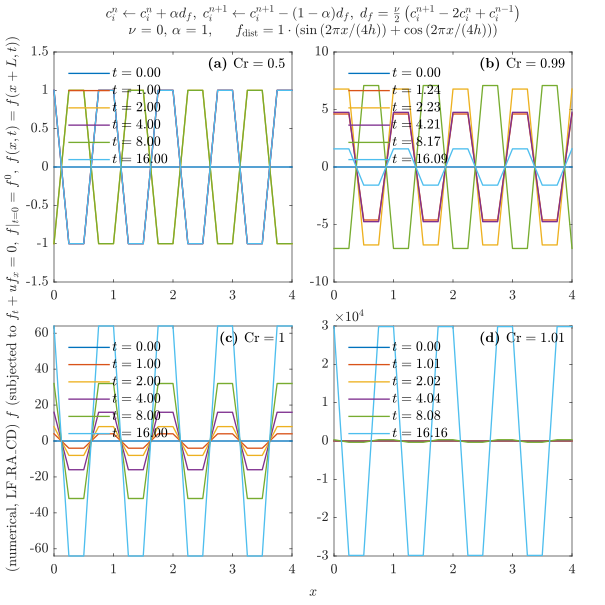
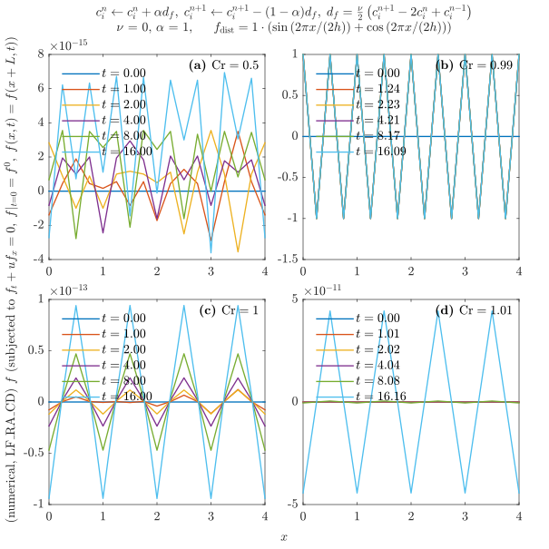
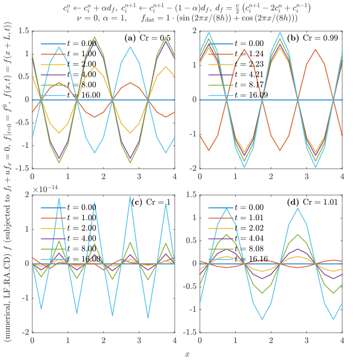

---
export_on_save:
  html: true
html:
  embed_local_images: true
  embed_svg: true
  offline: false
  toc: true
print_background: true
---

# Homework 3

- **Course:** Numerical Solutions to PDEs - FALL 2024
- **Instructor:** Zhou, Bowen ([周博闻](https://as.nju.edu.cn/54/79/c11339a218233/page.htm))
- **Due date:** Oct. 25, 2024
- **Submitted date:** Nov. 7, 2024
- **Problem set:** [PS3.pdf](https://box.nju.edu.cn/d/439906db314e411489a3/files/?p=%2FProblemSets%2FPS3.pdf)
- **Course website:** <https://grwei.github.io/NJU_070601C05_2024_Fall/>

> &ensp; &ensp; Describe the setup and each step in your solutions with words and clearly label your final answers. Use Matlab for plotting and programming and include your code as an appendix to your problem set.

## Table of Contents {ignore=true}

<!-- @import "[TOC]" {cmd="toc" depthFrom=1 depthTo=6 orderedList=false} -->

<!-- code_chunk_output -->

- [Homework 3](#homework-3)
  - [Problem 1](#problem-1)
  - [Problem 2](#problem-2)
  - [Acknowledgement](#acknowledgement)
  - [Contact Information](#contact-information)
  - [Appendix](#appendix)
    - [Matlab code for problem 1](#matlab-code-for-problem-1)
      - [hw3_1.m](#hw3_1m)
      - [AdvecProb2D.m](#advecprob2dm)

<!-- /code_chunk_output -->

## Problem 1

> &ensp; &emsp; Leapfrog for scalar advection.
>
> &ensp; &emsp; **(a)** Repeat the numerical solution of the scalar advection equation from Problem Set [#2](../hw2/hw2.md#problem-2) using leapfrog for time advancement and central differencing in space. Use the same pulse of dye and other problem parameters (just modify your old Matlab code). Plot the results for $\text{Cr} = 0.5$ on the same $c, x$ axis at $t = 0, 1, 2 \, \text{s}$ and describe your plot. Note: you will have to use a different method to advance the first time step. Make sure the scheme you use is stable.
>
> &ensp; &emsp; **(b)** Use modified equation analysis to examine the accuracy of the leapfrog time stepping scheme used above. Make sure to express the error terms using spatial derivatives. Describe the influence of the leading error terms (are they dissipative? dispersive?) on the behavior of the numerical solution compared to the exact solution.
>
> &ensp; &emsp; **(c)** Use Von Neumann stability analysis to determine the stability properties of this scheme. You will get a quadratic expression for $\sigma$ which you can solve using the quadratic formula.
>
> &ensp; &emsp; **(d)** To control the oscillations in the leapfrog-central scheme, various approaches can be used. One is to use what’s commonly known as the Asselin filter (also the Robert filter) to replace $c^n_i$ with
>
> $$c_i^n + \frac{\alpha}{2}\left( c_{i}^{n+1} - 2c_i^{n} + c_{i}^{n-1} \right)$$
>
> at each time step. Try this for your code from problem 1 above using Asselin coefficients $\alpha = 0.05$ (recommended value) and $\alpha = 1.0$. What happens to your solution? Plot your results.

&ensp; &emsp; 本节要求解一维平流问题 (Eq. (2.23) in [Hw2](../hw2/hw2.md#problem-2))

$$
\begin{equation*}
    \tag{1.1}
    \left\{
    \begin{aligned}
        & c_t + u c_x = 0, \quad t \ge 0, \; x \in [0, L], \\
        & \text{(I.C.)} \quad \left. c \right|_{t = 0} = c^0(x),\\
        & \text{(B.C.)} \quad  \left. c \right|_{x = 0} = \left. c \right|_{x = L} = 0,
    \end{aligned}
    \right.
\end{equation*}
$$

式中常数 $u > 0$. 在[上一章](../hw2/hw2.md#problem-2), 此问题用前向 Euler 迎风格式 (Eq. (2.26) in [Hw2](../hw2/hw2.md#problem-2)) 离散. 在这里, 我们试试 Leap-frog central difference 格式,

$$
\begin{equation*}
    \tag{1.2}
    \left\{
      \begin{aligned}
          & c^{n+1}_j = c^{n-1}_{j} - \text{Cr} \, (c_{j+1}^{n} - c_{j-1}^{n}), \quad n \in \mathbb{N^*}, \; j \in \mathbb{Z} \cap [0, L / h], \\
          & (\text{I.C.}) \quad c_j^0 = \left\{
              \begin{aligned}
                  & 1, \quad & jh \in (0, 0.5], \\
                  & 0, \quad & jh \notin (0, 0.5],
              \end{aligned}
          \right. \\
          & (\text{B.C.}) \quad c_j^n = 0, \quad jh \in (-\infty, 0] \cup [L, +\infty),
      \end{aligned}
    \right.
\end{equation*}
$$

其中 Courant number

$$
\begin{equation*}
    \text{Cr} := u \tau / h.
\end{equation*}
$$

&ensp; &emsp; **(a)** 用 Matlab 实现格式 (1.2), 首个时间步的积分方案采用显式 Euler 迎风格式. 结果表明, 当 $\mathrm{Cr} = 0.5$, 格式 (1.2) 稳定, 但出现虚假的振荡; 当 $\mathrm{Cr} = 1$, 格式 (1.2) 能还原精确解, 但 $\mathrm{Cr}$ 只要略增大, 格式就失去稳定性; 只要略减小, 数值解就立即出现明显的虚假振荡.


&ensp; &emsp; **(b)** 满足 Leap-frog central diff. 格式 (Eq. (1.2))

$$
\begin{equation*}
    \tag{1.3}
    \frac{c_{j}^{n+1} - c_{j}^{n-1}}{2 \tau} + u \frac{c^n_{j+1} - c^n_{j-1}}{2 h} = 0
\end{equation*}
$$

的 $\tilde{c} \in C^6(\mathbb{R})$ 成立

$$
\begin{equation*}
    \tag{1.4a}
    \tilde{c}_t + u \tilde{c}_x = -\frac{\tau^2}{6} \tilde{c}_{t^3} - \frac{h^2}{6} u \tilde{c}_{x^3} + \mathcal{O}(\tau^4 + h^4),
\end{equation*}
$$

这就是格式 (1.2) 的 modified equation. 与精确方程 (1.1) 比较, (1.4a) 右端有截断误差的意义, 所以说格式 (1.2) 具有二阶时间精度和二阶空间精度. 想把 (1.4a) 右端的 $\tilde{c}_{t^3}$ 项写成空间导数, 以明晰物理意义. 为此, 让 (1.4a) 分别被算子 $\partial_{t^2}, \partial_{tx}, \partial_{x^2}$ 作用, 得

$$
\begin{align*}
    \tag{1.5}
    \tilde{c}_{t^3} + u \tilde{c}_{t^2 x} & = \mathcal{O}(\tau^2 + h^2), \\
    \tag{1.6}
    \tilde{c}_{t^2 x} + u \tilde{c}_{tx^2} & = \mathcal{O}(\tau^2 + h^2), \\
    \tag{1.7}
    \tilde{c}_{t x^2} + u \tilde{c}_{x^3} & = \mathcal{O}(\tau^2 + h^2).
\end{align*}
$$

三式联立得

$$
\begin{equation*}
    \tag{1.8}
    \tilde{c}_{t^3} = -u^3 \tilde{c}_{x^3} + \mathcal{O}(\tau^2 + h^2),
\end{equation*}
$$

进而把 (1.4a) 改写为

$$
\begin{equation*}
    \tag{1.4b}
    \tilde{c}_t + u \tilde{c}_{x} = \frac{h^2}{6} u (\text{Cr}^2 - 1) \tilde{c}_{x^3} + \mathcal{O}(\tau^4 + \tau^2 h^2 + h^4).
    \end{equation*}
$$

&ensp; &emsp; 为获得关于 modified equation (1.4b) 的截断误差主部 (即右端第一项) 对数值解的影响的直观, 考虑波数为 $\xi$ 的单色平面波

$$
\begin{equation*}
    \tag{1.9}
    f(x, t) = \hat{f}(t) \exp{(\mathrm{i} \xi x)}
\end{equation*}
$$

在系统

$$
\begin{equation*}
    \tag{1.10}
    f_t = a f_{x^3}
\end{equation*}
$$

中的行为. 由满足 (1.10) 的 (1.9) 所具有的形式

$$
\begin{equation*}
    \tag{1.11}
    f = \hat{f}(0) \exp{\left[ \mathrm{i} \xi \left(x - a \xi^2 t \right) \right]}
\end{equation*}
$$

看出, Leap-frog central diff. 格式 (1.3) 的误差主部 (来自 (1.4b))

$$
\frac{h^2}{6} u (\text{Cr}^2 - 1) \tilde{c}_{x^3}
$$

会引入**数值色散** (numerical dispersion), 即相速度依赖波数, 且高频波传播更快, 使初值在积分过程中变形, 可能出现高频“噪声”. 而纯平流问题 (1.1) 的精确行为, 是初值保持原样移向下游, 直至在区域边界被完全吸收.

&ensp; &emsp; **(c)** 引入

$$
\begin{equation*}
    \tag{1.12}
    \boldsymbol{C}_j^{n} := \begin{bmatrix}
        c_j^n & c_{j}^{n-1}
    \end{bmatrix}^{\text{T}},
\end{equation*}
$$

则 Leap frog central difference 格式 (1.3) 写成

$$
\begin{equation*}
    \tag{1.13}
    \boldsymbol{C}_j^{n+1} = \begin{bmatrix}
        -\text{Cr} & \\
        & 0\\
    \end{bmatrix} \boldsymbol{C}_{j+1}^{n} + \begin{bmatrix}
        & 1 \\
        1 &
    \end{bmatrix} \boldsymbol{C}_j^n + \begin{bmatrix}
        \text{Cr} & \\
        & 0
    \end{bmatrix} \boldsymbol{C}_{j-1}^n.
\end{equation*}
$$

为讨论格式 (1.3) 或 (1.13) 的稳定性, 考虑波数为 $\xi$ 的单色平面波

$$
\begin{equation*}
    \tag{1.14}
    \boldsymbol{C}_j^n = \hat{\boldsymbol{C}}(t_n) \exp{(\mathrm{i}\xi x_j)}
\end{equation*}
$$

在 (1.13) 积分过程中的表现, 发现有

$$
\begin{equation*}
    \tag{1.15}
    \boldsymbol{C}_j^{n+1} = \boldsymbol{G} \boldsymbol{C}_j^{n},
\end{equation*}
$$

其中**复增长矩阵**

$$
\begin{equation*}
    \tag{1.16}
    \boldsymbol{G} = \boldsymbol{G}(\xi, \tau, h) := \begin{bmatrix}
        -\mathrm{i}\, 2 \, \text{Cr} \sin{(\xi h)} & 1 \\
        1 & 0
    \end{bmatrix}
\end{equation*}
$$

的特征值 $\lambda$ 满足

$$
\begin{equation*}
    \tag{1.17a}
    \left\{
    \begin{aligned}
        & \lambda_1 + \lambda_2 = \mathop{\text{tr}}{\boldsymbol{G}} = - \mathrm{i}\, 2 \, \text{Cr} \sin{(\xi h)}, \\
        & \lambda_1 \lambda_2 = \det{\boldsymbol{G}} = -1,
    \end{aligned}
    \right.
\end{equation*}
$$

即是特征方程

$$
\begin{equation*}
    \tag{1.17b}
    0 = \det{(\lambda \boldsymbol{I} - \boldsymbol{G})} = \lambda^2 + \mathrm{i} \, 2 \lambda \, \text{Cr} \sin{(\xi h)} - 1
\end{equation*}
$$

在复数域上的两个根.

&ensp; &emsp; 常系数线性发展方程格式稳定的充要条件 (Eq. (3.20) in Durran[^1] ([2012](https://doi.org/10.1007/978-1-4419-6412-0))) 是 $\exist \tau_0, \, K, \, \forall \tau \le \tau_0, \, n \tau \le T, \, |\xi h| \le \pi:$

$$
\begin{equation*}
    \tag{1.18}
    \| \boldsymbol{G}(\xi, \tau, h) \|^n \le K.
\end{equation*}
$$

[^1]: Dale R. Durran (2012). *Numerical Methods for Fluid Dynamics: With Applications to Geophysics* [Book]. Springer New York, NY. <https://doi.org/10.1007/978-1-4419-6412-0>

Eq. (1.18) 蕴含 ($\rho(G)$ 是 $\boldsymbol{G}$ 的谱半径)

$$
\begin{align*}
    & (\rho(G))^n = \rho(G^n) \le \|G\|^n \le K, \quad (\forall n \tau \le T), \\
    \Rightarrow & \, \rho(G) \le K^{1/N} = K^{\tau/T} \le 1 + M \tau, \quad (\exist M = M(\tau_0, K), \, \forall \tau \le \tau_0). \tag{1.19}
\end{align*}
$$

Eq. (1.19) 被称为 **von Neumann 条件**, 是常系数线性发展方程格式稳定的一个**必要**条件. 此外, 若复增长矩阵 $G$ 满足

$$
\begin{equation*}
    \tag{1.20}
    \| G(\xi, \tau, h) \| \le 1 + M \tau, \quad (\exist M > 0, \, \forall |\xi h| \le \pi),
\end{equation*}
$$

则 (1.18) holds, 故 (1.20) 是格式稳定的一个充分条件. 故若 $\rho(G)$ 是 $G$ 的一种矩阵范数 (例如, 当 $G$ 是正规矩阵, 或是标量), 则 von Neumann 条件 (1.19) 成为格式稳定的充要条件. 简单起见, 且考虑物理意义 (波动不增长), 以后我们将稳定性 (充要) 条件取为 Eq. (3.21) in Durran[^1] ([2012](https://doi.org/10.1007/978-1-4419-6412-0)),

$$
\begin{equation*}
    \tag{1.21}
    \| G \| \le 1,
\end{equation*}
$$

使 von Neumann 条件 (1.19) 加强为, 复增长矩阵 $G$ 的**所有**特征值 $\lambda$ 均满足

$$
\begin{equation*}
    \tag{1.22}
    |\lambda| \le 1.
\end{equation*}
$$

&ensp; &emsp; 现在证明, 对于 Leap frog central difference 格式 (1.13), 稳定性条件 (1.22) 等价于

$$
\begin{equation*}
    \tag{1.23}
    |u| \tau / h = |\text{Cr}| \le 1.
\end{equation*}
$$

先证必要性. 若 (1.22) 成立, 则由 (1.17a) 第二式知 $\lambda_1, \lambda_2$ 落在复平面的单位圆上 (即 $|\lambda_1| = |\lambda_2| = 1$); 再由 (1.17a) 第一式得

$$
\begin{equation*}
    \tag{1.24}
    2 \, |\text{Cr} \, \sin{(\xi h)}| = |
    \lambda_1 + \lambda_2| \le |\lambda_1| + |\lambda_2| = 2
\end{equation*}
$$

对一切 $|\xi h| \le \pi$ 成立, 故有 (1.23). 必要性证毕. 再证充分性. 若 (1.23) 成立, 则从 (1.17a) 看出, 对任意 $|\xi h| \le \pi$, 存在复平面的单位圆上关于虚轴对称的两点 $\lambda_1, \lambda_2$ 满足 (1.17a), 而除此以外 (1.17b) 没有其他解 (代数基本定理), 故 $\lambda_1, \lambda_2$ 是 $G$ 的全部特征值. 因它们的幅值均为 1, 故有 (1.22). 充分性证毕. 证毕.

&ensp; &emsp; <span style="color: blue"> 严格来说, 对于格式 (1.13), Eq. (1.24) 及与之等价的 (1.22) 对稳定性条件 (1.21) 的充分性尚未被讨论. </span> 我们很快会看到, $|\text{Cr}| = 1$ 不能保证格式 (1.13) 的稳定性.

&ensp; &emsp; 格式 (1.13) 稳定振荡的现象, 可用 Fourier 分析予以解释. 在格式稳定的必要条件 (1.23) 被满足的前提下, 考虑 $\xi$ -单波 (1.14). 对于 $|\text{Cr} \, \sin{(\xi h)}| < 1$, 复增长矩阵 (1.16) 有两个不相等的特征值, 从而可被相似对角化. 又由 (1.15) 知, 存在可逆矩阵 $P = P(\xi, \tau, h)$, 使

$$
\begin{equation*}
    \tag{1.25}
    \boldsymbol{C}_j^{n+1} = P \begin{bmatrix*}
        \lambda_1 & \\
        & \lambda_2
    \end{bmatrix*}^n P^{-1} \boldsymbol{C}_j^{1},
\end{equation*}
$$

其中

$$
\begin{align*}
    \tag{1.26}
    \lambda_{1,2} = \pm \sqrt{1 - \text{Cr}^2 \sin^2 (\xi h)} - \mathrm{i} \, \text{Cr} \, \sin{(\xi h)}
\end{align*}
$$

是复增长矩阵 (1.16) 的两个特征值. 另一方面, $\xi$- 单波 $\boldsymbol{C}_j^n$ 由 (1.1) 的方程所决定的精确行为是

$$
\begin{equation*}
    \tag{1.27}
    \tilde{\boldsymbol{C}}_j^{n+1} = P \begin{bmatrix*}
        \tilde{\lambda} & \\
        & \tilde{\lambda}
    \end{bmatrix*}^n P^{-1} \tilde{\boldsymbol{C}}_j^{1},
\end{equation*}
$$

其中

$$
\begin{equation*}
    \tag{1.28}
    \tilde{\lambda} = \exp{(-\mathrm{i} \xi u \tau)} = \exp{(-\mathrm{i} \, \xi h \, \text{Cr})}.
\end{equation*}
$$

可见, 此时格式 (1.13) 稳定, 且数值行为特征值 (1.26) 与精确行为特征值 (1.28) 的幅值相同 (均为 1), 但相位不同, 即存在相位误差. 特别地, 当 $\xi h \, \text{Cr} \to 0$, 有 $\tilde{\lambda} \to 1$, 而 $\lambda_{1,2} \to \pm 1$. 此时, 数值模式 1 的特征值 $\lambda_1$ 趋于精确行为, 对应**物理模式** (physical mode). 而数值模式 2 的特征值 $\lambda_2$ 远离精确行为, 对应**计算模式** (computational mode), 是由数值格式引入的虚假模式. 在这种极限情形下, 计算模式虽然保持特征值幅值为 1, 从而不引起不稳定, 但每积分一个时间步都要变化一次正负号, 引起数值解稳定振荡. 一般地, 对取定的 $\xi h$, 随着 $\text{Cr}$ 从 $0$ 变化到 $1$, 数值行为特征值 (1.26) 和精确行为特征值 (1.28) 在复平面的单位圆上运动 (下图).

&ensp; &emsp; 对于 $\text{Cr} \, \sin{(\xi h)} = \pm 1$ (此时 $|\text{Cr}| = 1$ 且 $|\xi h| = \pi / 2$), 情况将有所不同. 此时, 复增长矩阵 (1.16) 成为

$$
\begin{equation*}
    \tag{1.29}
    G = \begin{bmatrix}
        \mp 2 \mathrm{i} & 1\\
        1 &
    \end{bmatrix},
\end{equation*}
$$

其特征值 (1.26)

$$
\begin{equation*}
    \tag{1.30}
    \lambda_1 = \lambda_2 = \mp \mathrm{i} = \tilde{\lambda}
\end{equation*}
$$

与精确行为的特征值 (1.28) 相同. 这特征值的几何重数 (特征子空间的维数) $2 - \mathop{\text{rank}}(\lambda I - G) = 1$ 小于代数重数 $2$, 故 $G$ 与其 Jordan 标准型

$$
\begin{equation*}
    \tag{1.31}
    J = \begin{bmatrix}
        \mp \mathrm{i} & 1 \\
        & \mp \mathrm{i}
    \end{bmatrix}
\end{equation*}
$$

相似,

$$
\begin{equation*}
    \tag{1.32}
    G = PJP^{-1},
\end{equation*}
$$

且 $P$ 可取为

$$
\begin{equation*}
    \tag{1.33}
    P = (\eta_1, \eta_2),
\end{equation*}
$$

其中

$$
\begin{equation*}
    \tag{1.34}
    \eta_1 = \begin{bmatrix}
        \mp \mathrm{i} & 1
    \end{bmatrix}', \quad \eta_2 = \begin{bmatrix}
        1 & 0
    \end{bmatrix}'
\end{equation*}
$$

是方程

$$
\begin{align*}
    \tag{1.35a}
    & (G - \lambda I) \eta_1 = 0, \\
    \tag{1.35b}
    & (G - \lambda I) \eta_2 = \eta_1
\end{align*}
$$

的一个解. 由 (1.15), 有 (这结果疑似有问题, 有空用 [MMA](https://www.wolfram.com/) 算算)

$$
\begin{equation*}
    \tag{1.36a}
    \begin{aligned}
        \boldsymbol{C}_j^{n+1} & = P J^n P^{-1} \boldsymbol{C}_j^{1} \\
        & = (\tilde{\lambda})^n \boldsymbol{C}_j^1 - n (\mp \mathrm{i})^n \begin{bmatrix}
            \mp \mathrm{i} c_j^1 & c^0_j
        \end{bmatrix}'.
    \end{aligned}
\end{equation*}
$$

Eq. (1.36a) 右端第一项与精确行为 (1.27) 一致, 第二项是幅度不断增长 (是 $\mathcal{O}(\tau^{-1})$ 量级的无穷大量 as $\tau \to 0^+$) 的误差项. 把 (1.36a) 写成 ($c^1 = 0$ ??)

$$
\begin{equation*}
    \tag{1.36b}
    c_j^n = (1 - n) (\mp \mathrm{i})^n c_j^0 = (1 - n) \tilde{c}_j^n,
\end{equation*}
$$

或绝对误差

$$
\begin{equation*}
    \tag{1.36c}
    e_j^n := c_j^n - \tilde{c}_j^n = -n \tilde{c}_j^n,
\end{equation*}
$$

看出对于使 $\text{Cr} \, \sin{(\xi h)} = \pm 1$ 的 $\xi$ -单波, 用格式 (1.13) 的积分结果没有相位误差, 但有不断增长的幅值误差, the scheme is unstable and divergent. 这是对于周期信号而言的. 而对于 $h \mathbb{Z}$ 上的平方可和的信号, 其频谱密度关于波数 $\xi$ 是在 $[-\pi / h, \pi / h)$ 上连续分布, 故至多可数个频谱分量的强度不影响叠加结果, 所以认为 $\mathrm{Cr} = 1$ 依然保证格式 (1.13) 的稳定性. <span style="color: blue;">对于有限长度的非周期信号, 格式 (1.13) 需要设置合适的初始和边界条件, 上述 Fourier 分析似乎不能严格地适用?</span>

&ensp; &emsp; 综上, 格式 (1.13) 稳定的充要条件是

$$
\begin{equation*}
    \tag{1.37}
    |\text{Cr}| = |u| \tau / h < 1.
\end{equation*}
$$

当格式稳定时, 数值解中存在虚假的计算模式, 特征值 (1.26) 与精确行为特征值 (1.28) 的差异造成数值解的稳定振荡现象.

&ensp; &emsp; Eq. (1.36b) 是从频谱空间得到的结果; 下面, 我们转向物理空间, 探讨 $\mathrm{Cr} = \pm 1$ 时格式 (1.13) 的稳定性. 这时 Leap-frog central diff. (LF_CD) 迭代格式 (1.3) 成为

$$
\begin{equation*}
    \tag{1.38}
    c_j^{n+1} - c_{j \mp 1}^n = (-1)(c_{j \pm 1}^n - c_j^{n-1}).
\end{equation*}
$$

若首个时间步的数值积分结果精确, 例如用 $\mathrm{Cr} = \pm 1$ 的迎风格式使 $c^0$ 和 $c^1$ 还原精确解, 则用 LF_CD 方案 (1.38) 的数值积分

$$
\begin{equation*}
    \tag{1.39}
    c^n_j = c^0_{j \mp n} = c^0(x_j \mp n\tau u)
\end{equation*}
$$

就是精确解.

&ensp; &emsp; 对于 $\mathrm{Cr} = 1$ 的 LF_CD 方案 (1.38), 若在首个时间步的积分引入一个周期为四个网格距的扰动, 情况将明显不同. 定义

$$
\begin{equation*}
    \tag{1.40}
    e_j^n := c_j^n - \tilde{c}_j^n
\end{equation*}
$$

为**绝对误差**, 其中 (不妨设置 $u > 0$)

$$
\begin{equation*}
    \tag{1.41}
    \tilde{c}_j^n := c^0(x_j - n \tau u)
\end{equation*}
$$

是一维平流问题 (1.1) 的精确解. 由 (1.38) 得误差传递关系

$$
\begin{align*}
    \tag{1.42a}
    e_j^{n+1} - e_{j-1}^n & = (-1)(e^n_{j+1} - e^{n-1}_j) \\
    \tag{1.42b}
    & = (-1)^n (e^1_{j+n} - e^0_{j+n-1}),
\end{align*}
$$

进而

$$
\begin{equation*}
    \tag{1.42c}
    e_j^{n+1} = e^0_{j-n-1} + \sum_{k = 0}^{n} {(-1)^k e^1_{j-n+2k}}.
\end{equation*}
$$

设初始状态被精确离散 (i.e., $e^0 = 0$), 且首个时间步的积分引入误差

$$
\begin{equation*}
    \tag{1.43}
    e_j^1 = A \cos{(j \pi / 2)} + B \sin{(j \pi / 2)},
\end{equation*}
$$

则由 (1.42c)(1.43) 得

$$
\begin{equation*}
    \tag{1.44}
    \begin{aligned}
        e_j^{n+1} & = \sum_{k = 0}^{n} {
        (-1)^k \left[ A \cos{(k\pi + (j-n) \pi / 2)} + B \sin{(k\pi + (j-n) \pi / 2)} \right]
    } \\
    & = \sum_{k = 0}^{n} {
        \left[ A \cos{((j-n) \pi / 2)} + B \sin{((j-n) \pi / 2)} \right]
    },
    \end{aligned}
\end{equation*}
$$

进而长度为 $M$ 的误差向量 $e^n$ 的 $L^2$-norm 满足

$$
\begin{equation*}
    \tag{1.45}
    M^{-1/2} \| e^n \|_2 \to n \sqrt{(A^2 + B^2) / 2}, \quad (M \to +\infty),
\end{equation*}
$$

即误差按 $\mathcal{O}(n) = \mathcal{O}(\tau^{-1})$ 量级增长, LF_CD scheme (1.13) is un-stable and in-consistent. 而若首个时间步积分没有误差, 则用 $\mathrm{Cr} = 1$ 的 LF_CD scheme (1.13) 将得到精确解 (1.39); 但这种临界稳定状态很危险, 首步积分稍有误差就可能 blows up, 所以最好让更严格的 (1.22) 即 (1.37) 成立以保证稳定性.

&ensp; &emsp; 从时域分析得到的 Eq. (1.45), 与从 Fourier 频域分析得到 Eq. (1.39) 意义相近, 都是说 $\mathrm{Cr} \, \sin{(\xi h)} = \pm 1$ 的单色波经过 LF_CD 格式 (1.3) 会 blows up. 然而, 时域和频域结果在细节上似乎有些差异. 例如, 时域结果 (1.39)(1.45) 能解释本文第 **1(a)** 节图 (c) 为何在临界稳定的情况下能得到精确解, 而这似乎是频域分析结果 Eq. (1.39) 所不能直接做到的. <b style="color: blue;">对这种差异的数学和物理解释, 可能是重要的, which 关系对 von Neumann 分析方法的准确理解. 我在此呼吁进一步讨论, 请求有兴趣的读者提供帮助! 文末附有[联系方式](mailto:313017602@qq.com).</b> 下面的简单试验也许可作为讨论的开始.

&ensp; &emsp; 为验证 (1.36) 或 (1.45), 设计了下述实验. 对 LF_CD 格式 (1.13), 提供零初值, 采取周期边界, 周期是扰动信号周期 (4 个网格距) 的 $2^{k}, \, k \in \mathbb{N}^*$ 倍. 首步积分采取迎风格式 (参见 [Hw 2 - Problem 2](../hw2/hw2.md#problem-2)), 对首步积分结果添加扰动信号 (1.43), 取不同的 $\text{Cr}$ 作积分. 将扰动改为 (1.43) 的倍频或半频信号, 重复实验. 结果示于下图. 试验结果表明, LF_CD 格式 (1.13) 当取 $\text{Cr} = 1$ 时, 对于 $\xi h = \pi / 2$ 的中频扰动信号不稳定, 误差幅值与积分时间成正比; 对于 $\xi h = \pi / 4$ 的低频信号和 $\xi h = \pi / 1$ 的高频信号稳定 (下图 (c), 下下图 (c) 中误差很小, 但也表现出正比于积分时间的增长趋势, 这如何解释?). 这就验证了 (1.45). 但如何理解 (1.36)?







&ensp; &emsp; **(d)** 为缓解 Leap-frog central diff. 格式 (1.13) 的稳定振荡 (computational mode) 现象, 一种方案是引入 Robert–Asselin (RA) time filter (Robert[^2], [1966](https://doi.org/10.2151/jmsj1965.44.5_237); Asselin[^3], [1972](https://doi.org/10.1175/1520-0493(1972)100<0487:FFFTI>2.3.CO;2)). 具体来说, 就是在**每次**完成 $t_{n+1}$ 时步的积分**之后**, 执行赋值语句 (Ferziger[^5] *et al*., [2020](https://doi.org/10.1007/978-3-319-99693-6), Eq. (6.47))

$$
\begin{equation*}
    \tag{1.46}
    c^n_i \leftarrow c_i^n + \frac{\nu}{2}\left( c_{i}^{n+1} - 2c_i^{n} + c_{i}^{n-1} \right) = c_i^n + d_f.
\end{equation*}
$$

针对 RA time filter (1.46) 引入的 undesired numerical damping 和精度下降的问题, Williams[^4] ([2009](https://doi.org/10.1175/2009MWR2724.1)) 对 (1.38) 提出改进 (Ferziger[^5] *et al*., [2020](https://doi.org/10.1007/978-3-319-99693-6), Eq. (6.48)(6.49)),

$$
\begin{align*}
    \tag{1.47a}
    & c^n_i \leftarrow c_i^n + \alpha d_f, \\
    \tag{1.47b}
    & c^{n+1}_i \leftarrow c_i^{n+1} - (1 - \alpha) d_f.
\end{align*}
$$

通常, 滤波器参数 $\nu$ 取 0.01–0.2, 且取 $\alpha \ge 0.5$ 以保证稳定性. Eq. (1.46)(1.47) 的几何意义示于下图 (Williams, [2009](https://doi.org/10.1175/2009MWR2724.1), his Fig. 1).

[. Graphical comparison of the operation of (a) the standard Robert–Asselin filter and (b) the modified family of filters proposed in this paper. Points at three consecutive time levels are shown (marked with times signs) and a straight line is drawn between the two outer points (dashed). The standard filter moves the inner point through a displacement d, defined by (1). The modified filter moves the inner and right outer points through displacements αd and (α − 1)d, respectively, where 0 ≤ α ≤ 1. For the configuration of three points shown, d > 0.")](https://doi.org/10.1175/2009MWR2724.1)

[^2]: Robert, A. J. (1966). The integration of a low order spectral form of the primitive meteorological equations. *J. Meteor. Soc. Japan*, *44*, 237–245. <https://doi.org/10.2151/jmsj1965.44.5_237>

[^3]: Asselin, R. (1972). Frequency filter for time integrations. *Monthly Weather Review*, *100*, 487–490. [https://doi.org/10.1175/1520-0493(1972)100<0487:FFFTI>2.3.CO;2](https://doi.org/10.1175/1520-0493(1972)100<0487:FFFTI>2.3.CO;2)

[^4]: Williams, P. D. (2009). A Proposed Modification to the Robert–Asselin Time Filter. *Monthly Weather Review*, *137*(8), 2538–2546. <https://doi.org/10.1175/2009MWR2724.1>

[^5]: Joel H. Ferziger, Milovan Perić & Robert L. Street (2020). *Computational Methods for Fluid Dynamics* [Book]. Springer Cham. <https://doi.org/10.1007/978-3-319-99693-6>

&ensp; &emsp; 用 Matlab 编程, 为格式 (1.3) 添加 RA time filter (1.46). 数值积分结果表明, 当 $\nu = 0.05$, 虚假振荡现象略有改善, 但临界稳定 $\mathrm{Cr}$ 由 $1$ 左移至约 $0.98$. 若增大 $\nu$ 至 $\nu = 1$, 则虚假振荡被进一步消除, 但物理信号也被过度衰减, 且临界稳定 $\mathrm{Cr}$ 进一步左移至约 0.60, 使时间步长的取值被限制. 若引入 Williams ([2009](https://doi.org/10.1175/2009MWR2724.1)) 的改进 (1.47), 则物理信号被过度衰减的问题可获改善, 但虚假振荡的消除效果亦被削弱. 可通过优化滤波器参数 $\nu$ 和 $\alpha$ 的选取, 使数值积分取得更优效果. 该实验体现了多参数联合调优在数值积分性能优化工作中的意义.


## Problem 2

> &ensp; &emsp; Consider the following numerical method which is proposed for solving $\frac{\partial u}{\partial t} = c \frac{\partial u}{\partial x}$,
>
> $$\frac{1}{\Delta t} \left[ u_j^{n+1} - \frac{1}{2} \left(u^n_{j+1} + u^n_{j-1} \right) \right] = \frac{c}{2 \Delta x} \left( u^n_{j+1} - u^n_{j-1} \right).$$
>
> Use von Neumann stability analysis to find the range of Courant numbers for which this method is stable. Perform modified equation analysis on this method. Is the method consistent, i.e. does it reduce to the original PDE as $\Delta x$ and $\Delta t$ each go to zero?

&ensp; &emsp; 满足格式

$$
\begin{equation*}
    \tag{2.1}
    \frac{1}{\tau} \left[ u_j^{n+1} - \frac{1}{2} \left(u^n_{j+1} + u^n_{j-1} \right) \right] = \frac{c}{2 h} \left( u^n_{j+1} - u^n_{j-1} \right)
\end{equation*}
$$

的 $\tilde{u} \in C^6(\mathbb{R})$ 成立 modified equation

$$
\begin{equation*}
    \tag{2.2}
    \tilde{u}_t - c\tilde{u}_x = \frac{\tau}{2} \tilde{u}_{t^2} - \frac{h^2}{2 \tau} \tilde{u}_{x^2} + \frac{h^2}{6} c \tilde{u}_{x^3} + \mathcal{O}(\tau^2 + h^4 \tau^{-1} + h^4),
\end{equation*}
$$

故格式 (2.1) is consistent iff. $(\tau, h)$ 沿 $h^2 = o(\tau) \; \mathrm{as} \; \tau \to 0$ 的路径趋于 $(0,0)$.

&ensp; &emsp; 格式 (2.1) 的复增长因子

$$
\begin{equation*}
    \tag{2.3}
    G = \cos{(\xi h)} + \mathrm{i} \frac{c \tau}{h} \sin{(\xi h)}
\end{equation*}
$$

满足加强的 von Neumann 条件 (1.22)

$$
\begin{equation*}
    \tag{2.4}
    \forall |\xi h| \le \pi : \; |G|^2 = 1 + ((c \tau / h)^2 - 1) \sin^2{(\xi h)} \le 1
\end{equation*}
$$

iff. Courant number 的平方

$$
\begin{equation*}
    \tag{2.5}
    \mathrm{Cr}^2 := (c \tau / h)^2 \le 1.
\end{equation*}
$$

## Acknowledgement

&ensp; &emsp; I am grateful to my fellow PhD student, Dan Cao (曹丹), whose insightful discussions significantly enriched this research.

## Contact Information

- **Author:** Guorui Wei (危国锐)
- **E-mail:** [313017602@qq.com](mailto:313017602@qq.com)
- **Website:** <https://github.com/grwei>

## Appendix

### Matlab code for problem 1

#### hw3_1.m

```matlab {.line-numbers}
%% hw3_1.m
% Description: Solving the 1-D advection problem: c_t + u c_x = 0
% Author: Guorui Wei (危国锐) (313017602@qq.com)
% Created at: Nov. 7, 2024
% Last modified: Nov. 9, 2024
%

clear; clc; close all

addpath("..\hw2\")
if ~isfolder(".\fig\")
    mkdir(".\fig\")
end

%% Problem 1(a)

Cr_list = [.50, .99, 1.00, 1.01]; % Cr = u delta_t / delta_x
[f_list, x_grid, t_list] = hw3_1_unit("time_leap_frog_RA_space_central_diff", Cr_list, true, nu=0, alpha=1);

%% Problem 1(d)

Cr_list = [.50, .75, .975, 1]; % Cr = u delta_t / delta_x
[f_list, x_grid, t_list] = hw3_1_unit("time_leap_frog_RA_space_central_diff", Cr_list, true, nu=.05, alpha=1);

Cr_list = [.50, .75, .975, 1]; % Cr = u delta_t / delta_x
[f_list, x_grid, t_list] = hw3_1_unit("time_leap_frog_RA_space_central_diff", Cr_list, true, nu=.05, alpha=.53);

Cr_list = [.50, .25, .57, .60]; % Cr = u delta_t / delta_x
[f_list, x_grid, t_list] = hw3_1_unit("time_leap_frog_RA_space_central_diff", Cr_list, true, nu=1, alpha=1);

Cr_list = [.50, .25, .57, .60]; % Cr = u delta_t / delta_x
[f_list, x_grid, t_list] = hw3_1_unit("time_leap_frog_RA_space_central_diff", Cr_list, true, nu=1, alpha=.53);

Cr_list = [.50, .25, .57, .60]; % Cr = u delta_t / delta_x
[f_list, x_grid, t_list] = hw3_1_unit("time_leap_frog_RA_space_central_diff", Cr_list, true, nu=.2, alpha=.53);

%% 首步扰动试验

clc;clear;close all;

scheme_name = "time_leap_frog_RA_space_central_diff";
Cr_list = [.5, .99, 1, 1.01];
delta_x = 0.25;
x_range = {[0, delta_x*4*(2^2)], };
% init_func = @(x) double(x > 0 & ~(x > .5));
init_func = @(x) zeros(size(x));
bndry_func = @(x, t) "periodic";
t_query = [0, 1, 2, 4, 8, 16];
ra_opts.nu = 0;
ra_opts.alpha = 1;
flag_save = true;

%%% 周期 4h

disturb_func_first_step = @(x) 1*(sin(2*pi / 4 / delta_x * x) + cos(2*pi / 4 / delta_x * x));
disturb_func_disp_str = "$f_{\rm{dist}} = 1 \cdot (\sin{(2 \pi x / (4h))} + \cos{(2 \pi x / (4h))})$";
fig_name = "fig_disturb_test_4h";

[f_list, x_grid, t_list] = disturb_test_unit(scheme_name, Cr_list, x_range, init_func, bndry_func, disturb_func_first_step, disturb_func_disp_str, delta_x, t_query, flag_save, fig_name, nu=ra_opts.nu, alpha=ra_opts.alpha);

%%% 周期 2h (Nyquist)

disturb_func_first_step = @(x) 1*(sin(2*pi / 2 / delta_x * x) + cos(2*pi / 2 / delta_x * x));
disturb_func_disp_str = "$f_{\rm{dist}} = 1 \cdot (\sin{(2 \pi x / (2h))} + \cos{(2 \pi x / (2h))})$";
fig_name = "fig_disturb_test_2h";

[f_list, x_grid, t_list] = disturb_test_unit(scheme_name, Cr_list, x_range, init_func, bndry_func, disturb_func_first_step, disturb_func_disp_str, delta_x, t_query, flag_save, fig_name, nu=ra_opts.nu, alpha=ra_opts.alpha);

%%% 周期 8h

disturb_func_first_step = @(x) 1*(sin(2*pi / 8 / delta_x * x) + cos(2*pi / 8 / delta_x * x));
disturb_func_disp_str = "$f_{\rm{dist}} = 1 \cdot (\sin{(2 \pi x / (8h))} + \cos{(2 \pi x / (8h))})$";
fig_name = "fig_disturb_test_8h";

[f_list, x_grid, t_list] = disturb_test_unit(scheme_name, Cr_list, x_range, init_func, bndry_func, disturb_func_first_step, disturb_func_disp_str, delta_x, t_query, flag_save, fig_name, nu=ra_opts.nu, alpha=ra_opts.alpha);

%% Function: Unit

function [f_list, x_grid, t_list] = hw3_1_unit(scheme_name, Cr_list, flag_save, ra_opts)
    arguments (Input)
        scheme_name = "time_leap_frog_RA_space_central_diff";
        Cr_list = [.5, .99, 1, 1.01]; 
        flag_save = false;
        ra_opts.nu = 0;
        ra_opts.alpha = 1;
    end
    
    solver = AdvecProb2D();

    %%% Solver params (1-D Advection problem)

    velocity = [1, ];
    t_start = 0;
    x_range = {[0, 4], };
    init_func = @(x) double(x > 0 & ~(x > .5));
    bndry_func = @(x, t) double(x > x_range{1}(1) & x < x_range{1}(2));
    delta_x = 0.05;
    t_query = [0, 1, 2, 3];

    %%% Solving

    % Cr_list = [.5, .99, 1, 1.01]; % Cr = u delta_t / delta_x
    f_list = cell(length(Cr_list), 1);
    x_grid = f_list;
    t_list = x_grid;
    for test_idx = 1:length(Cr_list)
        Cr = Cr_list(test_idx);
        delta_t =  Cr * delta_x / velocity(1);
        params_struct = AdvecProb2D.prepare_params(velocity, t_start, x_range, init_func, bndry_func, delta_t, delta_x, t_query);
        solver.reset(params_struct);
        solver.solve(scheme_name, nu=ra_opts.nu, alpha=ra_opts.alpha);
        [f_list{test_idx}, x_grid{test_idx}, t_list{test_idx}, ~] = solver.get_solution();
    end

    %%% Create figure
    switch scheme_name
        case "time_forward_Euler_space_upwind"
            fig_name_prefix = "fig_upwind";
            scheme_name_short = "upwind";
        case "time_forward_Euler_space_central_diff"
            fig_name_prefix = "fig_centdif";
            scheme_name_short = "central diff.";
        case "time_leap_frog_RA_space_central_diff"
            fig_name_prefix = sprintf("fig_LF_RA_CD_nu_%.2g_alpha_%.2g", ra_opts.nu, ra_opts.alpha);
            scheme_name_short = "LF\_RA\_CD";
        otherwise
            fig_name_prefix = "fig_undefined";
            scheme_name_short = "unknown scheme";
    end

    t_fig = figure(Name=sprintf("%s_Cr_compare_1", fig_name_prefix));

    % set figure size
    UNIT_ORIGINAL = t_fig.Units;
    t_fig.Units = "centimeters";
    t_fig.Position = [3, 3, 16, 16];
    t_fig.Units = UNIT_ORIGINAL;

    % plot
    t_TCL = tiledlayout(t_fig, floor(length(Cr_list) / 2), 2, TileSpacing="compact", Padding="compact");
    xlabel(t_TCL, "$x$", Interpreter="latex", FontSize=10.5);
    ylabel(t_TCL, "(numerical, " + scheme_name_short + ") $f$ (subjected to $f_{t} + u f_x = 0, \; f|_{t = 0} = f^0, \; f|_{x \in \partial \Omega} = 0$)", Interpreter="latex", FontSize=10.5);
    if scheme_name == "time_leap_frog_RA_space_central_diff"
        title(t_TCL, {"$c^n_i \leftarrow c_i^n + \alpha d_f, \; c^{n+1}_i \leftarrow c_i^{n+1} - (1 - \alpha) d_f, \; d_f = \frac{\nu}{2} \left( c_{i}^{n+1} - 2c_i^{n} + c_{i}^{n-1} \right)$"; sprintf("$\\nu$ = %.3g, $\\alpha$ = %.3g", ra_opts.nu, ra_opts.alpha)}, Interpreter="latex", FontSize=10.5);
    end

    for test_idx = 1:length(Cr_list)
        t_axes = nexttile(t_TCL, test_idx);
        hold(t_axes, "on");
        for t_query_idx = 1:length(t_list{test_idx})
            plot(t_axes, x_grid{test_idx}{1}, f_list{test_idx}{t_query_idx}, LineWidth=1.0, DisplayName=sprintf("$t = %.2f$", t_list{test_idx}(t_query_idx)))
        end
        set(t_axes, FontName="Times New Roman", FontSize=10.5, Box="on", TickLabelInterpreter="latex", ...
            Tag=sprintf("(%c) $\\mathrm{Cr} = %g$", char('a' - 1 + test_idx), Cr_list(test_idx)));
        legend(t_axes, Location="northwest", Interpreter="latex", FontSize=10.5, Box="off");
    end

    for t_axes = findobj(t_TCL, 'Type', "Axes", {'-regexp', 'Tag', "^\([a-z]+\)"}).'
        str_{1} = "\bf " + t_axes.Tag;
        t_txt_box = annotation(t_fig, "textbox", String=str_, Position=[t_axes.Position([1, 2]) + t_axes.Position([3, 4]), .1, .1], FontSize=10.5, Interpreter="latex", LineStyle="none", HorizontalAlignment="right", VerticalAlignment="top");
        UNIT_ORIGINAL = t_txt_box.Units;
        t_txt_box.Units = "points";
        t_txt_box.Position = [t_txt_box.Position([1,2]) - [10.5*10, 10.5*1.5], 10.5*10, 10.5*1.5];
        t_txt_box.Units = UNIT_ORIGINAL;
    end

    if flag_save
        print(t_fig, ".\fig\" + t_fig.Name + ".svg", "-vector", "-dsvg")
    end

    %%% Fig. Cr compare fixed t
    t_fixed = 2;
    t_fig = figure(Name=sprintf("%s_Cr_compare_2", fig_name_prefix));

    % set figure size
    UNIT_ORIGINAL = t_fig.Units;
    t_fig.Units = "centimeters";
    t_fig.Position = [3, 3, 12, 12];
    t_fig.Units = UNIT_ORIGINAL;

    % plot
    t_TCL = tiledlayout(t_fig, 1, 1, TileSpacing="compact", Padding="compact");
    if scheme_name == "time_leap_frog_RA_space_central_diff"
        title(t_TCL, {"$c^n_i \leftarrow c_i^n + \alpha d_f, \; c^{n+1}_i \leftarrow c_i^{n+1} - (1 - \alpha) d_f, \; d_f = \frac{\nu}{2} \left( c_{i}^{n+1} - 2c_i^{n} + c_{i}^{n-1} \right)$"; sprintf("$\\nu$ = %.3g, $\\alpha$ = %.3g", ra_opts.nu, ra_opts.alpha)}, Interpreter="latex", FontSize=10.5);
    end

    t_axes = nexttile(t_TCL, 1);

    test_idx = find(Cr_list == 1, 1);
    if ~isempty(test_idx)
        [~, t_query_idx] = min(t_list{test_idx} - t_fixed, [], ComparisonMethod="abs");
        plot(t_axes, x_grid{test_idx}{1}, f_list{test_idx}{t_query_idx}, "-k", LineWidth=1.0, DisplayName=sprintf("$\\mathrm{Cr} = %g, \\; t = %.2f$", Cr_list(test_idx), t_list{test_idx}(t_query_idx)));
    end
    hold(t_axes, "on");
    for test_idx = 1:length(Cr_list)
        if Cr_list(test_idx) == 1
            continue
        end
        [~, t_query_idx] = min(t_list{test_idx} - t_fixed, [], ComparisonMethod="abs");
        plot(t_axes, x_grid{test_idx}{1}, f_list{test_idx}{t_query_idx}, LineWidth=1.0, DisplayName=sprintf("$\\mathrm{Cr} = %g, \\; t = %.2f$", Cr_list(test_idx), t_list{test_idx}(t_query_idx)));
    end

    set(t_axes, FontName="Times New Roman", FontSize=10.5, Box="on", TickLabelInterpreter="latex", XLimitMethod="tight");
    legend(t_axes, Location="best", Interpreter="latex", FontSize=10.5, Box="off");

    xlabel(t_axes, "$x$", Interpreter="latex", FontSize=10.5);
    ylabel(t_axes, "(numerical, " + scheme_name_short + ") $f$", Interpreter="latex", FontSize=10.5);

    if flag_save
        print(t_fig, ".\fig\" + t_fig.Name + ".svg", "-vector", "-dsvg")
    end

end

%% Func: 首步扰动试验

function [f_list, x_grid, t_list] = disturb_test_unit(scheme_name, Cr_list, x_range, init_func, bndry_func, disturb_func_first_step, disturb_func_disp_str, delta_x, t_query, flag_save, fig_name, ra_opts)
    arguments (Input)
        scheme_name = "time_leap_frog_RA_space_central_diff";
        Cr_list = [.5, .99, 1, 1.01];
        x_range = {[0, 2], };
        init_func = @(x) 5*double(x > 0 & ~(x > .5));
        bndry_func = @(x, t) "periodic";
        disturb_func_first_step = @(x) sin(pi / 2 / obj.delta_x * x) + cos(pi / 2 / obj.delta_x * x);
        disturb_func_disp_str = "$f_{\rm{dist}} = \sin{(\pi x / (2h))} + \cos{(\pi x / (2h))}$";
        delta_x = 0.05;
        t_query = [0, 1, 2, 3];
        flag_save = false;
        fig_name = "fig_disturb_test";
        ra_opts.nu = 0;
        ra_opts.alpha = 1;
    end
    
    solver = AdvecProb2D();

    %%% Solver params (1-D Advection problem)

    velocity = [1, ];
    t_start = 0;
    % x_range = {[0, 4], };
    % init_func = @(x) double(x > 0 & ~(x > .5));
    % bndry_func = @(x, t) double(x > x_range{1}(1) & x < x_range{1}(2));
    % delta_x = 0.05;
    % t_query = [0, 1, 2, 3];

    %%% Solving

    % Cr_list = [.5, .99, 1, 1.01]; % Cr = u delta_t / delta_x
    f_list = cell(length(Cr_list), 1);
    x_grid = f_list;
    t_list = x_grid;
    for test_idx = 1:length(Cr_list)
        Cr = Cr_list(test_idx);
        delta_t =  Cr * delta_x / velocity(1);
        params_struct = AdvecProb2D.prepare_params(velocity, t_start, x_range, init_func, bndry_func, delta_t, delta_x, t_query);
        solver.reset(params_struct);
        solver.solve(scheme_name, disturb_func_first_step, nu=ra_opts.nu, alpha=ra_opts.alpha);
        [f_list{test_idx}, x_grid{test_idx}, t_list{test_idx}, ~] = solver.get_solution();
    end

    %%% Create figure
    switch scheme_name
        case "time_forward_Euler_space_upwind"
            scheme_name_short = "upwind";
        case "time_forward_Euler_space_central_diff"
            scheme_name_short = "central diff.";
        case "time_leap_frog_RA_space_central_diff"
            scheme_name_short = "LF\_RA\_CD";
        otherwise
            scheme_name_short = "unknown scheme";
    end

    t_fig = figure(Name=fig_name);

    % set figure size
    UNIT_ORIGINAL = t_fig.Units;
    t_fig.Units = "centimeters";
    t_fig.Position = [3, 3, 16, 16];
    t_fig.Units = UNIT_ORIGINAL;

    % plot
    t_TCL = tiledlayout(t_fig, floor(length(Cr_list) / 2), 2, TileSpacing="compact", Padding="compact");
    xlabel(t_TCL, "$x$", Interpreter="latex", FontSize=10.5);
    ylabel(t_TCL, "(numerical, " + scheme_name_short + ") $f$ (subjected to $f_{t} + u f_x = 0, \; f|_{t = 0} = f^0, \; f(x, t) = f(x + L, t)$)", Interpreter="latex", FontSize=10.5);
    if scheme_name == "time_leap_frog_RA_space_central_diff"
        title(t_TCL, {"$c^n_i \leftarrow c_i^n + \alpha d_f, \; c^{n+1}_i \leftarrow c_i^{n+1} - (1 - \alpha) d_f, \; d_f = \frac{\nu}{2} \left( c_{i}^{n+1} - 2c_i^{n} + c_{i}^{n-1} \right)$"; ...
                      sprintf("$\\nu$ = %.3g, $\\alpha$ = %.3g, $\\quad$ %s", ra_opts.nu, ra_opts.alpha, disturb_func_disp_str) ...
                      }, Interpreter="latex", FontSize=10.5);
    end

    for test_idx = 1:length(Cr_list)
        t_axes = nexttile(t_TCL, test_idx);
        hold(t_axes, "on");
        for t_query_idx = 1:length(t_list{test_idx})
            plot(t_axes, x_grid{test_idx}{1}, f_list{test_idx}{t_query_idx}, LineWidth=1.0, DisplayName=sprintf("$t = %.2f$", t_list{test_idx}(t_query_idx)))
        end
        set(t_axes, FontName="Times New Roman", FontSize=10.5, Box="on", TickLabelInterpreter="latex", ...
            Tag=sprintf("(%c) $\\mathrm{Cr} = %g$", char('a' - 1 + test_idx), Cr_list(test_idx)));
        legend(t_axes, Location="northwest", Interpreter="latex", FontSize=10.5, Box="off");
    end

    for t_axes = findobj(t_TCL, 'Type', "Axes", {'-regexp', 'Tag', "^\([a-z]+\)"}).'
        str_{1} = "\bf " + t_axes.Tag;
        t_txt_box = annotation(t_fig, "textbox", String=str_, Position=[t_axes.Position([1, 2]) + t_axes.Position([3, 4]), .1, .1], FontSize=10.5, Interpreter="latex", LineStyle="none", HorizontalAlignment="right", VerticalAlignment="top");
        UNIT_ORIGINAL = t_txt_box.Units;
        t_txt_box.Units = "points";
        t_txt_box.Position = [t_txt_box.Position([1,2]) - [10.5*10, 10.5*1.5], 10.5*10, 10.5*1.5];
        t_txt_box.Units = UNIT_ORIGINAL;
    end

    if flag_save
        print(t_fig, ".\fig\" + t_fig.Name + ".svg", "-vector", "-dsvg")
    end
end
```

#### AdvecProb2D.m

```matlab {.line-numbers}
%% AdvecProb2D.m
% Description: Solving the 1-D or 2-D advection problem: c_t + u c_x + v c_y = 0, u, v constants
% Author: Guorui Wei (危国锐) (313017602@qq.com)
% Created at: Oct. 21, 2024
% Last modified: Nov. 9, 2024
%

%%

classdef AdvecProb2D < handle
    properties (Constant)
        PARAMS_REQUIRED = ["velocity","t_start","x_range","init_func","bndry_func", "delta_t", "delta_x", "t_query"];
        SCHEME_NAME = ["time_forward_Euler_space_upwind", "time_forward_Euler_space_central_diff", "time_forward_Euler_space_CTU", "time_leap_frog_RA_space_central_diff"];
    end

    properties (Access=private)
        % solver params
        velocity
        t_start
        x_range
        init_func
        bndry_func
        delta_t
        delta_x
        t_query

        % results
        x_grid
        t_list
        f_list
        scheme_name
    end

    methods (Static, Access=public)
        function params_struct = prepare_params(velocity, t_start, x_range, init_func, bndry_func, delta_t, delta_x, t_query)
            arguments (Input)
                velocity = [1, 1];
                t_start = 0;
                x_range = {[0, 1], [0, 1]};
                init_func = @(x, y) (((x - 1/2).^2 + (y - 1/2).^2)*16 < 1) .* (1 + cos(pi * 4*sqrt( (x - 1/2).^2 + (y - 1/2).^2 ))) / 2;
                bndry_func = @(x, y, t) "periodic";
                delta_t = .0125 / 5;
                delta_x = [.0250, .0250] / 5;
                t_query = [0, .5, 1] * 5;  
            end

            params_struct.velocity = velocity;
            params_struct.t_start = t_start;
            params_struct.x_range = cellfun(@(list_) sort(list_, "ascend"), x_range, UniformOutput=false); 
            params_struct.init_func = init_func;
            params_struct.bndry_func = bndry_func;
            params_struct.delta_t = delta_t;
            params_struct.delta_x = delta_x;
            params_struct.t_query = sort(t_query(t_query >= t_start), "ascend");
        end
    end

    methods (Access=public)
        function obj = AdvecProb2D(varargin)
            if nargin < 1
                obj.reset(AdvecProb2D.prepare_params());
                return
            end
            obj.reset(varargin{:});
        end

        function obj = reset(obj, params_struct)
            field_missing_flag = ~isfield(params_struct, AdvecProb2D.PARAMS_REQUIRED);
            if any(field_missing_flag)
                warning("Invalid params_struct. Params not changed. Missing field: %s", join(AdvecProb2D.PARAMS_REQUIRED(field_missing_flag), ", "));
                return
            end

            params_struct = AdvecProb2D.prepare_params(params_struct.velocity, params_struct.t_start, params_struct.x_range, params_struct.init_func, params_struct.bndry_func, params_struct.delta_t, params_struct.delta_x, params_struct.t_query);
            for field_name = AdvecProb2D.PARAMS_REQUIRED
                obj.(field_name) = params_struct.(field_name);
            end

            obj.t_list = nan(size(obj.t_query));
            obj.f_list = cell(size(obj.t_query));
        end
    
        function [f_list, x_grid, t_list, scheme_name] = get_solution(obj)
            f_list = obj.f_list;
            x_grid = obj.x_grid;
            t_list = obj.t_list;
            scheme_name = obj.scheme_name;
        end

        function obj = solve(obj, scheme_name, disturb_func_first_step, ra_opts)
            arguments (Input)
                obj 
                scheme_name
                disturb_func_first_step = @(x) 0;
                ra_opts.nu = 0;
                ra_opts.alpha = 1;
            end

            if isscalar(obj.velocity)
                [obj.f_list, obj.x_grid, obj.t_list] = obj.solve_1D(scheme_name, disturb_func_first_step, nu=ra_opts.nu, alpha=ra_opts.alpha);
                return
            end
            if length(obj.velocity) == 2
                [obj.f_list, obj.x_grid, obj.t_list] = obj.solve_2D(scheme_name);
                return
            end
        end
    end

    methods (Access=private)
        function [f_list, x_grid, t_list] = solve_1D(obj, scheme_name, disturb_func_first_step, ra_opts)
            arguments (Input)
                obj
                scheme_name;
                disturb_func_first_step = @(x) sin(pi / 2 / obj.delta_x * x) + cos(pi / 2 / obj.delta_x * x);
                ra_opts.nu = 0; % Robert-Asselin filter params
                ra_opts.alpha = 1;
            end

            f_list = cell(size(obj.t_query));
            t_list = nan(size(obj.t_query));
            x_grid = cellfun(@(range_1D, delta_1D) (range_1D(1): delta_1D: range_1D(2)).', obj.x_range, num2cell(obj.delta_x), UniformOutput=false);

            %%% scheme I (2-level)

            if ismember(scheme_name, ["time_forward_Euler_space_upwind", "time_forward_Euler_space_central_diff"])
                obj.scheme_name = scheme_name;

                Cr = abs(obj.velocity) * obj.delta_t ./ obj.delta_x;
                f_last = obj.init_func(x_grid{1});
                t_last = obj.t_start;
                t_now = t_last;
                t_query_next_idx = find(obj.t_query > obj.t_start, 1, "first");

                % 若请求时刻不晚于初始时刻, 则无需计算, 直接返回初值
                if isempty(t_query_next_idx)
                    t_list(1) = t_last;
                    f_list{1} = f_last;

                    fprintf("%s\n\tscheme_name = %s,\n\tFinished.\n\tt_list = [%s]\n", datetime('now'), scheme_name, join(string(t_list), ", "));
                    return
                end
                
                % 用于记录进度
                REC_TIME_INT = 5; % seconds
                time_start = tic;
                t_now_last_rec = t_last;

                flag_first_step = true;
                while t_now < obj.t_query(end)
                    t_now = t_last + obj.delta_t;

                    % 输出进度
                    
                    if toc(time_start) > REC_TIME_INT
                        time_remained = REC_TIME_INT * (obj.t_query(end) - t_now) / (t_now - t_now_last_rec);
                        fprintf("%s\n\tscheme_name = %s,\n\ttime_remained = %.2e,\n\tspace_dim = (%s), Cr = (%s),\n\tt_now = %.2e, t_query_next = %.2e, t_query_end = %.2e\n", datetime('now'), scheme_name, time_remained, join(string(size(X)), ", "), join(string(Cr), ", "), t_now, obj.t_query(t_query_next_idx), obj.t_query(end));
                        time_start = tic;
                        t_now_last_rec = t_now;
                    end

                    % add halo points, advance one time step
                    if scheme_name == "time_forward_Euler_space_upwind" && obj.velocity(1) > 0
                        if string(obj.bndry_func(0, 0)) == "periodic"
                            halo_left = f_last(end-1);
                        else
                            halo_left = obj.bndry_func(x_grid{1}(1) - obj.delta_x(1), t_last);
                        end
                        halo_right = [];
                        f_last_expanded = [halo_left; f_last; halo_right];
                        f_now = (1 - Cr(1))*f_last_expanded(1 + length(halo_left) : end-length(halo_right)) + Cr(1)*f_last_expanded(length(halo_left) : -1 + end - length(halo_right));
                    elseif scheme_name == "time_forward_Euler_space_upwind"
                        halo_left = [];
                        if string(obj.bndry_func(0, 0)) == "periodic"
                            halo_right = f_last(2);
                        else
                            halo_right = obj.bndry_func(x_grid{1}(end) + obj.delta_x(1), t_last);
                        end
                        f_last_expanded = [halo_left; f_last; halo_right];
                        f_now = (1 - Cr(1))*f_last_expanded(1 + length(halo_left) : end-length(halo_right)) + Cr(1)*f_last_expanded(2 + length(halo_left) : 1 + end-length(halo_right));
                    elseif scheme_name == "time_forward_Euler_space_central_diff"
                        if string(obj.bndry_func(0, 0)) == "periodic"
                            halo_left = f_last(end-1);
                            halo_right = f_last(2);
                        else
                            halo_left = obj.bndry_func(x_grid{1}(1) - obj.delta_x(1), t_last);
                            halo_right = obj.bndry_func(x_grid{1}(end) + obj.delta_x(1), t_last);
                        end
                        f_last_expanded = [halo_left; f_last; halo_right];
                        f_now = f_last_expanded(1 + length(halo_left) : end-length(halo_right)) + sign(obj.velocity)*Cr(1)/2*(f_last_expanded(length(halo_left) : -1 + end-length(halo_right)) - f_last_expanded(2 + length(halo_left) : 1 + end-length(halo_right)));
                    end

                    % 添加首步扰动
                    if flag_first_step
                        flag_first_step = false;
                        f_now = f_now + disturb_func_first_step(x_grid{1});
                    end

                    % store solution at queried time.
                    if ~((obj.t_query(t_query_next_idx) - t_last)*(obj.t_query(t_query_next_idx) - t_now) > 0)
                        if abs(obj.t_query(t_query_next_idx) - t_now) < abs(obj.t_query(t_query_next_idx) - t_last)
                            t_list(t_query_next_idx) = t_now;
                            f_list{t_query_next_idx} = f_now;
                        else
                            t_list(t_query_next_idx) = t_last;
                            f_list{t_query_next_idx} = f_last;
                        end
                        t_query_next_idx = t_query_next_idx + 1;
                    end

                    % prepare for next time step
                    t_last = t_now;
                    f_last = f_now;
                end % end of `while t_now < obj.t_query(end)`

                fprintf("%s\n\tscheme_name = %s,\n\tFinished.\n\tt_list = [%s]\n", datetime('now'), scheme_name, join(string(t_list), ", "));
                return
            end % end of `if ismember(scheme_name, ["time_forward_Euler_space_upwind", "time_forward_Euler_space_central_diff"])`

            %%% scheme II (3-level)

            if ismember(scheme_name, ["time_leap_frog_RA_space_central_diff"])
                obj.scheme_name = scheme_name;
                Cr = obj.velocity * obj.delta_t ./ obj.delta_x;

                f_llast = obj.init_func(x_grid{1});
                t_llast = obj.t_start;
                t_query_next_idx = find(obj.t_query > obj.t_start, 1, "first");

                % 若请求时刻不晚于初始时刻, 则无需计算, 直接返回初值
                if isempty(t_query_next_idx)
                    t_list(1) = t_llast;
                    f_list{1} = f_llast;

                    fprintf("%s\n\tscheme_name = %s,\n\tFinished.\n\tt_list = [%s]\n", datetime('now'), scheme_name, join(string(t_list), ", "));
                    return
                end

                if t_query_next_idx > 1
                    t_list(t_query_next_idx - 1) = t_llast;
                    f_list{t_query_next_idx - 1} = f_llast;
                end

                % 先用两层方案 (upwind) 积分一个时间步
                t_last = t_llast + obj.delta_t;
                if string(obj.bndry_func(0, 0)) == "periodic"
                    halo_left = f_llast(end-1);
                    halo_right = f_llast(2);
                else
                    halo_left = obj.bndry_func(x_grid{1}(1) - obj.delta_x(1), t_llast);
                    halo_right = obj.bndry_func(x_grid{1}(end) + obj.delta_x(1), t_llast);
                end
                f_llast_expanded = [halo_left; f_llast; halo_right];
                f_last = (1 - abs(Cr(1)))*f_llast_expanded(1 + length(halo_left) : end-length(halo_right)) ...
                        + abs(Cr(1))*(obj.velocity > 0)*f_llast_expanded(length(halo_left) : -1 + end - length(halo_right)) ...
                        + abs(Cr(1))*(obj.velocity < 0)*f_llast_expanded(2 + length(halo_left) : 1 + end - length(halo_right));
                
                % 添加首步扰动
                f_last = f_last + disturb_func_first_step(x_grid{1});
                
                % 用于记录进度
                REC_TIME_INT = 5; % seconds
                time_start = tic;
                t_now_last_rec = t_last;

                % 开始积分
                while t_last < obj.t_query(end) + obj.delta_t
                    t_now = t_last + obj.delta_t;

                    % 输出进度
                    
                    if toc(time_start) > REC_TIME_INT
                        time_remained = REC_TIME_INT * (obj.t_query(end) - t_now) / (t_now - t_now_last_rec);
                        fprintf("%s\n\tscheme_name = %s,\n\ttime_remained = %.2e,\n\tspace_dim = (%s), Cr = (%s),\n\tt_now = %.2e, t_query_next = %.2e, t_query_end = %.2e\n", datetime('now'), scheme_name, time_remained, join(string(size(X)), ", "), join(string(Cr), ", "), t_now, obj.t_query(t_query_next_idx), obj.t_query(end));
                        time_start = tic;
                        t_now_last_rec = t_now;
                    end

                    % add halo points, advance one time step
                    if scheme_name == "time_leap_frog_RA_space_central_diff"
                        if string(obj.bndry_func(0, 0)) == "periodic"
                            halo_left = f_last(end-1);
                            halo_right = f_last(2);
                        else
                            halo_left = obj.bndry_func(x_grid{1}(1) - obj.delta_x(1), t_last);
                            halo_right = obj.bndry_func(x_grid{1}(end) + obj.delta_x(1), t_last);
                        end
                        f_last_expanded = [halo_left; f_last; halo_right];
                        f_now = f_llast  ...
                                + Cr(1)*( + f_last_expanded(length(halo_left) : -1 + end-length(halo_right)) ...
                                          - f_last_expanded(2 + length(halo_left) : 1 + end-length(halo_right)) ...
                                        );
                        
                        % RA time filter
                        d_f = ra_opts.nu / 2 * (f_now - 2 * f_last + f_llast);
                        f_last = f_last + ra_opts.alpha * d_f;
                        f_now = f_now + (ra_opts.alpha - 1) * d_f;
                    end

                    % store solution at queried time.
                    if ~((obj.t_query(t_query_next_idx) - t_llast)*(obj.t_query(t_query_next_idx) - t_last) > 0)
                        if abs(obj.t_query(t_query_next_idx) - t_last) < abs(obj.t_query(t_query_next_idx) - t_llast)
                            t_list(t_query_next_idx) = t_last;
                            f_list{t_query_next_idx} = f_last;
                        else
                            t_list(t_query_next_idx) = t_llast;
                            f_list{t_query_next_idx} = f_llast;
                        end
                        t_query_next_idx = t_query_next_idx + 1;
                    end

                    % prepare for next time step
                    t_last = t_now;
                    f_llast = f_last; 
                    f_last = f_now;
                end % end of `while t_now < obj.t_query(end)`

                fprintf("%s\n\tscheme_name = %s,\n\tFinished.\n\tt_list = [%s]\n", datetime('now'), scheme_name, join(string(t_list), ", "));
                return
            end % end of `if ismember(scheme_name, ["time_leap_frog_RA_space_central_diff"])`

            warning("Invalid scheme_name. Please choose one of the following options: %s", join(AdvecProb2D.SCHEME_NAME, ", "));
        end % end of `function [f_list, x_grid, t_list] = solve_1D(obj, scheme_name)`

        function [f_list, x_grid, t_list] = solve_2D(obj, scheme_name)
            arguments (Input)
                obj
                scheme_name = "time_forward_Euler_space_upwind";
            end

            f_list = cell(size(obj.t_query));
            t_list = nan(size(obj.t_query));
            x_grid = cellfun(@(range_1D, delta_1D) (range_1D(1): delta_1D: range_1D(2)).', obj.x_range, num2cell(obj.delta_x), UniformOutput=false);
            if ismember(scheme_name, ["time_forward_Euler_space_upwind", "time_forward_Euler_space_CTU"])
                obj.scheme_name = scheme_name;

                Cr = abs(obj.velocity) * obj.delta_t ./ obj.delta_x;
                [X, Y] = ndgrid(x_grid{:});
                f_last = obj.init_func(X, Y);
                t_last = obj.t_start;
                t_now = t_last;
                t_query_next_idx = find(obj.t_query > obj.t_start, 1, "first");

                % 若请求时刻不晚于初始时刻, 则无需计算, 直接返回初值
                if isempty(t_query_next_idx)
                    t_list(1) = t_last;
                    f_list{1} = f_last;

                    fprintf("%s\n\tscheme_name = %s,\n\tFinished.\n\tt_list = [%s]\n", datetime('now'), scheme_name, join(string(t_list), ", "));
                    return
                end
                
                % 用于记录进度
                REC_TIME_INT = 5; % seconds
                time_start = tic;
                t_now_last_rec = t_last;

                while t_now < obj.t_query(end)
                    t_now = t_last + obj.delta_t;

                    % 输出进度
                    
                    if toc(time_start) > REC_TIME_INT
                        time_remained = REC_TIME_INT * (obj.t_query(end) - t_now) / (t_now - t_now_last_rec);
                        fprintf("%s\n\tscheme_name = %s,\n\ttime_remained = %.2e,\n\tspace_dim = (%s), Cr = (%s),\n\tt_now = %.2e, t_query_next = %.2e, t_query_end = %.2e\n", datetime('now'), scheme_name, time_remained, join(string(size(X)), ", "), join(string(Cr), ", "), t_now, obj.t_query(t_query_next_idx), obj.t_query(end));
                        time_start = tic;
                        t_now_last_rec = t_now;
                    end
                    
                    % add halo points, advance one time step
                    if ismember(scheme_name, ["time_forward_Euler_space_upwind", "time_forward_Euler_space_CTU"])
                        if obj.bndry_func(0, 0, 0) == "periodic"
                            halo_left = [f_last(end-1, end-1); f_last(:, end-1); f_last(2, end-1)];
                            halo_right = [f_last(end-1, 2); f_last(:, 2); f_last(2, 2)];
                            halo_upper = f_last(end-1, :);
                            halo_lower = f_last(2, :);
                        else
                            halo_left = obj.bndry_func([x_grid{1}(1) - obj.delta_x(1); x_grid{1}; x_grid{1}(end) + obj.delta_x(1)], ones(2 + length(x_grid{1}), 1)*(x_grid{2}(1) - obj.delta_x(2)), t_last);
                            halo_right = obj.bndry_func([x_grid{1}(1) - obj.delta_x(1); x_grid{1}; x_grid{1}(end) + obj.delta_x(1)], ones(2 + length(x_grid{1}), 1)*(x_grid{2}(end) + obj.delta_x(2)), t_last);
                            halo_upper = obj.bndry_func(ones(1, length(x_grid{2}))*(x_grid{1}(1) - obj.delta_x(1)), x_grid{2}.', t_last);
                            halo_lower = obj.bndry_func(ones(1, length(x_grid{2}))*(x_grid{1}(end) + obj.delta_x(1)), x_grid{2}.', t_last);
                        end
                        f_last_expanded = [halo_left, [halo_upper; f_last; halo_lower], halo_right];
                        f_now = (1 - Cr(1) - Cr(2)) * f_last_expanded(2:end-1, 2:end-1) ...
                                + Cr(1)*(obj.velocity(1) > 0)*f_last_expanded(1:end-2, 2:end-1) ...
                                + Cr(1)*(obj.velocity(1) < 0)*f_last_expanded(3:end, 2:end-1) ...
                                + Cr(2)*(obj.velocity(2) > 0)*f_last_expanded(2:end-1, 1:end-2) ...
                                + Cr(2)*(obj.velocity(2) < 0)*f_last_expanded(2:end-1, 3:end);
                        if scheme_name == "time_forward_Euler_space_CTU"
                            f_now = f_now + prod(Cr) * f_last_expanded(2:end-1, 2:end-1) ...
                                    - prod(Cr) * (obj.velocity(1) > 0)*f_last_expanded(1:end-2, 2:end-1) ...
                                    - prod(Cr) * (obj.velocity(1) < 0)*f_last_expanded(3:end, 2:end-1) ...
                                    - prod(Cr) * (obj.velocity(2) > 0)*f_last_expanded(2:end-1, 1:end-2) ...
                                    - prod(Cr) * (obj.velocity(2) < 0)*f_last_expanded(2:end-1, 3:end) ...
                                    + prod(Cr) * (obj.velocity(1) > 0 & obj.velocity(2) > 0)*f_last_expanded(1:end-2, 1:end-2) ...
                                    + prod(Cr) * (obj.velocity(1) > 0 & obj.velocity(2) < 0)*f_last_expanded(1:end-2, 3:end) ...
                                    + prod(Cr) * (obj.velocity(1) < 0 & obj.velocity(2) > 0)*f_last_expanded(3:end, 1:end-2) ...
                                    + prod(Cr) * (obj.velocity(1) < 0 & obj.velocity(2) < 0)*f_last_expanded(3:end, 3:end);
                        end
                    end

                    % store solution at queried time.
                    if ~((obj.t_query(t_query_next_idx) - t_last)*(obj.t_query(t_query_next_idx) - t_now) > 0)
                        if abs(obj.t_query(t_query_next_idx) - t_now) < abs(obj.t_query(t_query_next_idx) - t_last)
                            t_list(t_query_next_idx) = t_now;
                            f_list{t_query_next_idx} = f_now;
                        else
                            t_list(t_query_next_idx) = t_last;
                            f_list{t_query_next_idx} = f_last;
                        end
                        t_query_next_idx = t_query_next_idx + 1;
                    end

                    % prepare for next time step
                    t_last = t_now;
                    f_last = f_now;
                end % end of `while t_now < obj.t_query(end)`

                fprintf("%s\n\tscheme_name = %s,\n\tFinished.\n\tt_list = [%s]\n", datetime('now'), scheme_name, join(string(t_list), ", "));
                return
            end

            warning("Invalid scheme_name. Please choose one of the following options: %s", join(AdvecProb2D.SCHEME_NAME, ", "));
        end % end of `function [f_list, x_grid, t_list] = solve_2D(obj, scheme_name)`
    end % end of `methods (Access=private)`
end % end of `classdef AdvecProb2D < handle`
```
