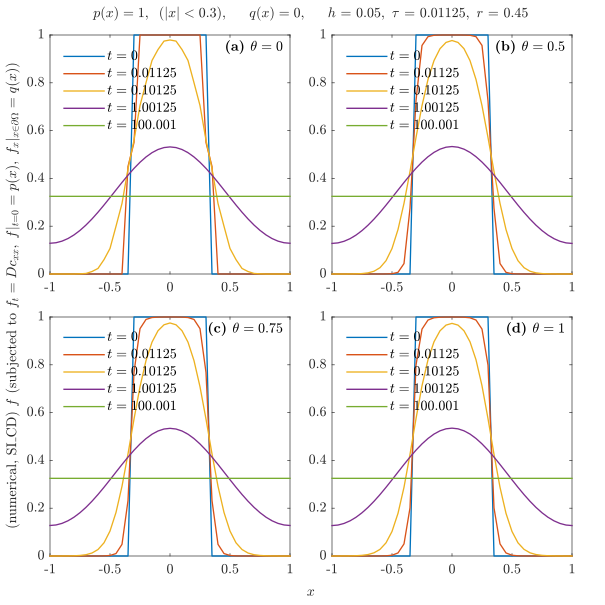
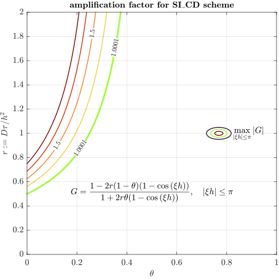

---
export_on_save:
  html: true
html:
  embed_local_images: true
  embed_svg: true
  offline: false
  toc: true
print_background: true
---

# Homework 4

- **Course:** Numerical Solutions to PDEs - FALL 2024
- **Instructor:** Zhou, Bowen ([周博闻](https://as.nju.edu.cn/54/79/c11339a218233/page.htm))
- **Due date:** Nov. 4, 2024
- **Submitted date:** Nov. 10, 2024
- **Problem set:** [PS4.pdf](https://box.nju.edu.cn/d/439906db314e411489a3/files/?p=%2FProblemSets%2FPS4.pdf)
- **Course website:** <https://grwei.github.io/NJU_070601C05_2024_Fall/>

> &ensp; &emsp; Describe the setup and each step in your solutions with words and clearly label your final answers. Use Matlab for plotting and programming and include your code as an appendix to your problem set.

## Table of Contents {ignore=true}

<!-- @import "[TOC]" {cmd="toc" depthFrom=1 depthTo=6 orderedList=false} -->

<!-- code_chunk_output -->

- [Homework 4](#homework-4)
  - [Problem 1](#problem-1)
  - [Acknowledgement](#acknowledgement)
  - [Contact Information](#contact-information)
  - [Appendix](#appendix)
    - [Matlab code for problem 1](#matlab-code-for-problem-1)
      - [hw4_1.m](#hw4_1m)
      - [DiffuProb1D.m](#diffuprob1dm)
      - [TriDiagSolver.m](#tridiagsolverm)

<!-- /code_chunk_output -->

## Problem 1

> &ensp; &emsp; 1. **Scalar diffusion equation.** Consider the 1D scalar diffusion equation
>
> $$\frac{\partial c}{\partial t} = D \frac{\partial^2 c}{\partial x^2}$$
>
> given these initial and boundary conditions:
>
> $$
> \begin{align*}
>   & c(x,0) = 1 \quad \text{for} \; \; |x| < 0.3, \\
>   & c(x,0) = 0 \quad \text{for} \; \; |x| \ge 0.3,
> \end{align*}
> $$
>
> $$
> \begin{equation*}
>   \left. \frac{\partial c}{\partial x} \right|_{(-1, t)} = 0, \quad \left. \frac{\partial c}{\partial x} \right|_{(1, t)} = 0.
> \end{equation*}
> $$
>
> Solve this equation numerically using the following schemes for $D = 0.1$.
>
> &ensp; &emsp; **(a)** Use first-order explicit time stepping with central differences in space to compute the numerical solution. Use $40$ grid cells and select $r = 0.45$. Plot your initial concentration profile, as well as the results at $t = 0.1, 1 \, \text{s}$.
>
> &ensp; &emsp; **(b)** Run the code again using $c = \sin{(2 \pi x)}$ as the initial condition, with $c(−1,t) = c(1,t) = 0$ for boundary conditions. Discuss how the behavior of the solution confirms that there is no dispersive error in this scheme, just numerical diffusion.
>
> &ensp; &emsp; **(c)** Use the $\theta$-method to set up a semi-implicit solution to this equation. Solve the resulting tridiagonal matrix equation using the Thomas algorithm at each time step (with the original initial and boundary conditions from part **a**). Store the banded matrix as three separate 1D vectors as you did in a previous homework assignment. Compare your results with $\theta = 0.5, 0.75$ and discuss the order of the truncation errors using modified equation analysis.

&ensp; &emsp; 本节讨论一维有限区间上的标量扩散初边值问题

$$
\begin{equation*}
    \tag{1.1}
    (\text{I}) \left\{
        \begin{aligned}
            & c_t = D c_{x^2}, \quad x \in \Omega, \; t \ge 0, \\
            & \text{(I.C.)} \quad c|_{t = 0} = p(x), \\
            & \text{(B.C.)} \quad \left. c_x \right|_{x \in \partial \Omega} = q(x, t), \quad \text{or} \quad \left. c \right|_{x \in \partial \Omega} = q(x, t)
        \end{aligned}
    \right.
\end{equation*}
$$

的数值解. 对 (1.1) 的一种离散方案是 semi-implicit $\theta$-method,

$$
\begin{equation*}
    \tag{1.2a}
    \frac{1}{\tau} \left( c_j^{n+1} - c_j^n \right) = \frac{D}{h^2} \left[ \theta \left( c^{n+1}_{j+1} - 2 c^{n+1}_j + c^{n+1}_{j-1} \right)  + (1 - \theta) \left( c^{n}_{j+1} - 2 c^{n}_j + c^{n}_{j-1} \right) \right].
\end{equation*}
$$

记

$$
\begin{equation*}
    \tag{1.3}
    r := D \tau / h^2,
\end{equation*}
$$

则格式 (1.2) 写成

$$
\begin{equation*}
    \tag{1.2b}
    -r \theta (c_{j-1}^{n+1} + c^{n+1}_{j+1}) + (1 + 2r \theta) c_j^{n+1} = r(1 - \theta) (c^n_{j-1} + c^n_{j+1}) + (1 - 2r (1 - \theta)) c^n_j.
\end{equation*}
$$

为使格式 (1.2) 适用于边界点, 我们利用 (1.1) 的边界条件 (boundary conditions, B.C.), 采取

$$
\begin{equation*}
    \tag{1.4a}
    \frac{c^{n}_{j + 1} + c^{n}_{j-1}}{2} = q(x_j, t_n), \quad \text{Dirichlet B.C.,}
\end{equation*}
$$

或

$$
\begin{equation*}
    \tag{1.4b}
    \frac{c^{n}_{j + 1} - c^{n}_{j-1}}{2h} = q(x_j, t_n), \quad \text{Neumann B.C.,}
\end{equation*}
$$

的方案来生成 halo points $c^{}_{-1}, c^{}_{M+1}$. Eq. (1.4a,b) 分别是对 $c(x_j, t_n), c^{}_x(x_j, t_n), \, j = 0, M$ 的 $\mathcal{O}(h^2)$ 离散, 使边界精度与内点精度 (不超过 2 阶) 匹配, 且使 (1.2b) 构成三对角方程. 一般地, 用户可利用 *Taylor table* (参见 [Hw 1 - Problem 4](../hw1/hw1.md#problem-4)), 选取若干个点, 构造不同于 (1.4) 的 halo points 生成方案. 引入 halo points (1.4) 后, 格式 (1.2) 可写成三对角方程

$$
\begin{equation*}
    \tag{1.5a}
    \begin{bmatrix}
        1 &  &   &  & \\
        \alpha & \beta & \gamma & & \\
        & & \ddots & & \\
        & & \alpha & \beta & \gamma \\
        & & & & 1
    \end{bmatrix} \begin{bmatrix}
        c_0^{n+1} \\
        c_1^{n+1} \\
        \vdots \\
        c_{M-1}^{n+1} \\
        c_M^{n+1}
    \end{bmatrix} = \begin{bmatrix}
        q(x_0, t_{n+1}) \\
        f_1^n \\
        \vdots \\
        f_{M-1}^n \\
        q(x^{}_M, t_{n+1})
    \end{bmatrix}, \quad \text{Dirichlet B.C.},
\end{equation*}
$$

或

$$
\begin{equation*}
    \tag{1.5b}
    \begin{bmatrix}
        \beta & \alpha + \gamma &   &  & \\
        \alpha & \beta & \gamma & & \\
        & & \ddots & & \\
        & & \alpha & \beta & \gamma \\
        & & & \alpha + \gamma & \beta
    \end{bmatrix} \begin{bmatrix}
        c_0^{n+1} \\
        c_1^{n+1} \\
        \vdots \\
        c_{M-1}^{n+1} \\
        c_M^{n+1}
    \end{bmatrix} = \begin{bmatrix}
        f_0^n + 2 \alpha h q(x_0, t_{n+1}) \\
        f_1^n \\
        \vdots \\
        f_{M-1}^n \\
        f_M^n - 2 \alpha h q(x^{}_M, t_{n+1})
    \end{bmatrix}, \quad \text{Neumann B.C.},
\end{equation*}
$$

式中

$$
\begin{equation*}
    \tag{1.6}
    \alpha = \gamma = -r \theta, \quad \beta = 1 + 2 r \theta,
\end{equation*}
$$

$$
\begin{equation*}
    \tag{1.7}
    f_j^n = r(1 - \theta) (c^n_{j-1} + c^n_{j+1}) + (1 - 2r (1 - \theta)) c^n_j, \quad j = 0, 1, \cdots, M.
\end{equation*}
$$

三对角方程 (1.5) 用追赶法求解的时间复杂度是线性 (i.e., $\mathcal{O}(M)$) 的, 求解耗时与显式 Euler 方案同量级 (参见 [Hw 2 - Problem 1](../hw2/hw2.md#problem-1)).

&ensp; &emsp; **(a)** 半隐式 Euler central difference (SI_CD) 格式 (1.2) 取参数 $\theta = 0$, 就退化为 forward Euler central diff. (FE_CD) 格式. 取网格距 $h = 0.05$, 时间步 $\tau = 0.01125$, 对施加了齐次 Neumann B.C. 的 (1.1) 用 SI_CD 或 FE_CD 方案的积分结果示于下图. 图中已标注边界条件类型 (y 轴标签) 和参数 $\theta$ 的取值.



&ensp; &emsp; **(b)** 将 (1.1) 中的边界条件改为齐次 Dirichlet B.C., 初始条件取为 $p(x) = \sin{(\xi x)}, \, \xi = 2 \pi, \pi, 4\pi$, 重复 (a) 的试验, 结果示于下图. 结果表明, 对于三种空间频率的初值, 初始相位的空间分布在数值积分过程中均保持恒定, 即相速度均为零. 由此猜想, SI_CD 或 FE_CD 方案无色散误差 (dispersive error), 只有数值扩散 (numerical diffusion).

 = sin(2 \pi x)")

 = sin(1 \pi x)")

 = sin(4 \pi x)")

&ensp; &emsp; 事实上, 由 (1.2b) 得 SI_CD 格式的复增长因子

$$
\begin{equation*}
    \tag{1.8}
    G = G(\xi; r, \theta) = \frac{1 - 2r(1 - \theta) (1 - \cos{(\xi h)})}{1 + 2r \theta (1 - \cos{(\xi h)})}, \quad |\xi h| \le \pi.
\end{equation*}
$$

因 $G$ 是实数, 故初值的各平面波分量在 SI_CD 方案 (1.2) 积分过程中只改变幅度 (数值扩散), 不改变相位的空间分布, 即各平面波分量的数值相速度均为零, 所以不存在色散误差.

&ensp; &emsp; 用 (1.8), 还可对格式 (1.2) 作 von Neumann 稳定性分析. 用 Matlab 编程, 对 $\max_{|\xi h| \le \pi} |G|$ 关于参数 $\theta, r$ 作扫描, 结果示于下图. 结果表明, 当 $\theta = 0$ (FE_CD 方案), 稳定性条件是 $r \le 0.5$. 随着 $\theta$ 增大, SI_CD 格式 (1.2) 的稳定性条件愈加宽松, 当 $\theta = 1$ 时格式对任意 $r > 0$ 均稳定.



&ensp; &emsp; **(c)** 比较 (a) 小节图的四个子图, 发现与 $\theta = 0.5, 0.75, 1$ 的积分结果 (SI_CD 方案) 相比, $\theta = 0$ (FE_CD 方案) 的数值扩散速度在积分初期较慢, 在第一个时步只扩散了一个空间网格距, 小于 SI_CD 方案的. 随着积分的进行, 四种 $\theta$ 取值的积分结果的差异变得很小, 似乎都收敛到同一个稳态解.

&ensp; &emsp; 下面对 SI_CD 格式 (1.2) 作 modified equation analysis. 满足 (1.2) 的 $\tilde{c} \in C^{\infty}(\mathbb{\Omega \times \mathbb{R}^+})$ 成立 modified equation

$$
\begin{equation*}
    \tag{1.9a}
    \tilde{c}_t - D \tilde{c}_{x^2} = - \frac{\tau}{2} \tilde{c}_{t^2} + \tau D \theta \tilde{c}_{x^2 t} + \frac{h^2}{12} D \tilde{c}_{x^4} + \mathcal{O}(\tau^2 + \tau h^2 + h^4).
\end{equation*}
$$

在 (1.9a) 的推导中, 利用了由二元 Taylor 展开得到的

$$
\begin{equation*}
    \tag{1.10}
    \tilde{c}^{n+1}_{j+1} - 2 \tilde{c}^{n+1}_{j} + \tilde{c}^{n+1}_{j-1} = h^2 \tilde{c}_{x^2} + \tau h^2 \tilde{c}_{x^2 t} + \frac{h^4}{12} \tilde{c}_{x^4} + {\color{grey}{\frac{\tau^2 h^2}{12} \tilde{c}_{x^2 t^2}}} + \mathcal{O}(\tau h^4 + {\color{grey}{\tau^3 h^2}}).
\end{equation*}
$$

为了将 (1.9a) 右端的时间导数项改写为空间导数, 让 (1.9a) 分别被 $\partial_t, \partial_{x^2}$ 作用, 得

$$
\begin{align*}
    \tag{1.11a}
    \tilde{c}_{t^2} - D \tilde{c}_{x^2 t} = \mathcal{O}(\tau + h^2), \\
    \tag{1.11b}
    \tilde{c}_{x^2 t} - D \tilde{c}_{x^4} = \mathcal{O}(\tau + h^2),
\end{align*}
$$

进而

$$
\begin{equation*}
    \tag{1.12}
    \tilde{c}_{t^2} = D^2 \tilde{c}_{x^4} + \mathcal{O}(\tau + h^2).
\end{equation*}
$$

将 (1.11b)(1.12) 代入 (1.9a), 得

$$
\begin{equation*}
    \tag{1.9b}
    \tilde{c}_t - D \tilde{c}_{x^2} = \tau D^2 \left( \theta - \frac{1}{2} \right) \tilde{c}_{x^4} + \frac{h^2}{12} D \tilde{c}_{x^4} + \mathcal{O}(\tau^2 + \tau h^2 + h^4).
\end{equation*}
$$

可见, SI_CD 格式 (1.2) 具有二阶空间精度. 格式具有二阶时间精度, 当且仅当 $\theta = 1/2$, 否则时间精度为一阶.

## Acknowledgement

&ensp; &emsp; I am grateful to [Yunzhu He](https://orcid.org/0000-0003-4723-8609) ([何韵竹](https://nicoleheyz.github.io/)), whose JGR article ([2024](https://doi.org/10.1029/2023JC020667), Fig. 12) reminded me to include a legend for the contour map.

## Contact Information

- **Author:** Guorui Wei (危国锐)
- **E-mail:** [313017602@qq.com](mailto:313017602@qq.com)
- **Website:** <https://github.com/grwei>

## Appendix

### Matlab code for problem 1

#### hw4_1.m

```matlab {.line-numbers}
%% hw4_1.m
% Description: Solving the 1-D advection problem: c_t + u c_x = 0
% Author: Guorui Wei (危国锐) (313017602@qq.com)
% Created at: Nov. 8, 2024
% Last modified: Nov. 10, 2024
%

clear; clc; close all

addpath("..\hw2\")
if ~isfolder(".\fig\")
    mkdir(".\fig\")
end

flag_save_fig = true;

%% Problem 1(a)

scheme_name = "time_SI_space_CD";
theta_list = [0, .5, .75, 1]; % delta_t = r_num * delta_x^2 / diffu_coeff;
delta_x = .05;
r_num = .45;
init_func = @(x) double(abs(x) < .3);
init_func_disp_str = "$p(x) = 1, \;\; (|x| < 0.3)$";
bndry_func_type = "Neumann";
bndry_func = @(x, t) zeros(size(x));
bndry_func_disp_str = "$q(x) = 0$";
fig_name = "fig_1_Neumann";
[f_list, x_grid, t_list] = hw4_1_unit(scheme_name, theta_list, delta_x, r_num, bndry_func_type, bndry_func, bndry_func_disp_str, init_func, init_func_disp_str, flag_save_fig, fig_name);

%% Problem 1(b)

%%% p(x) = sin(2 \pi x)

scheme_name = "time_SI_space_CD";
theta_list = [0, .5, .75, 1]; % delta_t = r_num * delta_x^2 / diffu_coeff;
delta_x = .05;
r_num = .45;
init_func = @(x) sin(2*pi*x);
init_func_disp_str = "$p(x) = \sin{(2 \pi x)}$";
bndry_func_type = "Dirichlet";
bndry_func = @(x, t) zeros(size(x));
bndry_func_disp_str = "$q(x) = 0$";
% flag_save_fig = true;
fig_name = "fig_2_Dirichlet_1";
[f_list, x_grid, t_list] = hw4_1_unit(scheme_name, theta_list, delta_x, r_num, bndry_func_type, bndry_func, bndry_func_disp_str, init_func, init_func_disp_str, flag_save_fig, fig_name);

%%% p(x) = sin(1 \pi x)

init_func = @(x) sin(1*pi*x);
init_func_disp_str = "$p(x) = \sin{(1 \pi x)}$";
fig_name = "fig_2_Dirichlet_2";
[f_list, x_grid, t_list] = hw4_1_unit(scheme_name, theta_list, delta_x, r_num, bndry_func_type, bndry_func, bndry_func_disp_str, init_func, init_func_disp_str, flag_save_fig, fig_name);

%%% p(x) = sin(4 \pi x)

init_func = @(x) sin(4*pi*x);
init_func_disp_str = "$p(x) = \sin{(4 \pi x)}$";
fig_name = "fig_2_Dirichlet_3";
[f_list, x_grid, t_list] = hw4_1_unit(scheme_name, theta_list, delta_x, r_num, bndry_func_type, bndry_func, bndry_func_disp_str, init_func, init_func_disp_str, flag_save_fig, fig_name);

%% SI_CD 格式的 von Neumann 稳定度分析

clc; clear;

r_vec = 0:.001:2;
theta_vec = 0:.001:1;
[r_grid, theta_grid] = ndgrid(r_vec, theta_vec);
G_max_grid = arrayfun(@(r, theta) G_abs_max(r, theta), r_grid, theta_grid);

%% create figure

t_fig = figure(Name="fig_3_SI_CD_stability");
    
% set figure size
UNIT_ORIGINAL = t_fig.Units;
t_fig.Units = "centimeters";
t_fig.Position = [3, 3, 12, 12];
t_fig.Units = UNIT_ORIGINAL;
t_TCL = tiledlayout(t_fig, 1, 1, TileSpacing="compact", Padding="tight");
t_axes = nexttile(t_TCL, 1);

[C, h] = contour(t_axes, theta_vec, r_vec, G_max_grid, LevelList=[1.0001, 1.0001], LineWidth=2.0);
clabel(C, h, FontSize=8, Interpreter="latex");
hold on
[C, h] = contour(t_axes, theta_vec, r_vec, G_max_grid, LevelList=0:.25:2, LineWidth=1.0, DisplayName="$$\max_{|\xi h| \le \pi} |G|$$");
hold off
clabel(C, h, [.5, 1.0, 1.5], FontSize=8, Interpreter="latex");

set(t_axes, FontName="Times New Roman", FontSize=10.5, Box="on", TickLabelInterpreter="latex", Tag="$|G|_{\mathrm{max}}$")

colormap(t_axes, "turbo")
clim(t_axes, [0, 2])
% axis(t_axes, "equal")

xlabel(t_axes, "$\theta$", Interpreter="latex", FontSize=10.5);
ylabel(t_axes, "$r := D \tau / h^2$", Interpreter="latex", FontSize=10.5);
grid(t_axes, "on");
legend(t_axes, h, Box="off", Location="best", Interpreter="latex", FontSize=10.5)

title(t_axes, "\bf amplification factor for SI\_CD scheme", Interpreter="latex", FontSize=10.5);

t_txt_box = annotation(t_fig, "textbox", String="$$G = \frac{1 - 2r(1 - \theta) (1 - \cos{(\xi h)})}{1 + 2r \theta (1 - \cos{(\xi h)})}, \quad |\xi h| \le \pi$$", ...
                        Position=[t_axes.Position([1, 2]) + t_axes.Position([3, 4]).*[0, .2], t_axes.Position(3), .1], FontSize=10.5, Interpreter="latex", LineStyle="none", HorizontalAlignment="center", VerticalAlignment="middle");
UNIT_ORIGINAL = t_txt_box.Units;
t_txt_box.Units = "points";
t_txt_box.Position = [t_txt_box.Position([1,2,3]), 10.5*3];
t_txt_box.Units = UNIT_ORIGINAL;

if true
    print(t_fig, ".\fig\" + t_fig.Name + ".svg", "-vector", "-dsvg")
end

%% Function:

function abs_max = G_abs_max(r, theta)
    x = 0:.001:2;
    G = (1 - 2*r*(1 - theta)*x) ./ (1 + 2*r*theta*x);
    abs_max = max(abs(G));
end

%% Function: Unit

function [f_list, x_grid, t_list] = hw4_1_unit(scheme_name, theta_list, delta_x, r_num, bndry_func_type, bndry_func, bndry_func_disp_str, init_func, init_func_disp_str, flag_save_fig, fig_name)
    arguments
        scheme_name 
        theta_list 
        delta_x
        r_num
        bndry_func_type 
        bndry_func 
        bndry_func_disp_str
        init_func
        init_func_disp_str
        flag_save_fig = false;
        fig_name = "fig_unknown"
    end

    if scheme_name == "time_SI_space_CD"
        scheme_name_short = "SI\_CD";
    end
    
    solver = DiffuProb1D();

    %%% Solver params (1-D Advection problem)

    diffu_coeff = .1;
    t_start = 0;
    x_range = [-1, 1] * (.05 / delta_x);
    % init_func = @(x) double(abs(x) < .3);
    % init_func_disp_str = "$p(x) = 1, \; |x| < 0.3$";
    % bndry_func_type = "Neumann";
    % bndry_func = @(x, t) zeros(size(x));
    % bndry_func_disp_str = "$q(x) = 0$";
    % delta_x = .05;
    % r_num = .45;
    
    delta_t = r_num*delta_x^2 / diffu_coeff;
    t_query = [0, delta_t, .1, 1, 100];  

    %%% Solving

    f_list = cell(length(theta_list), 1);
    x_grid = f_list;
    t_list = x_grid;
    for test_idx = 1:length(theta_list)
        params_struct = DiffuProb1D.prepare_params(diffu_coeff, t_start, x_range, init_func, bndry_func_type, bndry_func, delta_t, delta_x, t_query);
        solver.reset(params_struct);
        solver.solve(scheme_name, theta=theta_list(test_idx));
        [f_list{test_idx}, x_grid{test_idx}, t_list{test_idx}, ~] = solver.get_solution();
    end

    %%% Create figure

    t_fig = figure(Name=fig_name);

    % set figure size
    UNIT_ORIGINAL = t_fig.Units;
    t_fig.Units = "centimeters";
    t_fig.Position = [3, 3, 16, 16];
    t_fig.Units = UNIT_ORIGINAL;

    % plot
    t_TCL = tiledlayout(t_fig, floor(length(theta_list) / 2), 2, TileSpacing="compact", Padding="compact");
    xlabel(t_TCL, "$x$", Interpreter="latex", FontSize=10.5);
    if bndry_func_type == "Neumann"
        ylabel(t_TCL, "(numerical, " + scheme_name_short + ") $f$ (subjected to $f_{t} = Dc_{xx}, \; f|_{t = 0} = p(x), \; f_x|_{x \in \partial \Omega} = q(x)$)", Interpreter="latex", FontSize=10.5);
    elseif bndry_func_type == "Dirichlet"
        ylabel(t_TCL, "(numerical, " + scheme_name_short + ") $f$ (subjected to $f_{t} = Dc_{xx}, \; f|_{t = 0} = p(x), \; f|_{x \in \partial \Omega} = q(x)$)", Interpreter="latex", FontSize=10.5);
    else
        ylabel(t_TCL, "(numerical, " + scheme_name_short + ") $f$ (subjected to $f_{t} = Dc_{xx}, \; f|_{t = 0} = p(x), \; $ unknown B.C.)", Interpreter="latex", FontSize=10.5);
    end
    
    if scheme_name == "time_SI_space_CD"
        title(t_TCL, sprintf("%s, $\\quad$ %s, $\\quad$ $h$ = %g, $\\, \\tau$ = %g, $\\, r$ = %g", init_func_disp_str, bndry_func_disp_str, delta_x, delta_t, r_num), Interpreter="latex", FontSize=10.5);
    end

    for test_idx = 1:length(theta_list)
        t_axes = nexttile(t_TCL, test_idx);
        hold(t_axes, "on");
        for t_query_idx = 1:length(t_list{test_idx})
            plot(t_axes, x_grid{test_idx}, f_list{test_idx}{t_query_idx}, LineWidth=1.0, DisplayName=sprintf("$t = %g$", t_list{test_idx}(t_query_idx)))
        end
        set(t_axes, FontName="Times New Roman", FontSize=10.5, Box="on", TickLabelInterpreter="latex", ...
            Tag=sprintf("(%c) $\\theta = %g$", char('a' - 1 + test_idx), theta_list(test_idx)));
        legend(t_axes, Location="northwest", Interpreter="latex", FontSize=10.5, Box="off");
    end

    for t_axes = findobj(t_TCL, 'Type', "Axes", {'-regexp', 'Tag', "^\([a-z]+\)"}).'
        str_{1} = "\bf " + t_axes.Tag;
        t_txt_box = annotation(t_fig, "textbox", String=str_, Position=[t_axes.Position([1, 2]) + t_axes.Position([3, 4]), .1, .1], FontSize=10.5, Interpreter="latex", LineStyle="none", HorizontalAlignment="right", VerticalAlignment="top");
        UNIT_ORIGINAL = t_txt_box.Units;
        t_txt_box.Units = "points";
        t_txt_box.Position = [t_txt_box.Position([1,2]) - [10.5*10, 10.5*1.5], 10.5*10, 10.5*1.5];
        t_txt_box.Units = UNIT_ORIGINAL;
    end

    if flag_save_fig
        print(t_fig, ".\fig\" + t_fig.Name + ".svg", "-vector", "-dsvg")
    end
end
```

#### DiffuProb1D.m

```matlab {.line-numbers}
%% DiffuProb1D.m
% Description: Solving the 1-D diffusion problem: c_t = D c_xx, D constant
% Author: Guorui Wei (危国锐) (313017602@qq.com)
% Created at: Nov. 8, 2024
% Last modified: Nov. 9, 2024
%

%%

classdef DiffuProb1D < handle
    properties (Constant)
        PARAMS_REQUIRED = ["diffu_coeff","t_start","x_range","init_func", "bndry_func_type", "bndry_func", "delta_t", "delta_x", "t_query"];
        SCHEME_NAME = ["time_SI_space_CD"];
    end

    properties (Access=private)
        % solver params
        diffu_coeff
        t_start
        x_range
        init_func
        bndry_func_type
        bndry_func
        delta_t
        delta_x
        t_query

        % results
        x_grid
        t_list
        f_list
        scheme_name

        % 三对角方程求解器
        tri_diag_solver
    end

    methods (Static, Access=public)
        function params = prepare_params(diffu_coeff, t_start, x_range, init_func, bndry_func_type, bndry_func, delta_t, delta_x, t_query)
            arguments (Input)
                diffu_coeff = .1;
                t_start = 0;
                x_range = [-1, 1];
                init_func = @(x) double(abs(x) < .3);
                bndry_func_type = "Neumann";
                bndry_func = @(x, t) 0;
                delta_t = .01125;
                delta_x = .05;
                t_query = [0, .1, 1];  
            end

            params.diffu_coeff = diffu_coeff;
            params.t_start = t_start;
            params.x_range = sort(x_range, "ascend");
            if ~iscolumn(init_func)
                init_func = init_func.';
            end
            params.init_func = init_func;
            params.bndry_func_type = bndry_func_type;
            params.bndry_func = bndry_func;
            params.delta_t = delta_t;
            params.delta_x = delta_x;
            params.t_query = sort(t_query(t_query >= t_start), "ascend");
        end
    end

    methods (Access=public)
        function obj = DiffuProb1D(varargin)
            obj.tri_diag_solver = TriDiagSolver();
            if nargin < 1
                obj.reset(DiffuProb1D.prepare_params());
                return
            end
            obj.reset(varargin{:});
        end

        function obj = reset(obj, params)
            field_missing_flag = ~isfield(params, DiffuProb1D.PARAMS_REQUIRED);
            if any(field_missing_flag)
                warning("Invalid params_struct. Params not changed. Missing field: %s", join(DiffuProb1D.PARAMS_REQUIRED(field_missing_flag), ", "));
                return
            end

            params = DiffuProb1D.prepare_params(params.diffu_coeff, params.t_start, params.x_range, params.init_func, params.bndry_func_type, params.bndry_func, params.delta_t, params.delta_x, params.t_query);
            for field_name = DiffuProb1D.PARAMS_REQUIRED
                obj.(field_name) = params.(field_name);
            end
            obj.tri_diag_solver.reset();

            obj.t_list = nan(size(obj.t_query));
            obj.f_list = cell(size(obj.t_query));
        end
    
        function [f_list, x_grid, t_list, scheme_name] = get_solution(obj)
            f_list = obj.f_list;
            x_grid = obj.x_grid;
            t_list = obj.t_list;
            scheme_name = obj.scheme_name;
        end

        function obj = solve(obj, scheme_name, opts)
            arguments (Input)
                obj 
                scheme_name
                opts.theta = .5;
            end

            if isscalar(obj.diffu_coeff)
                [obj.f_list, obj.x_grid, obj.t_list] = obj.solve_1D(scheme_name, theta=opts.theta);
                return
            end

            error("diffu_coeff must be scalar.")
        end
    end

    methods (Access=private)
        function [f_list, x_grid, t_list] = solve_1D(obj, scheme_name, opts)
            arguments (Input)
                obj
                scheme_name;
                opts.theta = .5;
            end

            f_list = cell(size(obj.t_query));
            t_list = nan(size(obj.t_query));
            x_grid = (obj.x_range(1): obj.delta_x: obj.x_range(2)).';

            %%% scheme I (2-level)

            if ismember(scheme_name, ["time_SI_space_CD"])
                obj.scheme_name = scheme_name;
                r_num = obj.diffu_coeff * obj.delta_t / obj.delta_x^2;

                f_last = obj.init_func(x_grid);
                t_last = obj.t_start;
                t_query_next_idx = find(obj.t_query > obj.t_start, 1, "first");

                % 若请求时刻不晚于初始时刻, 则无需计算, 直接返回初值
                if isempty(t_query_next_idx) || t_query_next_idx > 1
                    t_list(1) = t_last;
                    f_list{1} = f_last;
                end
                
                % 用于记录进度
                REC_TIME_INT = 5; % seconds
                time_rec_start = tic;
                t_last_rec = t_last;

                while t_last < obj.t_query(end)
                    t_now = t_last + obj.delta_t;

                    % 输出进度
                    if toc(time_rec_start) > REC_TIME_INT
                        time_remained = REC_TIME_INT * (obj.t_query(end) - t_now) / (t_now - t_last_rec);
                        fprintf("%s\n\tscheme_name = %s,\n\ttime_remained = %.2e,\n\tspace_dim = (%s), r_num = (%s),\n\tt_now = %.2e, t_query_next = %.2e, t_query_end = %.2e\n", datetime('now'), scheme_name, time_remained, join(string(size(X)), ", "), join(string(r_num), ", "), t_now, obj.t_query(t_query_next_idx), obj.t_query(end));
                        time_rec_start = tic;
                        t_last_rec = t_now;
                    end

                    % add halo points, advance one time step
                    if scheme_name == "time_SI_space_CD"
                        if obj.bndry_func_type == "periodic"
                            error("周期边界的求解程序尚未完工")
                        end
                        if obj.bndry_func_type == "Dirichlet"
                            tri_diag_coeff_mat = [[-r_num*opts.theta*ones(length(x_grid)-1, 1); 0], [1; (1 + 2*r_num*opts.theta)*ones(length(x_grid)-2, 1); 1], [0; -r_num*opts.theta*ones(length(x_grid)-1, 1)]];
                            const_vec = [obj.bndry_func(x_grid(1), t_now);
                                         r_num*(1 - opts.theta)*(f_last(1:end-2) + f_last(3:end)) + (1 - 2*r_num*(1 - opts.theta))*f_last(2:end-1);
                                         obj.bndry_func(x_grid(end), t_now)];
                            f_now = obj.tri_diag_solver.reset(tri_diag_coeff_mat, const_vec).solve();
                        end
                        if obj.bndry_func_type == "Neumann"
                            tri_diag_coeff_mat = [[-r_num*opts.theta*ones(length(x_grid)-1, 1); -2*r_num*opts.theta], (1 + 2*r_num*opts.theta)*ones(length(x_grid), 1), [-2*r_num*opts.theta; -r_num*opts.theta*ones(length(x_grid)-1, 1)]];
                            const_vec = [r_num*(1 - opts.theta)*2*(f_last(2) - obj.delta_x*obj.bndry_func(x_grid(1), t_last)) + f_last(1)*(1 - 2*r_num*(1 - opts.theta)) - 2*r_num*opts.theta*obj.bndry_func(x_grid(1), t_now);
                                         r_num*(1 - opts.theta)*(f_last(1:end-2) + f_last(3:end)) + (1 - 2*r_num*(1 - opts.theta))*f_last(2:end-1);
                                         r_num*(1 - opts.theta)*2*(f_last(end-1) + obj.delta_x*obj.bndry_func(x_grid(end), t_last)) + f_last(end)*(1 - 2*r_num*(1 - opts.theta)) + 2*r_num*opts.theta*obj.bndry_func(x_grid(end), t_now)];
                            f_now = obj.tri_diag_solver.reset(tri_diag_coeff_mat, const_vec).solve();
                        end
                    else
                        error("Unknown scheme.")
                    end

                    % store solution at queried time.
                    if ~((obj.t_query(t_query_next_idx) - t_last)*(obj.t_query(t_query_next_idx) - t_now) > 0)
                        if abs(obj.t_query(t_query_next_idx) - t_now) < abs(obj.t_query(t_query_next_idx) - t_last)
                            t_list(t_query_next_idx) = t_now;
                            f_list{t_query_next_idx} = f_now;
                        else
                            t_list(t_query_next_idx) = t_last;
                            f_list{t_query_next_idx} = f_last;
                        end
                        t_query_next_idx = t_query_next_idx + 1;
                    end

                    % prepare for next time step
                    t_last = t_now;
                    f_last = f_now;
                end % end of `while t_last < obj.t_query(end)`


                t_list_disp_str = string(t_list);
                t_list_disp_str(ismissing(t_list_disp_str)) = "NaN";
                fprintf("%s\n\tscheme_name = %s,\n\tFinished.\n\tt_list = [%s]\n", datetime('now'), scheme_name, join(t_list_disp_str, ", "));
                return
            end % end of `if ismember(scheme_name, ["time_forward_Euler_space_upwind", "time_forward_Euler_space_central_diff"])`

            error("Invalid scheme_name. Please choose one of the following options: %s", join(DiffuProb1D.SCHEME_NAME, ", "));
        end % end of `function [f_list, x_grid, t_list] = solve_1D(obj, scheme_name)`
    end % end of `methods (Access=private)`
end % end of `classdef DiffuProb1D < handle`
```

#### TriDiagSolver.m

```matlab {.line-numbers}
%% TriDiagSolver.m
% Description: 用 Thomas algorithm (追赶法) 求解系数矩阵为三对角的线性方程组
% Author: Guorui Wei (危国锐) (313017602@qq.com)
% Created at: Oct. 17, 2024
% Last modified: Oct. 18, 2024
%

%% Class definition

classdef TriDiagSolver < handle
    properties (Access=private)
        tri_diag_coeff_mat__ = [];
        const_vec__ = [];
        solut_vec__ = [];
        cpu_time__ = [];
    end

    methods (Access=public)
        function obj = TriDiagSolver(tri_diag_coeff_mat, const_vec)
            arguments
                tri_diag_coeff_mat = [NaN, 2, 1;
                                      1, 2, 1;
                                      1, 2, NaN];
                const_vec = [4; 8; 8];
            end
            obj.tri_diag_coeff_mat__ = tri_diag_coeff_mat;
            obj.const_vec__ = const_vec;
        end

        function tri_diag_coeff_mat = get_coeff_mat(obj)
            tri_diag_coeff_mat = obj.tri_diag_coeff_mat__; 
        end

        function const_vec = get_const_vec(obj)
            const_vec = obj.const_vec__; 
        end

        function cpu_time = get_cpu_time(obj)
            cpu_time = obj.cpu_time__;
        end

        function obj = reset(obj, tri_diag_coeff_mat, const_vec)
            arguments
                obj
                tri_diag_coeff_mat = [];
                const_vec = [];
            end
            obj.clear();
            obj.tri_diag_coeff_mat__ = tri_diag_coeff_mat;
            obj.const_vec__ = const_vec;
        end

        function obj = clear(obj)
            obj.tri_diag_coeff_mat__ = [];
            obj.const_vec__ = [];
            obj.solut_vec__ = [];
            obj.cpu_time__ = [];
        end
        
        function solut_vec = solve(obj)
            if ~isempty(obj.solut_vec__)
                solut_vec = obj.solut_vec__;
                return
            end

            aug_mat = [obj.tri_diag_coeff_mat__, obj.const_vec__];
            tStart = cputime();
            for i = 2:size(aug_mat, 1)
                aug_mat(i, [1, 2, 4]) = aug_mat(i, [1, 2, 4]) + aug_mat(i-1, [2, 3, 4]) * (-aug_mat(i, 1) / aug_mat(i-1, 2)); 
            end
            
            obj.solut_vec__(length(obj.const_vec__), 1) = aug_mat(length(obj.const_vec__), 4) / aug_mat(length(obj.const_vec__), 2);
            for i = length(obj.const_vec__)-1 : -1 : 1
                obj.solut_vec__(i) = (aug_mat(i, 4) - aug_mat(i, 3) * obj.solut_vec__(i + 1)) / aug_mat(i, 2);
            end

            obj.cpu_time__ = cputime() - tStart;
            solut_vec = obj.solut_vec__;
        end
    end % end of method
end % end of classdef
```
